# 第二章：人工智能背后的技术秘密

## 2.1 人工智能技术体系全景：AI技术的\"三位一体\"

在任何AI项目中，技术体系架构的理解程度直接影响项目的成功率和可扩展性。深入理解数据、算法与算力的\"三位一体\"协同关系，掌握分层架构的设计原理，合理选择框架与工具，是在快速发展的AI技术环境中保持技术方向清晰的关键要素。本节将系统性地介绍AI技术体系的核心组成：首先分析AI的底层三要素及其相互关系，然后解析多层次的技术架构体系，最后对比深度学习与传统机器学习框架的特点与适用场景，为读者构建完整的AI技术认知框架。

### 2.1.1 数据、算法与算力：AI的铁三角

在人工智能的世界里，有一个被业内人士广泛认可的\"三位一体\"黄金组合：数据、算法与算力。这三者就像是支撑人工智能大厦的三根支柱，缺一不可。对于非AI专业但从事软件行业的你来说，理解这三者的关系和重要性，将帮助你更好地把握AI技术的本质和发展趋势。

**数据在AI系统中的核心作用**

数据是AI系统的基础要素，其质量直接决定了系统的性能表现。计算机科学中的\"垃圾进，垃圾出\"（Garbage
In, Garbage Out）原则在AI系统中尤为重要，充分说明了数据质量对系统成败的决定性影响。现代AI系统对数据的要求体现在三个维度：规模性要求海量数据支撑模型训练，如ChatGPT使用了数十TB的训练数据，相当于数百万本书的内容；多样性要求系统能够处理从结构化数据到非结构化数据的各类信息，多模态数据融合能力已成为现代AI系统的核心竞争力；时效性则强调数据的\"保质期\"概念，过时信息可能导致模型判断偏差，例如使用2019年前数据训练的模型无法准确处理新冠疫情相关问题。

以图像识别系统为例，数据质量问题的影响机制可以清晰地展现出来。当训练数据量不足时，模型容易出现过拟合现象，只能识别训练集中的特定特征；当数据分布不均衡时，模型在少数类别上的表现会显著下降；当数据质量较差时，如图像模糊、标注错误等问题，会导致模型学习到错误的特征映射关系。这些数据质量问题对AI系统性能的影响如图2-1所示。

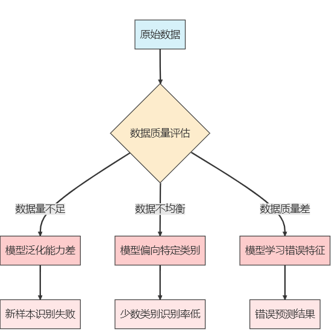{width=\"5.739583333333333in\"
height=\"5.75in\"}

图2-1 数据质量对AI性能的影响

在实际AI项目实施过程中，数据工程通常占据项目总工作量的70%-80%。数据工程涵盖了完整的数据处理流程：数据收集负责从多种来源获取原始数据，数据清洗处理噪声、缺失值和错误信息，数据标注为机器学习提供监督信号，数据增强通过变换技术扩充训练样本以提高模型泛化能力，数据版本管理则确保数据变更的可追溯性和实验的可重复性。对于软件工程师而言，数据工程实践的重要性不亚于代码质量管理，在某些场景下甚至更为关键。

**算法的演进与应用**

算法是解决特定问题的一系列明确指令或规则，在AI领域特指能让计算机从数据中学习并做出决策的数学模型和计算方法。AI算法的发展经历了三个主要阶段：符号主义阶段通过人工定义的规则和逻辑推理实现智能，如早期的专家系统；统计学习阶段从数据中自动学习模式和规律，包括决策树、支持向量机、随机森林等方法；深度学习阶段基于神经网络的多层结构，能自动学习复杂特征，代表性技术包括CNN、RNN、Transformer等。

无论算法复杂程度如何，其核心功能都可以概括为特征提取和决策映射两个方面。特征提取负责从原始数据中识别和提取有用的模式或特征，决策映射则建立特征与目标之间的映射关系，用于预测或决策。以推荐系统为例，基于规则的算法依赖人工定义的推荐规则，协同过滤算法通过分析用户行为模式发现相似偏好，而深度学习算法则能够分析多维度数据并建立复杂的非线性映射关系，这三种算法的工作方式差异如图2-2所示。

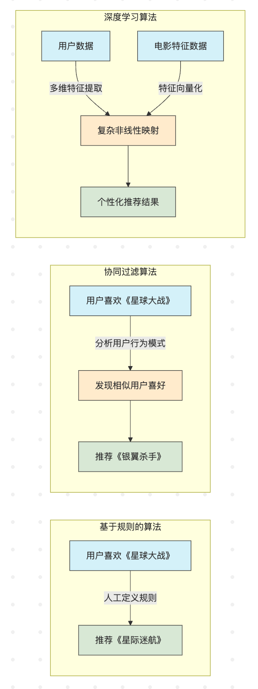{width=\"5.875in\"
height=\"15.645833333333334in\"}

图2-2 不同算法的工作方式对比

在实际应用中，算法选择需要综合考虑性能指标（准确率、召回率、F1分数等）、计算效率（训练时间、推理速度、资源消耗）、可解释性（模型决策过程的透明度）、泛化能力（在新数据上的表现）以及实现复杂度（开发和维护的难度）等多种因素。软件工程师虽然不必精通每种算法的数学原理，但需要了解各类算法的适用场景和优缺点，以便在项目中做出合理选择。

**算力：AI的\"引擎\"**

算力是指计算机系统执行计算任务的能力，通常用每秒浮点运算次数（FLOPS）来衡量。在AI领域，算力是支撑大规模模型训练和推理的关键资源。随着深度学习模型规模的不断扩大，算力需求呈指数级增长。从2012年的AlexNet（约6亿参数）到2018年的BERT-Large（约3.4亿参数），再到2020年的GPT-3（约1750亿参数）以及2023年的GPT-4（参数量估计约1.8万亿），模型规模的增长对算力提出了更高要求。据估算，仅训练GPT-3的算力成本就约为460万美元（有报道称高达1200万美元），相当于一台高端服务器连续运行数千年的计算量。

现代AI算力呈现多样化形态，主要包括GPU（图形处理器）的强大并行计算能力，TPU（张量处理器）等专为机器学习设计的ASIC芯片，FPGA（现场可编程门阵列）的可重配置特性，以及AWS、Azure、Google
Cloud等云计算平台提供的弹性AI计算服务。不同算力平台在处理相同任务时的效率差异显著，如图2-3所示。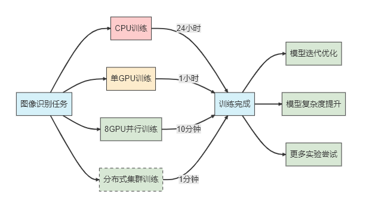{width=\"6.299305555555556in\"
height=\"3.6686001749781276in\"}

图2-3 算力对AI项目开发效率的影响

面对有限的算力资源，AI工程师通常采用多种优化策略：模型压缩技术（剪枝、量化、知识蒸馏等）减小模型体积，分布式训练将任务分散到多台机器并行计算，混合精度训练使用FP16或INT8代替FP32以提高计算效率，梯度累积在内存受限情况下模拟大批量训练，云资源弹性调度根据需求动态分配计算资源。

**三要素的协同效应与实践应用**

数据、算法和算力三者之间存在复杂的相互依赖关系。数据驱动算法优化，更多更好的数据可以改进算法性能，但需要足够的算力支撑处理；算法创新能够提高数据利用效率，先进的算法可以从更少的数据中学习有效模式，同时降低对算力的需求；算力扩展技术边界，强大的算力使处理更大规模数据和更复杂算法成为可能。

以自动驾驶系统为例，该领域完美体现了三要素的协同效应。数据层面需要来自车载摄像头、雷达、激光雷达的海量多模态数据，涵盖各种道路、天气和交通情况；算法层面需要复杂的深度学习模型处理目标检测、语义分割、轨迹预测等任务；算力层面需要车载AI芯片（如NVIDIA DRIVE Orin）提供高性能、低功耗的实时计算能力。三者缺一不可，共同确保系统能够在毫秒级时间内完成复杂计算并做出安全决策。数据、算法与算力的三位一体关系如图2-4所示。

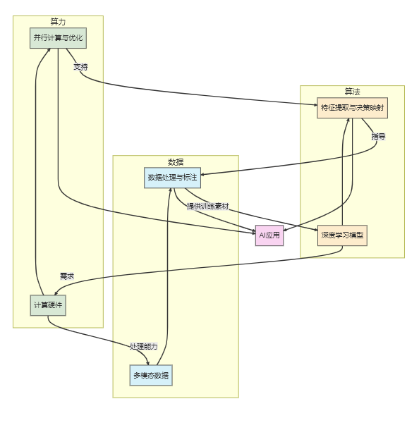{width=\"6.010416666666667in\"
height=\"6.354166666666667in\"}

> 图2-4：数据、算法与算力三位一体

随着技术发展，三要素的关系也在不断演变。数据效率提升体现在自监督学习、小样本学习等技术降低了对标注数据的依赖；算法创新加速表现为Transformer、扩散模型等新架构不断突破性能上限；算力民主化则通过云服务、开源框架降低了AI技术的使用门槛。

对于软件工程师而言，理解这三者的平衡点至关重要。在资源有限的情况下，是收集更多数据、设计更复杂的算法，还是投入更多算力，需要根据具体问题和约束条件做出权衡。通过掌握数据、算法与算力的协同关系，技术人员能够在项目评估与资源配置中做出更加科学的决策，在技术选型中选择适合实际需求的解决方案，并通过观察三大要素的演进趋势预判技术发展方向。

### 2.1.2 解构AI：从底层到应用的技术分层

在理解了数据、算法与算力的三要素关系后，从分层架构的视角来审视AI技术体系的整体结构同样重要。现代AI技术体系可以概括为五个相互依赖的层次，从底层到顶层分别是硬件基础层、系统软件层、框架工具层、算法模型层和应用服务层。这种分层架构不仅有助于理清AI技术的内在逻辑，也为不同背景的从业者提供了切入AI领域的多个入口点。AI技术的分层架构从硬件到应用的技术栈，如图2-5所示。

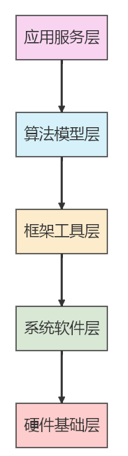{width=\"1.90625in\"
height=\"6.760416666666667in\"}

图2-5 AI技术的分层架构

**硬件基础层的核心组成**

硬件基础层是整个AI技术栈的物理基础，主要包括计算处理器、存储设备和网络设备三大核心组件。计算处理器涵盖了通用CPU、并行计算优化的GPU、专用AI芯片TPU/NPU以及可编程逻辑门阵列FPGA等多种类型。存储设备包括提供高速临时数据访问的内存（RAM）和用于持久化存储的硬盘/SSD等设备。网络设备则支持分布式训练和推理的高速互联网络，如InfiniBand、RDMA等低延迟高带宽技术。

以图像识别模型训练为例，硬件配置对性能的影响十分显著。处理1000万张高清图片的训练任务，普通CPU可能需要数周时间且存在内存不足的风险，高端GPU可将训练时间缩短至几天并大幅提升训练速度，而TPU集群可能只需要几小时即可完成，体现了专用硬件在矩阵运算方面的优化效果。同时，存储系统的性能也会成为关键瓶颈，慢速硬盘会导致数据加载成为瓶颈并降低GPU利用率，而SSD配合高速内存则能确保数据加载迅速并提高计算资源利用率。如图2-6所示，不同硬件配置对AI性能有显著影响。

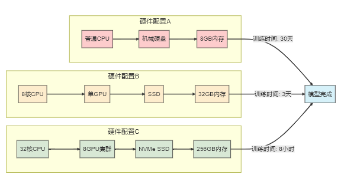{width=\"6.0in\"
height=\"3.1979166666666665in\"}

图2-6 不同硬件对AI性能的影响

**系统软件层的功能定位**

系统软件层负责管理硬件资源并为上层提供稳定的运行环境，核心组件包括操作系统、驱动程序、容器与虚拟化以及分布式系统。操作系统主要采用Linux发行版（如Ubuntu、CentOS等）以及一些针对AI工作负载优化的专用操作系统。驱动程序作为连接硬件与上层软件的接口，如NVIDIA的CUDA、AMD的ROCm等GPU计算平台发挥着关键作用。容器与虚拟化技术提供环境隔离与快速部署能力，如Docker容器和Kubernetes编排系统。分布式系统支持大规模数据存储与计算，包括分布式文件系统（HDFS、Ceph）和资源调度系统（YARN、Mesos）。

以语音识别服务部署为例，系统软件层配置的重要性体现在多个方面。缺少CUDA驱动会导致即使有高端GPU，模型也只能在CPU上运行，速度极慢。系统软件层的配置对AI开发效率有直接影响如下图2-7所示。

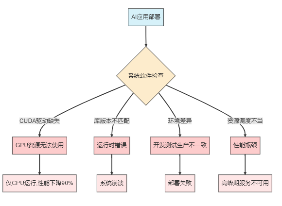{width=\"6.041666666666667in\"
height=\"4.416666666666667in\"}

图2-7 系统软件对AI开发的影响

**框架工具层的技术生态**

框架工具层为AI开发者提供高效的开发工具和抽象接口，主要包括深度学习框架、机器学习库、数据处理工具和模型部署工具四大类。深度学习框架提供神经网络构建与训练的编程接口，如PyTorch、TensorFlow、JAX、MXNet/OneFlow等。机器学习库实现传统机器学习算法，如Scikit-learn、XGBoost/LightGBM、Spark MLlib等。数据处理工具支持数据清洗、转换与特征工程，如Pandas/NumPy、Apache Beam、Dask等。模型部署工具优化模型推理性能并简化部署流程，如ONNX、TensorRT、TF Serving/Triton等。

在图像生成模型开发中，框架选择对开发效率和部署便捷性产生不同影响。PyTorch的动态计算图便于调试，在研究新算法时迭代速度较快；TensorFlow的生产部署工具链较为完善，但研究原型开发相对繁琐；使用高级API（如Keras）可以快速搭建模型，但自定义功能受限；使用低级API能够完全控制计算过程，但开发时间较长。如图2-8所示，不同框架的选择对开发效率和部署便捷性有不同影响。

{width=\"6.0in\"
height=\"2.5729166666666665in\"}

图2-8 框架选择对开发效率的影响

**算法模型层的技术体系**

算法模型层是AI系统的核心智能部分，负责数据分析、模式识别和决策生成。该层包括传统机器学习算法、深度学习模型、预训练模型和组合模型四大类别。传统机器学习算法涵盖监督学习（如线性回归、决策树、支持向量机）、无监督学习（如聚类算法、主成分分析、异常检测）和强化学习（如Q-learning、策略梯度法）。深度学习模型包括CNN（卷积神经网络）、RNN/LSTM/GRU（循环神经网络及其变体）、Transformer（基于自注意力机制的架构）、GAN（生成对抗网络）和扩散模型等。预训练模型涵盖大语言模型（如BERT、GPT系列、LLaMA）、多模态模型（如CLIP、DALL-E）和视觉模型（如ResNet、Vision Transformer）。组合模型通过集成学习和混合模型实现性能提升和能力互补。

以电商推荐系统为例，不同算法模型的应用效果和特点各有差异。协同过滤作为传统算法基于用户行为相似性推荐，但存在明显的冷启动问题；基于内容的推荐算法基于商品特征推荐，需要大量人工特征工程；深度学习推荐（如DeepFM）能够自动学习特征交互，性能更好但需要更多数据和算力；强化学习推荐能够优化长期用户价值，但训练复杂度较高。如图2-9所示，不同算法模型在推荐系统中的应用对比体现了各自的优势和局限性。

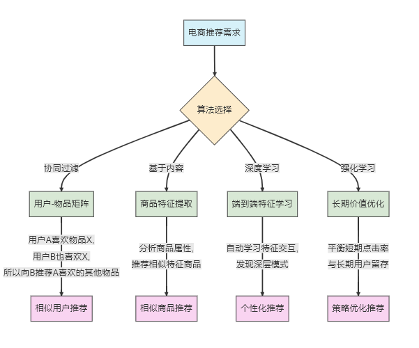{width=\"6.260416666666667in\"
height=\"5.208333333333333in\"}

**图2-9 不同算法模型在推荐系统中的应用对比**

**应用服务层的实现形态**

应用服务层是AI技术与最终用户直接交互的界面，将底层技术能力转化为解决实际问题的应用。该层主要包括垂直领域应用、通用AI服务、AI开放平台和AI增强传统软件四大类别。垂直领域应用涵盖智能医疗、智能金融、智能制造、智能交通等专业领域的AI应用。通用AI服务包括语音助手、大语言模型应用、AI内容生成和智能搜索引擎等面向大众的服务。AI开放平台提供云AI服务和API服务，为开发者提供AI能力接入。AI增强传统软件通过集成AI功能提升传统软件的智能化水平。

以智能客服系统为例，其工作流程展示了AI技术的协同工作机制。当用户询问\"我的订单什么时候到货？\"时，系统首先通过语音识别将用户语音转换为文本，然后通过自然语言理解识别用户意图（查询订单状态）和实体（当前用户的订单），接着从订单系统进行知识检索获取相关信息（预计3天后送达），通过对话管理维护对话上下文并处理多轮交互，最后通过自然语言生成产生回复（\"您好，您的订单预计将在3天后送达\"）并通过语音合成将文本转换回语音。如图2-10所示，智能客服系统的工作流程展示了AI技术如何协同工作。

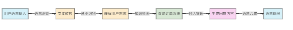{width=\"6.083333333333333in\"
height=\"0.6354166666666666in\"}

图2-10 智能客服系统的工作流程

**分层架构的价值与挑战**

分层架构为AI技术发展带来了显著价值。专业分工的细化使不同背景的专业人才能够在适合的技术层次发挥专长，硬件工程师专注于计算芯片和系统架构优化，系统工程师致力于提供稳定高效的运行环境，框架开发者构建易用的开发工具，算法研究员设计创新的AI模型，应用开发者将技术转化为解决实际问题的产品。技术架构的解耦为创新提供了更大的灵活性，上层应用开发不再需要等待底层系统的完全重构，各层级可以相对独立地演进。多元化的学习路径降低了AI领域的学习门槛，开发者可以根据不同的兴趣和专长选择适合的切入点。

然而，分层架构也面临着多重挑战。各层级之间需要建立清晰的接口定义和高效的通信机制以确保系统协同运作；性能优化往往需要跨层级协同进行，比单层优化更具挑战性；过度专业化可能导致技术割裂，形成相互孤立的技术孤岛；既懂硬件架构又通晓算法设计，还能理解应用场景的全栈型人才极为稀缺，这类复合型人才的培养周期长、难度大。

对于软件工程师而言，可以根据兴趣和职业规划选择不同的学习路径。应用导向路径适合希望快速实现AI落地的开发者，从调用现成的AI API和服务入手，逐步深入理解模型选择和参数调优。模型导向路径适合对算法研发感兴趣的学习者，需要先打好机器学习和深度学习的理论基础，掌握主流框架的使用，通过完整的模型训练和部署实践培养端到端的模型开发能力。工程导向路径针对AI系统架构和工程实现方面的专业人才，专注于分布式训练、高效推理等工程实践，解决AI模型从开发到上线过程中的各种工程挑战。

### 2.1.3 开源框架与工具生态简介

人工智能技术的蓬勃发展离不开丰富的开源框架与工具生态。这些工具不仅降低了AI开发的门槛，也加速了算法从研究到应用的转化过程。本节将系统介绍AI领域的核心开发框架与专项技术工具链，帮助读者在技术选型时做出明智决策。

#### 谁是AI开发者的得力助手？

深度学习框架是AI工程师的核心工具，它们提供了构建、训练和部署神经网络模型的高级抽象和便捷接口，常见的深度学习框架如下：

**PyTorch**作为Meta公司推出的深度学习框架，凭借其独特优势已成为AI研究领域的首选工具。该框架采用创新的动态计算图设计，支持构建与执行同步进行的开发模式，大幅提升了调试效率和模型修改的灵活性。其Python优先的API设计理念，使得接口风格完全符合Python开发者的使用习惯，显著降低了学习门槛。同时，PyTorch构建了完善的生态系统，提供包括专注于计算机视觉的TorchVision、面向自然语言处理的TorchText等一系列领域特化库，为不同AI研究方向提供了强有力的支持，这些特点共同造就了PyTorch在研究社区中的领先地位。

**TensorFlow**作为Google推出的工业级深度学习框架，在生产部署方面展现出显著优势。该框架提供全平台统一API支持，从云端服务器到移动终端都能保持一致的开发体验。其生产导向的设计理念体现在完善的工具链上，包括TensorFlow
Serving模型部署系统和TF
Lite移动端推理框架等专业工具。得益于Google的持续投入，TensorFlow还提供强大的企业级支持，并与Google云服务深度集成。特别值得一提的是，开发者只需通过简单几步操作，就能将训练好的TensorFlow模型转换为适用于移动设备的轻量级格式，真正实现从模型开发到生产落地的无缝衔接，这些特性使TensorFlow成为企业级AI应用的首选框架。

**JAX**作为Google推出的新一代科学计算框架，凭借其独特设计理念迅速崛起为AI科研领域的新贵。该框架采用纯函数式编程范式，通过函数变换实现强大的组合能力，其高效的自动微分系统同时支持前向和反向模式，大幅简化了梯度计算过程。JAX针对现代硬件进行了深度优化，提供卓越的GPU/TPU加速支持，已成为DeepMind等顶尖研究机构开展大型科研项目的技术基础。特别值得注意的是，JAX允许研究人员通过简单的函数变换即可实现自动微分、向量化和即时编译等高级功能，这种优雅而强大的设计使得复杂科学计算任务的实现变得更加高效和直观，极大地推动了前沿AI研究的进展。

除了主流框架外，当前AI领域还涌现出多个具有特色的新兴框架值得关注：华为推出的**MindSpore**作为全场景AI计算框架，其突出优势在于支持端侧、边缘计算和云平台的协同运作；国产的**OneFlow**框架专注于分布式训练优化，在大规模集群环境下展现出卓越的性能表现；而百度的**飞桨（PaddlePaddle）**则提供覆盖深度学习全流程的解决方案，凭借丰富的中文技术文档和海量预训练模型资源，极大降低了中文开发者的使用门槛。这些新兴框架各具特色，为不同应用场景提供了多样化的技术选择，如图2-11所示。

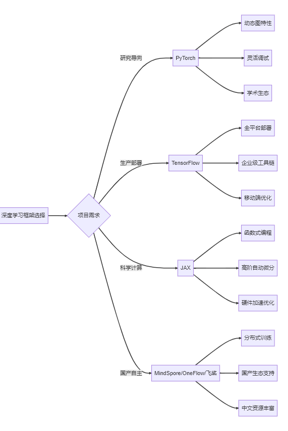{width=\"6.010416666666667in\"
height=\"8.989583333333334in\"}

图2-11 深度学习框架生态图

#### 机器学习全流程工具

除了深度学习框架，传统机器学习工具在结构化数据处理和分析中仍然发挥着重要作用。

**Scikit-learn**作为机器学习领域的经典算法库，以其优雅的设计和强大的功能深受开发者喜爱。该库采用简洁一致的API设计风格，使得各类机器学习算法的调用方式高度统一，用户可以轻松尝试和比较不同算法，显著提升实验效率。Scikit-learn全面覆盖机器学习基础任务，包括分类、回归、聚类等核心功能模块，同时提供丰富的预处理和特征工程工具，构建了完整的机器学习工作流解决方案。这种\"一站式\"的设计理念，加上出色的文档和社区支持，使Scikit-learn成为机器学习实践者和研究人员的首选工具库。

**XGBoost**和**LightGBM**作为结构化数据建模的标杆工具，基于梯度提升树算法在表格类数据任务中展现出卓越的性能表现。这类框架不仅以高效的内存使用和快速的训练速度著称，更通过内置的正则化机制有效防止过拟合，同时提供特征重要性分析功能，既保证了出色的预测准确率，又能帮助开发者理解模型决策过程。特别是在金融风控等需要模型可解释性的关键应用场景中，XGBoost既能提供优异的预测性能，又能通过特征重要性分析揭示关键决策因素，这种性能与可解释性兼备的特点，使其成为结构化数据建模的首选解决方案。

**Spark MLlib**作为专为大规模数据处理设计的分布式机器学习库，其核心优势在于与Spark大数据生态系统的深度集成，能够轻松处理TB级别的海量数据集。该框架不仅支持传统批量训练模式，还提供流式学习和在线预测能力，完美解决了传统机器学习工具难以应对的超大规模数据挑战。特别在电商个性化推荐、广告点击率预测等典型大数据应用场景中，Spark
MLlib通过分布式计算架构实现了对海量用户行为数据的高效处理和分析，为企业在真实业务场景中应用机器学习技术提供了强有力的支持。

#### 专项技术工具链

除了通用框架外，各个AI技术分支也发展出了专门的工具链，以满足特定领域的需求。

**自然语言处理（NLP）**

Hugging Face Transformers已成为预训练模型生态的代名词，其核心优势在于整合了200,000多个包括BERT、GPT等在内的先进预训练模型，并通过统一接口实现不同模型架构的便捷调用。得益于活跃的开源社区和持续更新机制，开发者仅需几行代码就能快速部署这些强大的预训练模型，轻松完成各类复杂NLP任务，无需耗费大量资源从头训练模型。

除Transformers外，NLP领域还有其他特色鲜明的工具可供选择：FastNLP是专为中文处理优化的工具包，提供丰富的中文文本预处理功能；NLTK作为经典的语言学工具包，在词法分析、句法分析等基础NLP任务上表现出色；而SpaCy则以工业级性能和出色的易用性著称，特别适合生产环境中的NLP应用部署。这些工具共同构成了NLP技术开发生态。

**计算机视觉**

OpenMMLab作为计算机视觉领域的综合工具箱，以其模块化设计和全面覆盖能力著称。该套件整合了包括MMDetection（目标检测）、MMSegmentation（语义分割）在内的多个专业子项目，完整覆盖检测、分割、生成等主流视觉任务。通过提供大量预训练模型和详实的技术文档，OpenMMLab构建了从学术研究到工业应用的完整工具链，显著降低了复杂视觉任务的实现门槛。

在目标检测领域，Facebook推出的Detectron2已成为行业标杆框架。该框架凭借出色的目标检测和实例分割性能广受认可，其模块化架构设计既保证了核心功能的高效性，又为开发者提供了灵活的扩展空间。Detectron2还配备了丰富的预训练模型库，帮助开发者快速实现各类检测相关的应用场景。

**强化学习**

Stable
Baselines3作为强化学习领域的标准化工具库，通过提供统一规范的算法实现显著降低了使用门槛。该库与OpenAI
Gym环境实现无缝集成，并配有详尽的文档说明和实用教程，例如可以轻松使用PPO算法训练CartPole平衡游戏。这种设计使得强化学习算法的应用变得简单直观，特别适合教学演示和科研实验场景。

在分布式强化学习领域，Ray
RLlib框架展现出独特优势。该框架不仅支持超大规模分布式训练，还能兼容多种强化学习算法。其高度可扩展的架构设计，使得从单机实验到集群部署的过渡变得平滑高效，为复杂强化学习任务的实现提供了专业级解决方案如下图2-12所示。

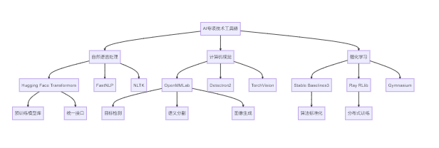{width=\"6.299305555555556in\"
height=\"2.1270384951881014in\"}

图2-12 强化学习工具链架构

#### 如何为你的AI项目选择合适的工具？

在面对如此丰富的AI工具生态时，明智的选择策略往往决定着项目的成败。经验表明，项目需求应当成为选择的首要指南针：当你处于研究探索阶段时，PyTorch与Hugging
Face的组合能够提供最大的灵活性和丰富的预训练模型资源；而当项目进入工业部署阶段，TensorFlow配合TF
Serving则能确保生产环境的稳定性和性能；对于大数据处理场景，Spark
MLlib与Ray架构的结合则是不二之选。除了技术匹配度，团队的技能基础同样不容忽视------优先选择团队已有经验的工具栈，不仅能够降低学习成本，更能有效规避项目风险。此外，社区的活跃程度往往反映了工具的生命力，活跃的开源社区意味着更丰富的资源支持和更快的问题解决速度；而工具背后组织的支持力度和版本更新频率，则直接关系到项目的长期维护性；最后，从数据处理到模型部署的全流程工具支持能力评估，将帮助你构建一个完整而高效的开发生态系统。

开源框架和工具生态构成了AI技术发展的重要基础设施。通过合理选择和组合这些工具，开发者能够显著提升开发效率，将精力集中于解决实际业务问题而非底层技术实现。在企业落地实践中，通常需要根据数据规模、时效要求与资源预算的综合考量来确定核心框架，然后逐步构建包含特征库、AutoML与监控闭环的完整机器学习生产线，实现轻量化、快速化、稳定化的技术架构。

从技术体系的整体视角来看，数据、算法、算力三要素决定了项目实施的技术边界；分层架构为系统建设提供了从底层基础到上层应用的清晰路径；而框架选型则是连接技术理念与实际开发的关键桥梁。这一完整的技术脉络为AI项目的规划和实施提供了系统性指导，帮助从业者准确识别项目瓶颈所在，并在后续的深入学习中找到针对性的解决方案。

## 2.2 核心引擎：从机器学习到深度学习

### 2.2.1 机器学习（Machine Learning）

机器学习是人工智能的核心技术之一，它赋予计算机系统从数据中学习并改进的能力，而无需显式编程。对于非AI专业但从事软件行业的读者来说，理解机器学习的基本原理和应用场景，将帮助你更好地把握AI技术的发展趋势和应用潜力。

#### 机器学习的本质

传统编程与机器学习的根本区别在于解决问题的方法论：传统编程中，程序员编写明确的规则（代码），计算机根据这些规则处理数据，得出结果；而机器学习则是程序员提供数据和期望的结果，计算机自己学习规则（模型），并用这些规则处理新数据。如下图2-9所示。

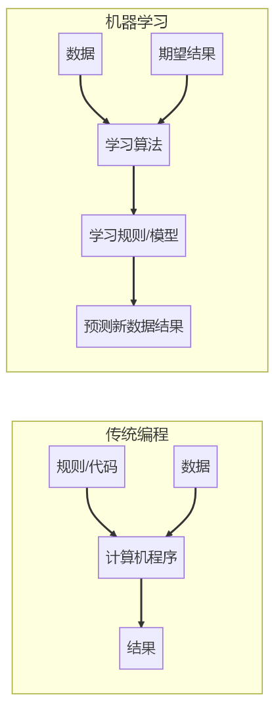{width=\"4.3125in\"
height=\"11.125in\"}

图2-9：传统编程与机器学习的区别

**机器学习的三大类型**

机器学习领域中有三种主要的学习方式：监督学习、无监督学习和强化学习。每种学习方式都有其独特的应用场景和核心特点，下面将逐一介绍。

**监督学习（Supervised Learning）**

监督学习是目前应用最为广泛的机器学习类型。它通过已标记的训练数据（输入和正确的输出）来训练模型，其核心特点是利用有标签的数据来学习输入与输出之间的映射关系。每个训练样本都有明确的\"答案\"（标签），模型的目标是通过这些数据学习出一种模式，从而能够对新的输入数据进行准确的预测。评估模型性能也很直接，只需将预测结果与真实标签进行比较即可。

监督学习主要适用于分类和回归任务。分类任务用于预测离散的类别，例如垃圾邮件检测（是/否）或图像识别（猫/狗/鸟等）。回归任务则用于预测连续的数值，如房价预测、股票价格趋势或温度变化预测。

在监督学习中，常用的算法包括线性回归、逻辑回归、决策树、随机森林、支持向量机（SVM）、K近邻（KNN）和神经网络等。这些算法各有优势，适用于不同的数据类型和任务需求。

**无监督学习（Unsupervised Learning）**

无监督学习则处理的是没有标签的数据。它的目标是发现数据中隐藏的结构或模式，而不是学习输入与输出之间的映射关系。由于训练数据没有明确的\"答案\"，因此无监督学习的评估通常需要依赖间接指标或人工评估。

无监督学习的主要任务类型包括聚类、降维和异常检测。聚类是将相似的数据点分组，例如客户细分、社交网络社区发现或图像分割。降维则是减少数据特征的数量，用于数据可视化、特征提取或数据压缩。异常检测用于识别异常数据点，如欺诈检测、系统故障预警或网络安全监控。

无监督学习的常用算法包括K-均值聚类（K-means）、层次聚类（Hierarchical Clustering）、DBSCAN（基于密度的聚类）、主成分分析（PCA）、t-SNE（t-分布随机邻域嵌入）和自编码器（Autoencoder）等。这些算法能够帮助我们从无标签的数据中提取有价值的信息。

**强化学习（Reinforcement Learning）**

强化学习是一种通过与环境交互来学习最优策略的方法。智能体（Agent）通过在环境中采取行动并根据反馈（奖励或惩罚）来学习。其核心特点包括交互学习、延迟反馈以及探索与利用的平衡。智能体需要在尝试新行动和利用已知好行动之间找到平衡，以最大化长期奖励。

强化学习的主要组成部分包括智能体（Agent）、环境（Environment）、状态（State）、行动（Action）和奖励（Reward）。智能体是学习和决策的主体，环境是智能体交互的外部系统，状态是环境的当前情况，行动是智能体可以执行的操作，而奖励则是环境对行动的反馈信号。

强化学习的常用算法包括Q-学习（Q-Learning）、深度Q网络（DQN）、策略梯度（Policy Gradient）、Actor-Critic方法和近端策略优化（PPO）等。这些算法广泛应用于机器人控制、游戏开发和智能决策等领域。

**案例：三种学习方式教会AI玩游戏**

想象我们要教AI玩一个简单的游戏，比如\"猜数字\"（1-100之间猜一个数字）。

在**监督学习**模式下，AI通过分析带有正确答案标注的游戏记录来学习猜数策略。系统会提供大量完整的游戏数据样本，如当猜测50时得到\"太大\"的提示，猜测25时得到\"太小\"的提示，最终以正确答案37结束。AI从中归纳出\"根据提示调整猜测范围\"的基本规则，在新游戏中应用这种有监督的学习成果，逐步缩小数字范围直至猜中。

**无监督学习**则只需提供未经标注的游戏过程记录，如完整的猜测序列\[50,25,37\...\]和总猜测次数7次等。AI通过分析这些数据自主发现成功游戏普遍采用的\"二分查找\"策略模式------即每次选择当前范围的中间值。虽然没有明确指导，但AI仍能识别出这一高效策略并在新游戏中应用。

**强化学习**采用更接近人类学习的方式，让AI通过直接参与游戏并获得实时反馈来掌握猜数技巧。初始阶段AI随机猜测，系统会给予相应奖励：猜对得高分，有效缩小范围得低分，无效猜测则扣分。通过这种试错机制，AI最终自主发现并优化出最优的二分查找策略，无需任何先验数据或明确指导。

三种机器学习方式各有特点和适用场景，如下图2-10所示。

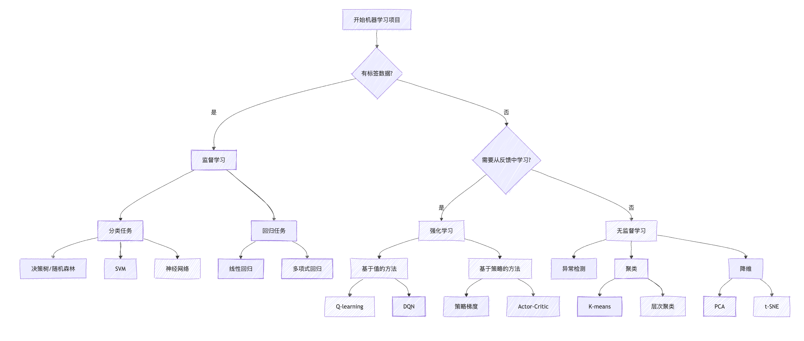{width=\"10.625in\"
height=\"4.514850174978128in\"}

图2-10 机器学习的三大类型

#### 机器学习为何无法突破"经验壁垒"？

尽管机器学习强大，它也有着不可忽视的短板。

首当其冲的是数据依赖问题。就像厨师需要优质食材才能做出美味佳肴一样，机器学习模型的表现完全取决于训练数据的质量和数量。数据不足或存在偏差时，模型就会\"营养不良\"，在面对训练时未曾见过的新场景时往往表现不佳，这种泛化能力的局限让许多企业在实际应用中屡屡碰壁。

更为棘手的是可解释性难题。特别是深度学习模型，它们就像一个神秘的\"黑盒子\"，虽然能给出准确的预测结果，却无法解释自己是如何得出这个结论的。这在医疗诊断、金融风控等需要透明决策的领域尤其成问题。

此外，复杂模型对计算资源的巨大需求也让许多中小企业望而却步，训练一个大型模型可能需要消耗相当于数百户家庭一年的用电量。而更令人担忧的是，模型可能会无意中继承并放大训练数据中的社会偏见，导致在招聘、贷款等场景中出现不公平的歧视性结果。

### 2.2.2 深度学习（Deep Learning）

深度学习是机器学习的一个重要分支，它通过构建和训练多层神经网络来模拟人脑的学习过程。作为当前AI领域最热门的技术之一，深度学习在图像识别、自然语言处理、语音识别等领域取得了突破性进展。对于软件开发者而言，理解深度学习的基本原理和应用场景，将有助于把握AI技术的发展方向和应用潜力。

#### 深度学习：模拟大脑的算法革命

深度学习与传统机器学习的核心差异体现在特征提取的处理方式上。传统机器学习方法通常需要领域专家根据问题特性手工设计和选择相关特征，这些特征随后被输入到学习算法中进行模式识别和分类。这个过程高度依赖人工经验和专业知识，特征质量直接影响最终的模型性能。

深度学习则通过多层神经网络结构实现了特征提取的自动化。原始数据直接输入网络，通过多个隐藏层的逐层变换，系统能够自动学习从低级特征到高级抽象特征的层次化表示。每一层网络都在前一层的基础上提取更加复杂和抽象的特征，最终形成适合特定任务的特征表示。这种端到端的学习方式减少了人工干预，使得模型能够处理更加复杂的数据模式。

深度学习与传统机器学习在特征提取方式上的差异如下图2-11所示。

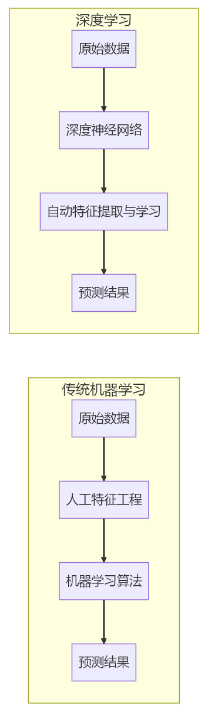{width=\"3.6875in\"
height=\"12.53125in\"}

图2-11：深度学习和传统机器学习对比

#### 解密人工神经网络：AI的思考引擎

深度学习的核心是人工神经网络，它受到人脑神经元结构的启发而设计。

**神经元**是构成神经网络的基本计算单元，其工作机制模拟了生物神经元的信息处理过程。每个神经元接收来自前一层神经元的输入信号，并通过权重参数来调控各个输入连接的重要性程度。同时，神经元还包含偏置项用于微调激活阈值，以及激活函数（如Sigmoid、ReLU等）来引入非线性变换，这些特性共同赋予了神经网络学习复杂模式的能力。

神经网络采用**分层架构**来组织神经元，形成信息处理的层级结构。输入层作为网络的第一层，负责接收和传递原始数据；隐藏层则进行信息的逐层抽象和转换，深度学习中的\"深度\"概念正是指这些隐藏层的数量；最后的输出层负责整合所有信息并生成最终结果。这种分层设计使得网络能够从简单特征逐步构建复杂的特征表示。

神经网络的核心在于神经元之间的**连接关系**，每个连接都对应一个特定的权重值。这些权重在训练过程中通过反向传播算法不断调整，最终形成能够准确建模输入输出关系的参数矩阵。正是这种动态可调的连接机制，使得神经网络具备强大的学习和适应能力。

神经网络的基本组成结构和信息流动方式如图2-12所示

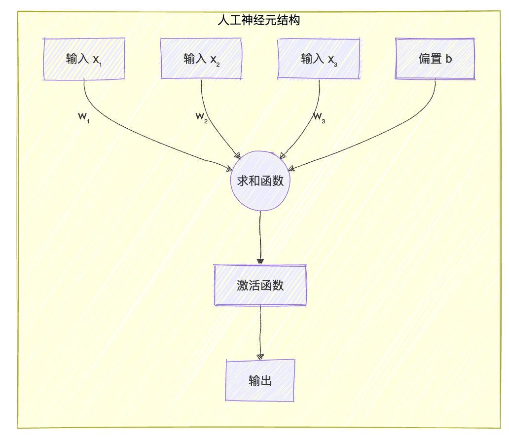{width=\"6.061092519685039in\"
height=\"5.215358705161854in\"}

图2-12：神经网络基础结构

#### 各类神经网络架构解析

**前馈神经网络（FNN）**是最基础的神经网络架构，其特点是信息严格按从输入层到输出层的单向流动，不存在任何反馈或循环连接。这种网络采用层间全连接的简单结构，虽然计算效率高但参数量较大，特别适合处理结构化数据的分类和回归问题，是深度学习入门和教学演示的理想选择。

**卷积神经网络（CNN）**则是专为处理图像等网格化数据而设计的特殊架构。它通过局部连接和权重共享机制大幅减少参数量，并利用池化层实现空间下采样，这些特性使其能高效提取图像的局部特征并保持平移不变性。CNN的这种仿生学设计使其成为计算机视觉领域最成功的神经网络架构之一。其典型应用包括图像分类与识别，目标检测，图像分割，人脸识别等。

**循环神经网络（RNN）**是专为处理序列数据设计的神经网络架构，其最大特点是具有循环连接结构，能够将隐藏层的输出反馈到输入，从而实现对历史信息的记忆功能。RNN通过参数共享机制在序列的不同时间步使用相同的权重，这种设计使其特别适合处理自然语言、语音信号和时间序列等数据。针对传统RNN在长序列训练中的梯度消失问题，研究者开发了LSTM（长短期记忆网络）和GRU（门控循环单元）两种改进结构，它们通过门控机制有效提升了网络对长距离依赖关系的建模能力，在机器翻译、语音识别等领域展现出卓越性能。

**生成对抗网络（GAN）**采用了一种创新的对抗学习框架，由生成器和判别器两个子网络组成。生成器负责生成逼真的数据样本，判别器则试图区分真实样本和生成样本，二者通过这种对抗博弈实现共同优化。GAN的最大优势在于其强大的无监督生成能力，不需要标记数据就能创造出与真实数据分布高度相似的新样本，这使其在图像生成、风格转换、超分辨率重建等视觉任务中表现突出，同时也为艺术创作和数据增强提供了新工具。

**变换器（Transformer）**架构彻底改变了序列建模的传统思路，完全摒弃了循环结构，转而采用自注意力机制来捕捉序列中任意位置之间的依赖关系。其核心组件包括多头自注意力模块、前馈网络以及残差连接与层归一化结构，这些设计使得Transformer能够并行处理整个序列，大幅提升计算效率，同时有效建模长距离依赖关系。这种架构在自然语言处理领域引发革命性突破，催生了BERT、GPT等里程碑式模型，并成功扩展到计算机视觉、多模态学习和语音识别等多个领域，展现出强大的通用性和扩展性。

深度学习领域最重要的几种神经网络架构及其特点如下图2-14所示。

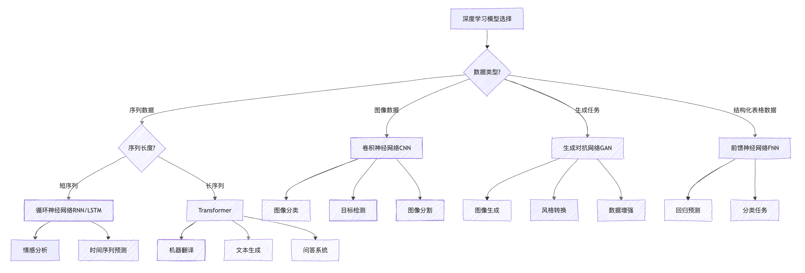{width=\"10.625in\"
height=\"3.620021872265967in\"}

图2-14：深度学习的常见架构

#### 深度学习如何改变各行各业？

视觉领域深度学习的应用极为广泛，涵盖图像分类与识别（如医疗影像诊断、安防监控和自动驾驶场景理解）、目标检测与跟踪（包括人脸识别、行人检测和产品缺陷检测）以及图像生成与处理（如超分辨率重建、图像去噪和AI艺术创作DALL-E、Midjourney等），这些技术正在重塑医疗、安防、制造和创意产业。

自然语言处理方面，深度学习已实现文本理解与生成（应用于智能客服、内容摘要和自动写作）、语言翻译（支持实时翻译和多语言文档处理）以及情感分析（用于社交媒体监测、用户反馈分析和市场研究），极大地提升了人机交互的效率和质量。

语音与音频处理中，深度学习技术赋能语音识别（用于语音助手、会议记录和字幕生成）、语音合成（如有声读物、导航系统和虚拟助手）以及音乐生成与处理（包括AI作曲、音频修复和音乐推荐），正在改变我们获取信息和娱乐的方式。

跨模态应用展现了深度学习整合多模态数据的能力，包括图像描述（为视障人士服务、内容索引）、文本到图像生成（根据描述生成图像、辅助产品设计）以及视频理解（内容分析、行为识别和异常检测），这些突破性应用正在模糊不同媒体类型之间的界限。

#### 深度学习的五大痛点与应对之道

深度学习虽然表现出色，但在实际使用中还是会遇到不少问题。

首先是数据问题。深度学习就像一个需要大量例子才能学会的学生，没有足够的训练数据就很难工作好。而且这些数据还得是有标签的------比如要教计算机认识猫，就得给它看成千上万张标注了\"这是猫\"的图片。在医疗、法律这些专业领域，找专家来标注数据既费时又费钱。

其次是计算成本。训练一个复杂的深度学习模型就像建造一座大楼，需要大量的\"建筑材料\"------也就是计算资源。普通的电脑往往跑不动，必须用专门的GPU服务器，而且一跑就是好几天甚至几周。这对很多小公司和研究团队来说是个不小的负担。

还有一个让人头疼的问题是\"黑盒\"特性。深度学习模型就像一个聪明但沉默的专家，它能给出答案，但不会告诉你为什么这样判断。在银行放贷、医生诊断这些需要解释原因的场合，这就成了大问题。

另外，这些模型有时候表现得像\"书呆子\"------在熟悉的环境里很厉害，但一换个环境就不行了。比如在中国训练的人脸识别系统，拿到欧洲可能就不太好用了。

最后还有安全性担忧。研究发现，只要对输入数据做一些人眼看不出的微小改动，就能让模型犯低级错误。这在自动驾驶、安防监控这些关键应用中可能带来严重后果。

#### 深度学习的前沿探索

面对这些挑战，研究人员正在从多个角度寻找解决方案。

在效率方面，大家都在想办法让模型\"瘦身\"。就像手机从砖头变成现在这么轻薄一样，深度学习模型也在朝着更小、更快的方向发展。通过各种压缩技术，现在已经能让一些模型在手机上流畅运行了。

数据方面的进展也很有意思。研究人员发现，可以让模型先在大量无标签数据上\"自学\"，掌握一些基本技能，然后再用少量标注数据进行\"专业培训\"。这就像先让孩子大量阅读培养语感，再教具体的写作技巧一样。

在解决\"黑盒\"问题上，科学家们开发了各种\"透视\"技术，试图看清模型内部的工作机制。虽然还不能完全做到，但已经能在一定程度上解释模型的决策过程了。

跨领域应用也是个热门方向。现在的趋势是开发能同时处理文字、图片、声音的\"全能型\"模型，就像人类能综合运用各种感官信息一样。

还有一个重要趋势是把计算能力下沉到终端设备。这样不仅响应更快，还能更好地保护用户隐私------数据不用上传到云端，就在本地处理。

最后，大型预训练模型的出现改变了整个行业的玩法。这些模型就像\"万能工具箱\"，可以快速适应各种不同的任务，大大降低了开发门槛。

这些发展方向表明，深度学习正在变得更实用、更亲民，也更符合实际应用的需求。

## 2.3 AI主要应用领域与场景解析

在了解了AI的基础技术架构后，我们需要进一步探讨这些技术如何在实际应用中发挥价值。技术本身只是手段，真正的意义在于解决现实问题。

当前AI技术的应用可以归纳为几个主要领域，每个领域都有其特定的技术特点和应用场景。

**自然语言处理**是AI应用最广泛的领域之一。从搜索引擎的语义理解，到机器翻译、智能客服，再到近年来兴起的大语言模型，这个领域的核心是让计算机理解和生成人类语言。随着多模态技术的发展，现在的系统还能同时处理文本和图像信息。

**语音处理**使人机交互变得更加自然。语音识别将声音转换为文字，语音合成则将文字转换为自然的语音。这项技术在智能助手、车载系统、无障碍辅助等场景中发挥重要作用。

**计算机视觉**赋予机器理解视觉信息的能力。从基础的图像分类、目标检测，到复杂的场景理解、三维重建，这项技术在安防监控、医疗影像、自动驾驶等领域都有重要应用。

**智能推荐**通过分析用户行为数据，为用户提供个性化的内容或商品推荐。这项技术已成为电商、内容平台、广告投放等互联网服务的核心组成部分。

**时序预测**利用历史数据的时间序列特征来预测未来趋势。在金融市场分析、供应链管理、设备维护等需要预测性决策的场景中应用广泛。

**边缘AI**将AI计算能力部署到数据产生的源头，减少数据传输延迟，提高系统响应速度，同时保护数据隐私。这在物联网、移动设备等场景中越来越重要。

**机器人与具身智能**将AI从数字世界扩展到物理世界。通过机器人载体，AI系统能够感知环境、做出决策并执行物理动作，在制造业、服务业等领域展现出巨大潜力。

这些应用领域虽然面向不同的问题域，但在技术层面存在相当程度的重叠。例如，Transformer架构在自然语言处理、计算机视觉等多个领域都有成功应用。同时，每个领域也面临着特有的技术挑战，需要针对性的解决方案。

理解这些应用领域的特点和相互关系，有助于我们更好地把握AI技术的发展趋势，并在实际工作中做出合适的技术选择。

### 2.3.1 自然语言处理（NLP）：让“机器”理解人类语言

自然语言处理（NLP）是人工智能的重要分支，专注于让计算机理解和处理人类语言。从搜索引擎到智能客服，从机器翻译到文档分析，NLP技术已经深入到我们工作和生活的各个方面。

#### 从文字到含义：NLP的基础加工流程

要让计算机理解人类语言，首先需要对文本进行加工。**文本预处理**是所有NLP任务的起点，它好比是烹饪前的备菜环节，包括将长句子切分成词语（分词）、标注每个词的词性（名词、动词等），以及识别出人名、地名等专有名词。这一步的目的是将杂乱的文本整理成计算机可以处理的结构化信息。

在预处理之后，**语义理解**则更进一步，旨在探究文本的深层含义。这包括解决一词多义的问题（如“苹果”可以指水果或公司），理清句子中各个成分扮演的角色（谁做了什么），并明确代词（如“它”）的具体指向。

#### NLP的五大核心能力与应用场景

NLP技术的核心任务是利用对语言的理解来完成实际工作，主要包括：

- **文本分类**：将文本自动归入预设类别。常见的应用有判断评论是好评还是差评的**情感分析**，以及自动过滤**垃圾邮件**。
- **信息抽取**：从海量文本中提取关键信息。例如，从新闻报道中自动抓取事件的发生时间、地点和参与者。
- **机器翻译**：实现不同语言之间的自动翻译，现在的神经机器翻译技术已经能生成相当流畅和准确的译文。
- **问答系统**：直接回答用户提出的问题。无论是“珠穆朗玛峰有多高”这样的常识问题，还是特定领域的专业咨询，问答系统都能提供答案。
- **文本生成**：让计算机像人一样“写作”。应用场景包括自动生成新闻摘要、创作故事，或是作为聊天机器人的“大脑”来生成对话。

#### NLP如何改变我们的工作与生活？

- **智能客服系统**：自动理解客户在聊天窗口或电话中提出的问题，并从知识库中找到答案进行回复，大大提高了服务效率。
- **智能文档分析系统**：快速阅读并分析大量文档（如合同、简历），自动提取关键信息（如合同金额、风险条款），帮助专业人士从繁琐的审阅工作中解放出来。

#### 计算机视觉的挑战与未来：迈向真正的"机器视觉"

尽管NLP技术进步显著，但仍面临挑战，例如，计算机还难以完全理解人类语言中的比喻、讽刺等复杂表达，对小语种和方言的支持也相对有限。

未来的发展重点包括：让强大的语言模型变得更“轻”，以便在手机等普通设备上运行；提高模型决策过程的透明度，让我们能理解它为什么会给出某个答案；以及更好地融合文本、图像和声音等多种信息，构建更全面的理解能力。

### 2.3.2 语音处理：让机器“能听会说”

语音处理技术是实现人机自然对话的关键，它赋予了机器“听懂”人类语言并用语音“回应”的能力。这项技术已广泛应用于智能音箱、语音助手、会议记录、实时翻译等场景，成为连接数字世界与物理世界的桥梁。

语音处理主要包括两大核心方向：

* **语音识别 (ASR)**：将人类的口头语言转化为计算机可读的文本，是所有语音交互应用的基础。无论是向手机下达指令，还是将会议录音整理成文字，都离不开这项技术。
* **语音合成 (TTS)**：将文本信息转化为自然流畅的人类语音。从导航软件的路线播报，到有声读物的情感朗读，语音合成让冷冰冰的文字变得“有声有色”。

此外，还包括一系列重要的支撑技术，如在嘈杂环境中提取清晰人声的**语音增强**，识别说话人身份的**说话人识别**，以及分析语音语调中情感变化的**语音情感分析**。

**【建议插入图表】**

建议此处插入一个**结构图**，标题为“语音处理核心技术生态”。

* **中心节点**：语音处理
* **一级分支**：语音识别 (ASR)、语音合成 (TTS)、语音增强与分离、说话人识别、语音情感分析。
* **二级分支（应用场景）**：
  * ASR下可分支：智能客服、会议纪要、语音输入法。
  * TTS下可分支：智能导航、有声读物、虚拟主播。
  * 其他技术可统一指向：身份认证、智能质检、远程会议等。

#### 解密AI的"耳朵"与"声带"：语音技术核心原理

**1. 语音识别：从声音到文字**

语音识别的过程好比一位速记员，需要准确捕捉声音并将其记录为文字。传统技术如同一个分工明确的团队：声学模型负责识别基本发音，词典负责将发音对应到词语，语言模型则确保最终的句子通顺合乎逻辑。而现代基于深度学习的“端到端”模型，则像一位全能专家，直接将输入的音频流转化为完整的文本，流程更简化，效率也更高。

一个典型的应用是智能会议系统。在多人讨论的复杂场景下，系统首先利用麦克风阵列分离不同发言者的声音，接着进行实时转写，最后通过标点预测和说话人标注，生成一份结构清晰、内容准确的会议纪要。

**2. 语音合成：从文字到声音**

语音合成则像一位专业的配音演员，能将文字赋予生命。传统方法需要先分析文本的语法和情感，再将这些信息转化为声音参数，最后生成语音。现代的端到端系统同样简化了这一流程，可以直接从文本生成高质量、富含情感的语音，甚至能模仿特定人物的声音。

例如，在制作个性化有声读物时，只需提供少量某位朗读者的语音样本，AI就能“克隆”其声音，并用这套声音模型朗读任何文本内容，大大提升了有声内容的生产效率和个性化体验。

**3. 语音增强与分离：在喧闹中听清你**

语音增强技术专注于提升语音质量，如同给声音加上“降噪耳机”。它能有效抑制背景噪声、消除回声、减少空间混响，让目标语音更清晰。语音分离技术则旨在解决“鸡尾酒会问题”，即在多人同时说话的环境中，精准地分离出特定某个人的声音。这些技术对于远程会议、智能驾驶等场景至关重要，能确保在嘈杂环境下依然实现清晰的语音通信。

#### 语音技术挑战与发展方向

语音处理技术的应用已渗透到各行各业。例如，智能客服质检系统能够自动分析客服与客户的通话录音，通过识别关键词和情绪变化，评估服务质量并预警潜在风险，极大地提升了管理效率。

展望未来，语音处理技术正朝着更智能、更便捷的方向发展：

* **更低的依赖**：自监督学习技术（如Wav2Vec 2.0）的出现，使得模型可以从海量无标注的语音数据中自主学习，大幅降低了对人工标注数据的依赖。
* **更强的融合**：语音将与文本、图像等多模态信息深度融合，让AI能够结合上下文和视觉信息进行更精准的理解与交互。
* **更广的应用**：从通过语音特征进行健康筛查，到构建元宇宙中的自然交互界面，再到实现工业场景的语音控制，语音AI的应用边界正在不断拓宽。

对于普通用户和开发者而言，成功的语音应用关键在于平衡技术选型与用户体验。只有精准定义场景需求，并持续优化迭代，才能真正发挥语音AI的巨大潜力，创造以人为中心的智能交互新范式。

### 2.3.3 计算机视觉（CV）：让机器“看”懂世界

计算机视觉（Computer Vision, CV）赋予了机器“看”的能力，使其能够像人一样解析和理解图像、视频中的内容。这项技术已无处不在，从手机拍照时的自动美颜、医院里的医学影像分析，到工厂生产线上的产品质量检测，再到自动驾驶汽车的环境感知，都是计算机视觉在发挥作用。

#### 解密AI的"眼睛"：从像素到智能识别的奥秘

要让计算机看懂世界，需要一系列关键技术协同工作，其过程可以概括为“预处理—特征提取—任务执行”。

1. **图像预处理与特征提取**：首先，系统需要对原始图像进行“净化”和“增强”，例如通过调整对比度、消除噪声等方式提升图像质量。随后，关键是要从中提取出有价值的**特征**，比如物体的轮廓、角点和纹理。这些特征就像是图像的“指纹”，是机器后续识别和理解的基础。
2. **核心视觉任务**：提取特征后，计算机便可以执行具体的视觉任务：

   * **图像分类**：判断图像的整体类别，例如识别一张图片里是“猫”还是“狗”。
   * **目标检测**：不仅要识别出图像中的物体（如行人、车辆），还要用方框标出它们的精确位置。
   * **图像分割**：实现像素级别的精细划分，能够勾勒出每个物体的准确轮廓，甚至区分开同一类别的不同个体，这对于自动驾驶和医疗影像分析至关重要。
   * **目标跟踪与姿态估计**：在视频中持续锁定特定物体，或识别人体的姿态和动作，这些技术在安防监控和人机交互中应用广泛。
3. **三维视觉与视频理解**：除了处理静态的二维图像，计算机视觉还能从多个视角或连续的视频帧中恢复场景的三维结构，或理解视频中的动态事件和行为。这使得机器能够构建更真实、更立体的数字世界。

*（建议插入图表：可设计一张流程图，展示从“原始图像输入”到“图像预处理”、“特征提取”，再到“分类/检测/分割”等核心任务输出的完整过程，帮助读者直观理解计算机视觉的工作流。）*

#### 视觉AI在工作与生活中的应用

计算机视觉的应用深刻地改变了多个行业，以下是几个典型案例：

* **智能零售**：在无人便利店中，视觉系统通过部署在货架和天花板的摄像头，实时进行目标检测和跟踪，准确识别顾客拿取和放回的商品，自动完成结算，极大地提升了购物体验。
* **自动驾驶**：自动驾驶汽车的“眼睛”就是一套复杂的视觉感知系统。它融合摄像头、激光雷达等多种传感器的数据，通过图像分割解析道路边界，利用目标检测识别车辆和行人，并预测其动向，为安全驾驶提供决策依据。
* **医疗影像分析**：在医疗领域，计算机视觉成为医生的得力助手。AI系统能够辅助医生分析CT、MRI等医学影像，通过图像分割精确圈出潜在的病灶区域，并基于大量数据进行比对，为疾病的早期筛查和诊断提供重要参考。

#### 迈向真正的"机器视觉"

尽管计算机视觉技术取得了巨大成功，但仍面临诸多挑战，例如在光照变化、物体遮挡等复杂场景下的**鲁棒性**，对海量标注数据的**依赖**，以及人脸识别等应用引发的**隐私伦理**问题。

未来，计算机视觉将朝着更智能、更高效的方向发展。**自监督学习**有望减少对人工标注数据的依赖；**多模态融合**技术将结合视觉与语言信息，实现更深层次的场景理解；而**生成式AI**则能创造出前所未有的逼真图像和视频内容，为内容创作和虚拟现实开辟新的可能。

### 2.3.4 智能推荐：AI如何读懂你的喜好？

智能推荐旨在“猜你喜欢”，核心是解决“人与物”的匹配问题。它通过分析你的历史行为（如浏览、购买记录），来预测你可能感兴趣的商品、音乐或新闻，并主动推送给你。

为了更好地区分，我们可以将其与另一项重要的预测技术——时序预测进行对比。

**【建议插入图表】**

建议此处插入一个**对比表**，标题为“智能推荐 vs. 时序预测”。

* **对比维度**：核心目标、处理对象、典型场景、关键技术。
* **智能推荐**：匹配用户与物品、用户行为数据、电商/内容平台、协同过滤/深度学习。
* **时序预测**：预测未来数值、时间序列数据、金融/供应链、ARIMA/LSTM/Transformer。

在信息过载的今天，智能推荐系统就像一位贴心的私人导购，帮助我们在海量信息中快速找到所需。它的工作流程可以概括为“认识你-筛选商品-精准推送”三步。

**1. 核心算法：如何\"猜你喜欢\"？**

* **协同过滤**：这是最经典的方法，核心思想是\"物以类聚，人以群分\"。它会找到与你品味相似的用户，把他们喜欢的、而你还没接触过的好东西推荐给你（User-CF）；或者，找到与你喜欢的物品相似的其他物品推荐给你（Item-CF）。这种方法简单有效，但如果是一个新用户或新商品（即\"冷启动\"），系统就难以判断。
* **基于内容的推荐**：这种方法则关注物品本身的内容特征。比如，你喜欢科幻电影，系统就会分析电影的标签（导演、演员、剧情类型），然后推荐其他具有相似标签的科幻片。这能很好地解决冷启动问题，但推荐结果可能比较单一，缺乏惊喜。
* **深度学习**：现代推荐系统普遍采用深度学习技术，它能更深入地理解用户兴趣和物品特征之间复杂的非线性关系，捕捉用户兴趣的动态变化，从而做出更精准、更多样化的推荐。例如，抖音的推荐系统会综合分析视频内容、你的观看历史、停留时长、互动行为等多维度信息，实现高度个性化的内容分发。

**2. 推荐系统的评估标准与性能指标**

一个好的推荐系统，不仅要推得“准”，还要推得“好”。评估标准是多维的：除了**准确率**和**召回率**，还要考虑推荐结果的**多样性**（避免信息茧房）、**新颖性**（带来惊喜），并最终服务于商业目标，如**点击率**和**转化率**。

在**电商领域**，阿里巴巴的推荐系统通过多层筛选（召回、粗排、精排、重排），实现了“千人千面”的个性化购物体验。展望未来，推荐系统将从“猜你喜欢”走向“懂你所需”，更注重因果关系和可解释性，并打破平台壁垒，实现跨域推荐。

### 2.3.5 时序预测：AI如何洞察未来趋势？

时序预测旨在“预见未来”，核心是预测某个指标在未来的数值。它通过分析历史数据（如过去一年的销售额、未来三天的天气），来揭示其内在的趋势、周期性规律，从而预测未来的走向。无论是预测股票走势，还是预估下个季度的销售额，都离不开这项技术。

**1. 时序预测的核心原理与数据特征**

时序数据通常包含四大特征：**趋势性**（长期上涨或下跌）、**季节性**（如冬季用电量高于夏季）、**周期性**（如经济的周期性波动）和**随机性**。时序预测模型的核心任务就是从复杂的数据中分解并学习这些模式。

**2. 主要模型：从统计到深度学习**

* **经典统计模型**：如ARIMA模型，擅长捕捉数据自身的线性规律，模型简单、可解释性强，在许多传统领域依然广泛应用。
* **机器学习模型**：如Facebook开源的Prophet模型，能自动处理季节性、节假日等复杂因素，对使用者非常友好。
* **深度学习模型**：如LSTM和Transformer，凭借其强大的非线性建模能力，能够处理更复杂、更长期的依赖关系，在金融、气象等高精度要求的领域表现突出。

在**金融领域**，量化投资公司利用时序预测模型分析市场数据，制定交易策略。在**工业领域**，通过分析设备运行数据，可以预测故障发生时间，实现预测性维护。

未来时序预测将更多地融合领域知识（如物理规律），并从单一的数值预测转向对未来不确定性的量化评估，为决策提供更全面的参考。

### 2.3.6 边缘AI：智能如何走出云端，落地到你身边？

随着物联网设备爆发式增长和隐私保护需求提升，将AI能力从云端下沉到边缘设备已成为技术发展趋势。边缘AI指在靠近数据源的设备上直接运行AI算法和模型，而非将所有数据传输到云端处理。从智能手机语音助手到工厂质检设备，从智慧城市交通摄像头到家庭智能音箱，边缘AI正重塑人工智能应用形态。

#### 云边端协同：边缘AI的分层智能架构

边缘AI系统采用分层架构，根据计算能力和任务复杂度在不同层级部署AI功能，如下图2-39所示。

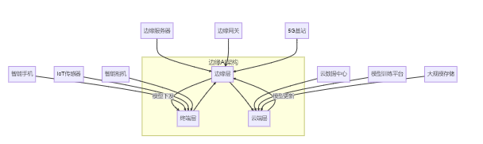{width=\"6.299305555555556in\"
height=\"1.8752865266841645in\"}

图2-39 边缘AI的分层架构与技术实现

#### 为什么AI需要走向边缘？四大核心优势解析

**低延迟响应**

边缘AI能实现毫秒级响应速度，对自动驾驶、工业控制等实时性要求高的场景至关重要。以自动驾驶为例，云端处理需要几百毫秒，而时速100公里下汽车每100毫秒前进约2.8米。边缘AI将算法部署在车载计算单元，可将响应时间缩短至10-20毫秒，提供充足制动时间。

**带宽优化与成本节约**

边缘AI在本地处理数据，仅传输结果而非原始数据，显著减少带宽占用和成本。一个高清监控摄像头每秒产生约5MB数据，智慧城市部署万台摄像头后，采用边缘AI方案可将数据量减少99%以上，节约带宽资源和存储成本。

**隐私保护与数据安全**

边缘AI允许敏感数据在本地处理，避免原始数据上传云端。新一代智能音箱采用本地唤醒词检测技术，只在确认用户指令后才传输特定请求到云端，确保日常对话不被记录上传，平衡隐私保护与功能丰富度。

**离线可用性与鲁棒性**

边缘AI可在网络不稳定甚至断网情况下持续工作。配备边缘AI的矿山巡检机器人能在完全离线环境中自主完成路径规划、障碍物避让等任务，即使失去联系也能安全返回，提升恶劣环境下的作业可靠性。

#### 边缘智能的技术突破

**模型压缩与优化技术**

将AI模型部署到资源有限的边缘设备需要模型压缩与优化技术，如下图2-40所示。

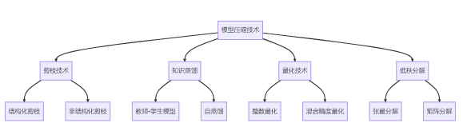{width=\"6.083333333333333in\"
height=\"1.6041666666666667in\"}

图2-40 边缘AI模型压缩技术体系

通过模型压缩技术，可将原本需要强大计算资源的AI模型转化为轻量级版本，缩小到原来1/10大小，同时保持90%以上准确率，实现在智能手机等设备上流畅运行。

**联邦学习与分布式训练**

联邦学习允许多个边缘设备在不共享原始数据的前提下协作训练AI模型，如下图2-41所示。

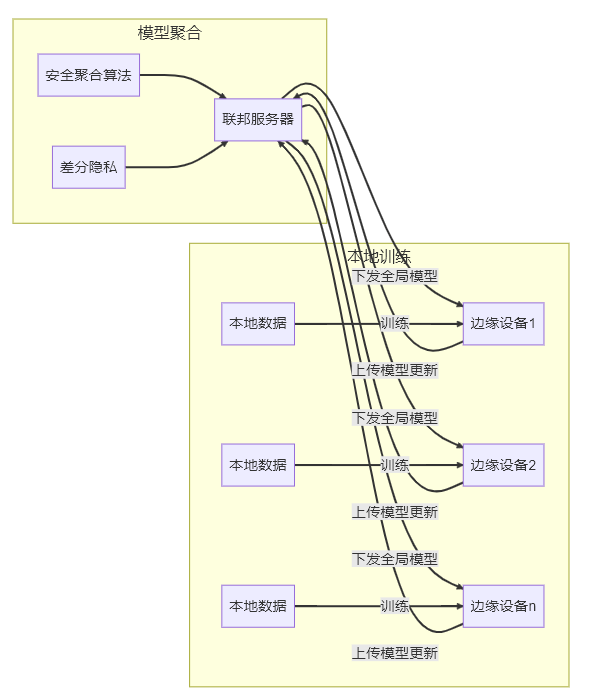{width=\"6.21875in\"
height=\"7.270833333333333in\"}

图2-41 联邦学习工作原理

以智能手机键盘为例，每部手机在本地学习用户输入模式，只将模型更新（非原始内容）加密发送到服务器。服务器汇总来自数百万设备的更新，生成改进的全局模型并分发回各设备，让用户从集体经验中受益，同时保护个人数据隐私。

**硬件加速与专用芯片**

为支持边缘AI高效运行，各类专用硬件加速方案应运而生，如下图2-42所示。

{width=\"6.145833333333333in\"
height=\"1.6770833333333333in\"}

图2-42 边缘AI硬件加速技术体系

通过专用AI加速芯片，AI模型性能显著提升。智能安防摄像头采用专用AI芯片后，单个设备可同时处理多路高清视频流，执行人脸识别、行为分析等多任务处理，功耗仅8W，节能90%以上。

#### 从工厂到家庭的边缘AI革命

**智能制造：工业4.0的核心推动力**

边缘AI正重塑制造业生产方式，为工业4.0提供技术支撑。某制造企业引入边缘AI后，机床配备声音传感器和边缘计算模块，通过分析声音特征识别早期故障征兆，在本地完成分析并向维护人员发出预警，显著降低设备故障率和停机时间。

**智慧城市：无处不在的智能感知**

边缘AI为智慧城市提供分布式智能感知能力，构建城市\"神经系统\"。某城市部署基于边缘AI的智能交通系统，在路口安装摄像头和边缘计算单元，本地实时分析交通数据并动态调整信号灯。系统响应时间控制在100毫秒内，能识别特种车辆并提供绿色通道，使路口等待时间减少47%，通行效率提升35%。

**消费电子：个人智能助手的进化**

边缘AI重新定义智能手机、可穿戴设备等产品体验。智能手机的计算摄影技术依靠边缘AI，在拍摄夜景时连续捕捉多张照片并在本地处理，合成清晰照片。整个过程在手机本地完成，保护用户隐私，避免网络延迟，即使无网络也能运行，同时保持低电量消耗。

**医疗健康：普惠AI医疗的实现路径**

边缘AI将医疗诊断能力下沉到基层机构和家庭设备。某医疗科技公司开发的皮肤病辅助诊断应用，将大型模型压缩至23MB，在智能手机上运行，用户拍摄照片后在本地分析，识别200多种皮肤病并提供建议，帮助基层医生提高诊断准确率，节省患者转诊时间和成本。

#### 万物互联的智能之路

边缘AI技术呈现几大趋势：超低功耗推理、自适应边云协同、多模态融合和边缘自主学习，推动AI向分布式、高效方向发展。同时面临资源约束、安全问题、异构设备管理和开发复杂性等挑战，需要算法、硬件、系统层面协同创新。

边缘AI代表了AI技术发展的重要方向——将智能从集中式云中心扩展到分布式终端网络，实现\"无处不在的智能\"。通过将AI能力下沉到边缘，解决了实时性、带宽、隐私等挑战，开辟全新应用场景，让AI融入日常生活和工作环境。

随着边缘计算硬件进步、模型优化创新和开发工具成熟，边缘AI将迎来爆发式增长，推动AI普惠化、场景化、个性化，在工业生产、城市管理、个人设备和医疗健康等领域带来革命性变革，让智能真正走进每个人的生活。

### 2.3.7 机器人与具身智能：AI如何获得"身体"与"行动力"？

具身智能（Embodied
Intelligence）是指通过与物理环境的直接交互来获取知识和技能的能力。不同于传统AI主要处理抽象数据，具身AI必须通过\"身体\"（机器人硬件）与真实世界互动，从而学习感知-动作映射关系。机器人要在真实世界中执行任务，首先需要感知和理解周围环境。机器人通过各种传感器获取物理世界的信息，并将这些信息转化为可理解的数据表示过程被称为\"机器人感知\"。

现代机器人通常配备如图图2.3.7-1的多种传感器，形成类似于人类多感官系统的感知网络。如同医院配送机器人配备的RGB-D相机识别环境、激光雷达精确测距、麦克风阵列接收语音、触觉传感器检测碰撞以及IMU监测自身运动状态。当遇到推病床的护士时，机器人能融合视觉识别人物、激光雷达测算距离、麦克风接收语音指令等多源信息，综合判断后执行礼让行为并语音回应\"请先通过\"，展现了多传感器协同工作的智能响应能力，如下图2-46所示。

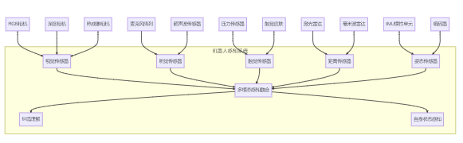{width=\"9.593672353455817in\"
height=\"2.9722222222222223in\"}

图2-46 机器人多模态感知系统架构

现代机器人还可以通过多层次传感器融合与环境理解技术实现精准操作。以工业装配机器人为例：首先融合RGB和深度相机数据生成彩色点云（低级融合），再结合视觉与力触觉数据识别物体位置、姿态和材质特性（中级融合），最终整合所有传感信息与机器人本体状态形成完整场景理解（高级融合）。这种分层融合策略使机器人能智能调整抓取力度------对金属件加大力度，对塑料件轻柔抓持，确保在精密装配中既准确定位又避免零件损伤。

#### 机器人如何"学习"？

具身智能的学习机制强调智能体通过与环境实时交互来获取知识，其核心是\"感知-行动-反馈\"的闭环学习。不同于传统AI的静态训练，具身智能通过多模态传感器（视觉、触觉等）获取环境信息，结合强化学习或模仿学习不断优化决策，并在物理交互中验证和修正模型。这种机制更接近人类学习方式，使智能体能适应动态环境，完成抓取、导航等复杂任务。具身学习的核心机制可以概括为一个持续的反馈循环，如下图2-47所示。

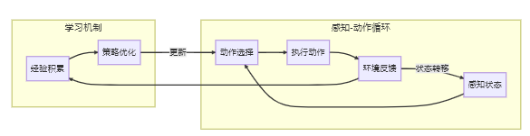{width=\"6.09375in\"
height=\"1.5729166666666667in\"}

图2-47 具身学习的基本循环

以家庭服务机器人学习抓取餐具为例。传统方法可能需要精确建模每种餐具的几何形状和物理特性，而具身学习则采用\"试错\"方式：

机器人观察餐具（感知状态），尝试一种抓取方式（动作选择与执行），感知抓取是否成功（环境反馈），记录这次尝试的结果（经验积累），根据成功和失败的经验调整抓取策略（策略优化）。

通过数百次尝试，机器人逐渐学会：叉子应该从柄部抓取、碗需要从侧面托住、玻璃杯要控制适当的抓取力度。这种学习方式不需要精确的物理模型，而是通过实际交互获得的经验来构建抓取技能。

**模仿学习**是具身智能机器人快速掌握新技能的主要算法。在工业装配场景中，机器人通过观察人类示范的动作序列（如抓取、插入），利用视觉系统解析并映射到自身运动控制，实现\"看学\"操作。这种方法显著降低了机器人编程门槛。

**强化学习**赋予机器人自主优化行为的能力。四足机器人通过在虚拟环境中尝试不同步态，根据稳定性、能效等奖励信号自动优化行走策略，最终适应各种复杂地形。这种\"试错学习\"机制使机器人获得了超越传统编程的适应性。

**自监督学习**帮助机器人理解物体物理特性。通过主动抓取和触碰各类物体，机器人建立视觉外观与触觉特征（重量、摩擦力等）的关联模型，实现仅凭视觉就能预判抓取参数的智能，如对光滑玻璃杯自动调整抓取力度。

#### 机器人如何改变工作与生活？

**工业机器人**

工业机器人是最早实现商业化的机器人类型，正从传统的预编程自动化向智能化、柔性化方向发展。

传统汽车装配线上的机器人需要精确定位每个零部件，对环境变化极为敏感。而新一代智能装配机器人则具备适应性：配备高精度相机和3D视觉系统，能够识别零部件位置和姿态的细微变化；内置AI算法能够根据视觉反馈实时调整运动轨迹；力控制系统使机器人能够感知接触力，安全地与人类工人协作。

在宝马工厂的一条混合生产线上，同一台机器人可以处理不同车型的装配任务，无需停线重新编程。当生产计划变更时，机器人能够自动识别新车型，调整抓取点和装配顺序，大大提高了生产线的灵活性和效率。

**服务机器人**

服务机器人旨在辅助或替代人类完成服务类工作，正从结构化环境向非结构化开放环境拓展。

在现代智慧医院中，配送机器人已成为医护人员的得力助手：结合激光SLAM技术与视觉识别，能够在复杂医院环境中精确定位和避障；同一台机器人可以配送药品、餐食、医疗器械和检验样本；通过语音识别和自然语言处理，能够接收口头指令并进行简单对话；能够识别电梯、自动门，并通过物联网接口与医院设施交互。

以上海某三甲医院为例，一支10台服务机器人的队伍每天可完成300多次配送任务，覆盖24个病区，大大减轻了医护人员的负担，提高了医疗资源的周转效率。这些机器人能够自主乘坐电梯、避让行人，甚至在遇到拥堵时礼貌地请求让路。

**特种机器人：挑战极端环境的\"机器英雄\"**

特种机器人被设计用于执行危险、困难或人类难以到达的环境中的任务，代表了机器人技术的前沿应用。

在地震、火灾等灾难现场，搜救机器人能够进入人类无法安全进入的区域：采用履带、腿足或混合结构，能够翻越障碍物、爬楼梯和穿越狭窄空间；配备热成像相机、气体传感器、声音探测器等，能够探测被掩埋人员的生命迹象；通过激光扫描和计算机视觉，评估建筑物的结构稳定性和坍塌风险；在通信受限区域建立网络，保持与指挥中心的实时连接。

在2023年土耳其地震救援中，一种蛇形搜救机器人成功穿过狭窄的废墟缝隙，发现了被埋72小时的幸存者。这种机器人配备热成像和声音传感器，能够在视线受限的环境中探测人体热量和微弱的呼救声。更重要的是，它的柔性结构能够适应不规则空间，将救援设备传递给被困人员，为救援争取宝贵时间。

#### 从工具到伙伴的智能进化之路

机器人与具身智能技术正呈现明确的发展趋势，如下图2-48所示。

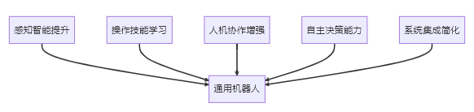{width=\"6.0625in\"
height=\"1.4375in\"}

图2-48 机器人技术发展趋势

机器人与具身智能技术正呈现几大发展趋势：多模态感知与深度学习结合赋予类人感知能力；操作技能学习从大数据驱动转向经验驱动；人机协作向自然交互演进；自主决策能力支持动态环境规划；模块化设计降低开发门槛。这些进步正推动机器人从工业场景渗透至日常生活各领域。

当前面临的核心挑战包括：环境变化下的感知鲁棒性、精细操作的灵巧性提升、学习效率优化、能源续航突破以及安全伦理规范。这些技术瓶颈的突破将决定机器人应用的深度和广度。

展望未来，具身智能将推动AI从虚拟走向物理世界。随着感知、控制和学习技术的融合，机器人将具备环境适应和自主进化能力，实现从\"程序执行\"到\"智能行动\"的跨越，最终构建人机深度协作的新生态。这一转变不仅重塑生产力，更将重新定义人机关系。

## 2.4 大语言模型：AI如何掌握人类语言的奥秘？

大语言模型（LLM）可以说是近年来自然语言处理领域最引人注目的技术突破。这些模型通过学习互联网上的海量文本，掌握了理解和生成人类语言的能力。从ChatGPT的火爆出圈到各种AI工具的普及，LLM已经开始改变我们的工作和生活方式。对于软件开发者来说，理解这项技术的原理和应用场景，有助于抓住新的技术机遇。

大语言模型的发展其实经历了一个渐进的过程：

最早期的统计语言模型主要基于n-gram等简单的统计方法，只能处理很短的文本片段。后来出现了Word2Vec、GloVe这样的词嵌入技术，能够将词语转换成数学向量，让计算机更好地理解词语之间的关系。

接着是LSTM、GRU等循环神经网络的应用，这些模型能够处理更长的文本序列，但计算效率不高。真正的转折点出现在2017年，Google Brain团队提出了Transformer架构，这个设计大大提高了处理效率。

在此基础上，BERT、GPT等预训练模型开始出现，它们先在大量文本上进行\"通识教育\"，然后再针对具体任务进行\"专业培训\"。最近几年，模型规模越来越大，参数从最初的几千万增长到现在的千亿级别。

### 2.4.1 AI语言巨人：主流大模型的能力与特点

当前主流的大语言模型主要分为几大代表性系列：

**OpenAI的GPT系列**（包括GPT-3/3.5/4）基于自回归语言模型架构，以其卓越的文本生成能力著称，擅长内容创作、对话系统和代码生成等任务，其突出的上下文学习能力使其能够适应多种应用场景。

**Google的BERT系列**（包括BERT/RoBERTa/DeBERTa）则采用掩码语言模型架构，特别擅长文本理解任务，凭借双向上下文理解的优势，在搜索引擎优化、情感分析和命名实体识别等分类抽取任务中表现优异。

**Meta的LLaMA系列**（LLaMA/LLaMA2）作为开源大语言模型的代表，通过高效的架构设计和开放的生态系统，为研究社区和开发者提供了重要的基础模型资源。

**Anthropic的Claude系列**（Claude/Claude2）则专注于构建安全可靠的AI助手，其特色在于超长的上下文窗口和对有害内容输出的严格控制，特别适合客服、内容审核等对安全性要求较高的应用场景。

**百度的文心大模型系列**（如ERNIE
3.0/4.0）充分发挥其搜索和知识图谱优势，在知识增强和产业落地方面表现突出，广泛应用于金融风控、智能文档处理等场景。

**阿里云的通义千问系列**通过与云计算基础设施深度集成，支持超长上下文理解，其创新的多模态统一架构为电商客服和内容生成提供了强大支持。

**腾讯的混元大模型**则基于其庞大的社交生态数据，在中文语境理解和实时交互方面独具特色，为游戏NPC和微信生态注入了智能活力。

主流大语言模型从开放性和模型规模的对比情况，如下图2-16所示。

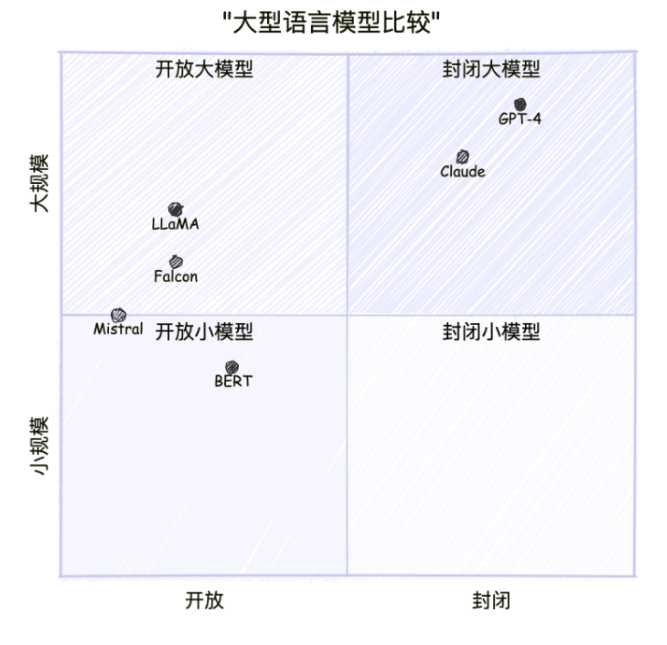{width=\"5.677083333333333in\"
height=\"5.489832677165355in\"}

图2-16：主流大语言模型从开放性和模型规模对比

### 2.4.2 揭秘大模型：从架构到训练的核心技术

**变换器（Transformer）**架构作为现代大语言模型（LLM）的基础，通过自注意力机制实现了对序列数据的高效并行处理。其核心组件包括：自注意力机制（计算位置间关联度，支持多头注意力从不同角度捕捉关系）、前馈神经网络（增强非线性表达能力）以及残差连接与层归一化（稳定深层网络训练）。这种设计突破了传统RNN的顺序处理限制，为处理长文本提供了有效方案。

现代LLM普遍采用\"预训练+微调\"的开发范式。预训练阶段通过海量通用文本的自监督学习（如掩码语言建模）来掌握语言规律和世界知识，这一过程需要数百GPU/TPU的算力支持；微调阶段则在特定任务数据上调整模型参数以适应专业领域；而提示工程技术更进一步，通过精心设计的输入模板引导模型行为，实现无需参数更新的\"在上下文中学习\"。

实现大语言模型需要多项关键技术支撑：模型并行化将网络分布到多个计算设备；混合精度训练（如FP16）显著提升计算效率；梯度检查点技术优化内存使用；Adam等高效优化器适应超参数规模；数据并行训练加速批量处理。这些创新共同解决了训练超大规模模型面临的计算、存储和优化挑战。

**案例分析：大语言模型的工作原理**

以一个简单的问答为例，看看大语言模型是怎么工作的。假设你问它：\"巴黎是哪个国家的首都？\"

**第一步：拆解问题**

模型首先把问题切分成一个个词语单元：\[\"巴黎\", \"是\", \"哪个\",
\"国家\", \"的\", \"首都\",
\"？\"\]，这就像我们阅读时会自然地识别出每个词一样。

**第二步：理解词义**

每个词都会被转换成一串数字（向量），这些数字包含了词语的含义信息。比如\"巴黎\"的向量会包含\"城市\"、\"欧洲\"、\"浪漫\"等语义特征。

**第三步：分析关系**

模型会分析词语之间的关系，发现\"巴黎\"和\"首都\"联系紧密，\"国家\"和\"首都\"也有很强的关联。这个过程叫做注意力计算，就像人在理解句子时会重点关注某些关键词一样。

**第四步：理解问题**

通过多层处理，模型逐渐理解这是一个关于地理知识的问题------询问某个城市属于哪个国家。

**第五步：调取知识**

模型从训练时学到的大量知识中找到相关信息：巴黎确实是法国的首都。

**第六步：组织回答**

最后，模型组织语言给出回答：\"巴黎是法国的首都。\"

整个过程虽然复杂，但发生在几毫秒之内。大语言模型的具体处理步骤如下图2-17所示。

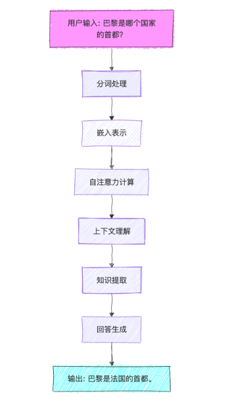{width=\"3.9791666666666665in\"
height=\"6.96875in\"}

图2-17：大语言模型的处理步骤

### 2.4.3 AI创造力的爆发：生成式AI如何重塑内容创作？

生成式AI技术正在以前所未有的速度改变我们创造和交互的方式。从文字到图像，从代码到视频，生成式AI已经渗透到各个领域，为创意工作者、开发人员和普通用户提供了强大的创作工具。本节将深入探讨生成式AI在不同场景下的典型应用，通过直观的案例和流程图帮助读者快速理解这些技术的工作原理和应用价值。

**文生图（Text-to-Image）技术**

文生图技术让用户可以通过文字描述生成对应的图像。这项技术基于扩散模型和Transformer架构，工作过程相对简单：先将文字描述转换为计算机能理解的语义信息，然后用这些信息指导图像生成过程，最后通过多次优化得到符合描述的图像，文生图技术的处理流程如下图2-49所示。

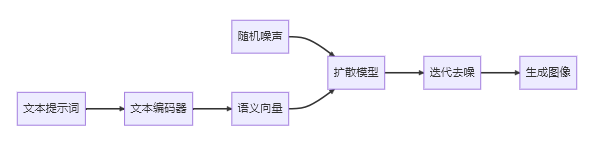{width=\"6.299305555555556in\"
height=\"1.5799562554680664in\"}

图2-49 文生图技术的处理流程

在产品设计领域，AI生成技术正带来革命性变革。设计师们采用文生图技术，只需输入详细的产品描述（如风格、材质和功能要求），Midjourney或DALL-E
3等文生图模型就能快速生成多个设计概念图。这一流程不仅将设计迭代速度提升数倍，还能提供超出设计师常规思维的创意方案，显著缩短产品开发周期并降低前期成本。设计师可以从AI生成的多样化方案中选择最优概念，再进行专业细化，实现人机协同创新。

教育内容创作同样受益于AI生成技术。教材编写者通过输入教学概念的文字描述，系统即可自动生成与之匹配的插图，确保视觉内容与教学文本的高度一致。这种方法不仅大幅降低了教育内容制作成本，更能将抽象知识转化为直观图像，有效提升学习效果。内容创作者只需对AI生成的插图进行简单筛选和微调，即可获得专业级教学素材，极大提升了教育资源的开发效率。

**图生文（Image-to-Text）技术**

图生文技术能够\"看懂\"图像并生成相应的文字描述。这项技术结合了计算机视觉和自然语言处理，通过视觉编码器提取图像特征，然后将这些特征转换为文字描述。图生文技术的处理流程如下图2-50所示。

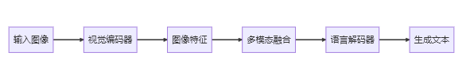{width=\"6.208333333333333in\"
height=\"1.09375in\"}

图2-50 图生文技术的处理流程

在企业图像管理中，这项技术解决了一个长期存在的问题。系统可以自动分析图像内容并生成文字描述，建立可搜索的数据库。员工可以用自然语言快速找到需要的图片，不再需要依赖人工标注。

对于视障人士，这项技术具有特殊的社会价值。系统可以实时解析环境图像或社交媒体图片，生成详细的语言描述，然后转换为语音播报。这大大提升了视障人士获取视觉信息的能力。

**代码生成：AI成为程序员的智能助手**

代码生成技术能够根据自然语言描述自动生成可执行的程序代码。这是AI如何成为程序员的智能助手。这项技术基于专门训练的大语言模型，如GitHub
Copilot使用的Codex等，代码生成技术的处理流程如下图2-51所示。

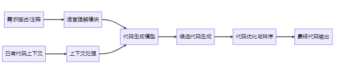{width=\"6.083333333333333in\"
height=\"1.3645833333333333in\"}

图2-51 代码生成技术的处理流程

在软件开发领域，AI编程助手正带来显著变革。开发者只需通过自然语言描述功能需求，智能系统即可分析上下文并生成符合项目规范的代码，大幅提升开发效率并减少重复劳动。这种技术不仅帮助专业程序员快速实现功能模块，还能辅助编程初学者通过实例学习，同时促进团队代码风格标准化和最佳实践的普及。

低代码/无代码平台通过AI技术实现质的飞跃。业务人员无需编程经验，通过可视化界面或简单语言描述即可生成完整应用，系统自动处理后端逻辑和前端实现。这种变革性方案显著降低了应用开发门槛，使业务部门能够自主实现数字化需求，既减轻了IT团队压力，又加速了企业创新迭代速度，推动组织整体数字化转型进程。

**视频生成：AI成为影视创作的革命力量？**

视频生成是生成式AI的前沿领域，能够创建从简单动画到复杂叙事视频的各种内容。这项技术结合了图像生成、时序建模和动作控制等多种技术，视频生成技术的处理流程如下图2-52所示。

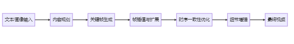{width=\"6.041666666666667in\"
height=\"0.9166666666666666in\"}

图2-52 视频生成技术的处理流程

在电商营销领域，AI视频生成技术正带来革命性变革。系统通过接收产品基础信息（如图片、描述和卖点），自动生成包含动画、场景、文字和音效的完整营销视频。这一解决方案将传统需要专业团队数天完成的视频制作流程压缩至分钟级，不仅实现低成本、大批量的营销内容生产，更能通过动态展示显著提升产品吸引力和销售转化率，为电商平台创造了全新的内容运营模式。

教育领域同样受益于AI视频生成技术。系统通过智能分析学习者的知识水平和偏好特征，自动调整教学视频的讲解速度、难度和案例，生成完全个性化的学习内容。这种定制化方案既保持了优质教育资源的一致性，又能满足不同学习者的特殊需求，在提高学习效果和参与度的同时，大幅降低了优质教育视频的制作成本，为教育公平和个性化学习提供了技术支撑。

**跨模态生成技术的融合应用**

随着生成式AI技术的发展，不同模态间的转换和融合应用正成为新趋势，如文本生成视频、音频生成动画等。让我们来看2个典型案例。

在内容创作领域，AI驱动的全流程平台正重新定义创意生产方式。创作者仅需输入创意概念，系统即可自动完成从文本生成、配图设计到视频制作的完整流程，包括分镜脚本、视频片段、配音和背景音乐的一站式输出。这种集成化解决方案不仅将传统需要多专业协作的内容创作周期大幅压缩，更打破了专业技术壁垒，让更多创意人才能够无障碍地实现想法，推动内容创作产业向更民主化的方向发展。

企业级虚拟人技术通过多模态AI融合实现了质的突破。系统基于文本描述生成个性化虚拟形象，结合语音合成、视频生成和大语言模型技术，打造出具备自然交流能力的数字代言人。这种创新应用不仅提供24/7的品牌互动服务，降低对真人明星的依赖和成本，更能通过深度个性化设置满足不同用户的交互需求，开创了品牌营销和客户服务的新范式。

### 2.4.4 大模型的双面性：超凡能力与不可忽视的局限

大语言模型展现出四大**核心能力**：在语言理解方面，不仅能准确把握文本语义，还能维持长对话的连贯性，并准确执行用户指令；其知识提取能力涵盖事实性知识、生活常识和程序性知识；内容生成方面擅长文本创作、代码编写和创意写作；同时具备一定程度的逻辑推理、常识推理和数学推理能力。这些能力使大模型能够处理从日常问答到专业咨询的广泛需求。

然而，大模型仍存在显著**局限**：首要问题是可能产生看似合理实则错误的\"幻觉\"信息，且难以区分事实与虚构；其知识受限于训练数据的时间范围，无法获取最新信息；在复杂推理和数学运算方面表现有限；上下文处理长度存在技术瓶颈；更值得关注的是，模型可能反映训练数据中的偏见或生成不当内容。这些局限提示我们在应用大模型时需要保持审慎态度，并辅以必要的人工监督和事实核查。

大语言模型的能力与局限对比，如下图2-18所示。

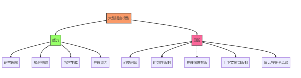{width=\"6.135416666666667in\"
height=\"1.6041666666666667in\"}

图2-18：大语言模型的能力与局限

### 2.4.5 大语言模型的开发与应用策略

**提示工程的艺术与实践**

提示工程是设计和优化输入提示，以引导LLM产生期望输出的关键技术。其主要通过精心设计输入提示来引导模型行为。如图223-4所示，其核心技巧包括：明确的任务说明以准确定义任务类型和目标；通过角色设定赋予模型特定身份（如\"你是一位资深医生\"）；格式指定确保输出符合结构化要求；示例展示实现少样本学习，提供输入输出范例；以及思维链（Chain-of-Thought）技术引导模型展示逐步推理过程。这些方法的组合运用能显著提升模型输出的准确性和可用性如下图2-19所示.

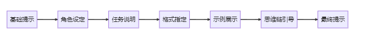{width=\"6.299305555555556in\"
height=\"0.6663724846894138in\"}

图2-19：大语言模型的能力与局限

**微调与适应性学习：如何让AI更懂你的专业领域？**

在特定领域应用中，微调与适应性学习是提升大语言模型性能的关键技术路径：监督微调（SFT）利用标注数据进行有监督训练；人类反馈的强化学习（RLHF）通过人类偏好数据优化模型输出；参数高效微调技术（如LoRA、Adapter等）实现低成本模型适配；而指令微调则专门提升模型对指令的理解和执行能力。这些方法可根据具体需求单独或组合使用，显著增强模型在专业领域的表现。

**检索增强生成：如何让AI获取最新知识？**

检索增强生成技术通过将外部知识库与大语言模型相结合，显著提升了模型回答的准确性和时效性。该技术首先分析用户查询意图，然后从外部数据源中检索相关信息，并将检索到的关键信息整合到提示上下文中，最终由语言模型基于增强后的上下文生成更准确、更具事实依据的回答。这种方法有效弥补了大语言模型在知识更新和事实准确性方面的局限，特别适合需要实时数据支持或专业领域知识的应用场景。检索增强生成（RAG）的工作流程，如下图2-20所示.

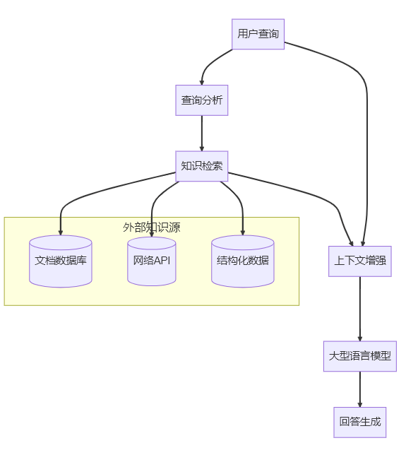{width=\"6.166666666666667in\"
height=\"6.708333333333333in\"}

图2-20：检索增强生成RAG示意图

**评估与优化：如何判断AI表现的好坏？**

在实际使用大语言模型时，我们需要从几个方面来判断它的表现好不好。

首先是**准确性**，也就是模型给出的答案是否正确。这听起来很基础，但其实很重要------如果一个AI助手总是给错误信息，那就失去了使用价值。比如问它\"北京有多少人口\"，它不能随便编个数字。

其次是**相关性**，看模型是否真正理解了你的问题。有时候模型会答非所问，你问天气它跟你聊历史，这就说明相关性不够好。一个好的模型应该能准确把握用户的真实意图。

**一致性**也很关键。同样的问题问几遍，如果每次答案都不一样，用户就会觉得这个系统不靠谱。当然，对于一些开放性问题，适度的变化是正常的，但核心观点应该保持稳定。

**安全性**在商业应用中尤其重要。模型不能输出有害内容、歧视性言论或者不当信息。这不仅是技术问题，也涉及法律和伦理责任。

最后是**效率**问题。再好的模型，如果用户问个问题要等半天才有回复，体验就会很差。而且运行成本太高的话，商业化也会遇到困难。

这些指标往往需要综合考虑，在实际应用中找到合适的平衡点。

### 2.4.6 八大趋势引领AI新时代

当前大语言模型的发展呈现出多维度并进的趋势：多模态融合技术正在突破单一文本处理的限制，整合图像、音频和视频等多种数据形式；模型上下文窗口持续扩展，显著提升长文档处理能力；工具调用功能的实现使模型能够灵活使用外部API和计算资源；同时，推理能力的增强让复杂逻辑判断和任务规划成为可能。在应用层面，个性化定制技术为不同用户和组织提供专属解决方案，而通过模型压缩、量化的高效部署方案正推动LLM向边缘设备延伸。安全对齐技术的进步确保模型行为更符合人类价值观，与此同时，开源生态的繁荣发展正加速技术创新和行业应用，共同推动大模型技术向更智能、更安全、更普惠的方向发展，如下图2-21所示。

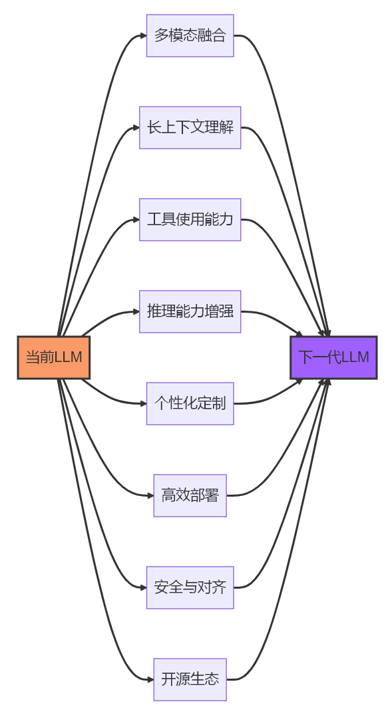{width=\"6.072916666666667in\"
height=\"11.0625in\"}

图2-21：大模型发展趋势

## 2.5 多模态与神经符号AI技术的融合与应用

多模态AI和神经符号技术代表了人工智能领域两个重要的发展方向。多模态AI打破了单一感知模式的局限，实现了跨模态的理解与生成；而神经符号AI则致力于融合神经网络的感知能力与符号系统的推理能力，为AI注入更强的可解释性和推理能力。这两种技术路线正在重塑AI的能力边界，为各行各业带来革命性的应用可能。

### 2.5.1 多模态AI：如何让机器同时"看"、"听"与"理解"？

多模态AI是指能够处理、理解和生成多种不同模态数据的人工智能系统。不同于传统的单模态AI（如纯文本NLP或纯图像CV），多模态AI能够同时处理文本、图像、音频、视频等多种形式的信息，实现跨模态的理解与转换。

在人工智能领域，模态指的是信息的不同表现形式，主要包括视觉模态（图像、视频等）、语言模态（文本、语音等）、音频模态（声音、音乐等）以及其他特殊模态（如触觉信号、生物电信号等）。每种模态都具有独特的特征和数据结构，多模态AI的核心目标就是实现这些不同形式信息之间的理解和转换。

典型的多模态系统包含四大关键组件：多模态编码器负责将不同模态的输入映射到统一的表示空间；跨模态对齐机制建立视觉、语言等模态间的语义关联；多模态融合模块整合多种信息源进行综合理解；而多模态生成器则能产生跨模态的输出内容（如根据文本生成图像）。这种架构使AI系统能够像人类一样综合处理多种感官信息如图2-24所示。

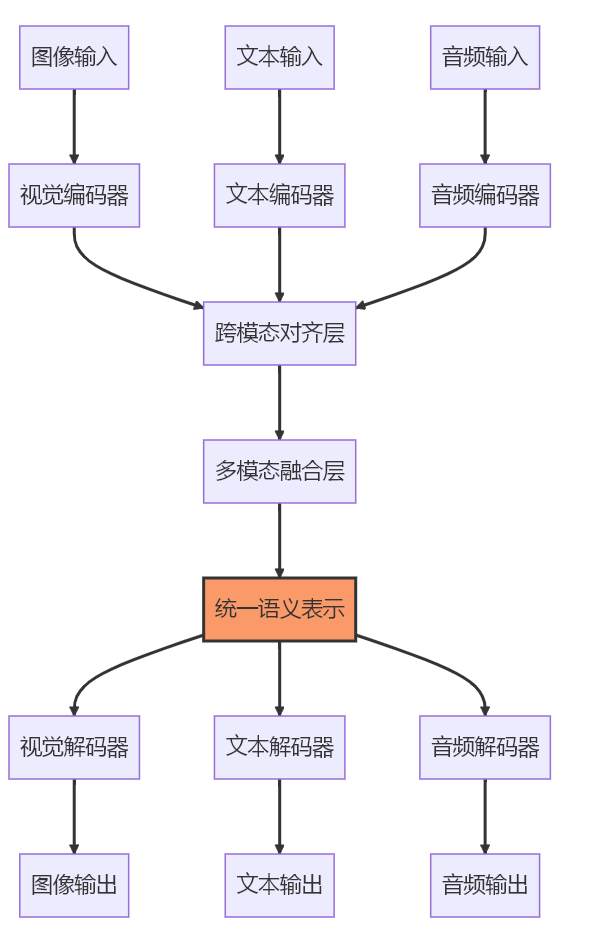{width=\"4.170639763779527in\"
height=\"6.53125in\"}

图2-24:多模态处理流程

多模态AI的核心价值在于其强大的跨模态理解与生成能力：在跨模态理解方面，可以实现视觉问答（VQA）准确回答图像相关问题、精确判断图文匹配程度，以及综合分析文本、语音和面部表情等多模态情感信息；而在跨模态生成方面，能够根据文本描述生成逼真图像（如DALL-E、Midjourney）、为图像自动生成自然语言描述，以及为视频内容智能配音和生成字幕。这些能力使得AI系统能够像人类一样在不同信息形式之间建立语义关联并进行双向转换，大幅提升了人机交互的自然度和智能化水平。

**案例分析：AI医生如何像人类医生一样"望闻问切"？**

在医疗诊断中，医生通常需要综合多种信息来做出准确判断。现在的AI系统也在朝这个方向发展。

比如一个患者来看病，医生不会只看一种检查结果。他们会查看CT或MRI等影像资料，了解内部器官的情况；翻阅电子病历，掌握患者的病史和之前的检查记录；仔细听患者描述症状，获取主观感受；还会查看心电图等各种检测数据。

智能医疗系统也在模仿这种综合分析的方式。它能够同时处理影像、文字、语音和各种生理信号数据，然后把这些信息整合起来分析。

举个具体例子：系统在胸部CT中发现了肺部有阴影，同时在病历记录中看到患者最近一直咳嗽，再结合患者亲口描述的胸痛症状，综合这些信息后，系统可能会判断这很可能是肺炎，并给出相应的治疗建议。

这种做法的好处很明显------就像有经验的医生会从多个角度分析病情一样，AI系统通过整合不同类型的信息，能够做出更准确、更全面的判断。单纯依靠某一种检查结果往往容易漏诊或误诊，而多方面的信息融合大大提高了诊断的可靠性。

### 2.5.2 神经符号AI：如何让机器既能"感知"又能"思考"？

神经符号AI（Neuro-symbolic AI）是一种融合神经网络（连接主义）和符号系统（符号主义）的混合智能范式，旨在结合两者的优势：神经网络的感知学习能力和符号系统的逻辑推理能力。

神经网络和符号系统各具优势与局限：神经网络擅长处理复杂的模式识别和特征学习任务，特别是在感知和预测方面表现出色，但其\"黑盒\"特性导致决策过程缺乏可解释性，且难以进行系统性推理；相比之下，符号系统在逻辑推理和结构化知识表示方面具有天然优势，能够提供清晰的推理链条，但在处理感知任务和不确定性信息时表现欠佳，难以适应复杂的现实场景。

神经符号融合的核心价值在于整合两者的优势：通过为神经网络决策提供符号级解释，显著增强模型的可解释性；引入符号推理机制可有效提升神经网络的逻辑推理能力；同时，将结构化知识融入神经网络学习过程，既能提高模型的数据效率，减少对海量训练数据的依赖，又能实现知识驱动的智能决策。这种融合为构建兼具感知能力和推理能力的AI系统提供了新路径，如图2-25所示。

{width=\"6.208333333333333in\"
height=\"3.28125in\"}

图2-25：神经符号融合

**案例分析：神经符号技术在工业质检中的应用**

在工厂的生产线上，质检是个既重要又繁琐的环节。传统的人工质检不仅效率低，而且容易因为疲劳而出现漏检。现在有些工厂开始使用结合了视觉识别和专家知识的智能质检系统。

这种系统的工作方式很有意思。它首先用摄像头和图像识别技术来\"看\"产品，能够发现表面的划痕、变形、色差等各种缺陷。这部分就像给系统装了一双\"火眼金睛\"。

但光能看出问题还不够，系统还需要\"知道\"这些问题意味着什么。所以工程师会把产品规格、质量标准、常见缺陷类型等专业知识都输入到系统中，形成一个知识库。

当系统发现问题时，它不仅会指出\"这里有个缺陷\"，还会进一步分析\"这个缺陷很可能是因为模具温度太高造成的变形\"，甚至会建议\"应该调低模具温度到某个范围\"。

这就比单纯的图像识别系统强多了。以前的系统只能告诉你有问题，但不知道为什么有问题，更不知道怎么解决。现在的系统就像一个既有敏锐观察力又有丰富经验的老师傅，不仅能发现问题，还能分析原因并给出改进建议。

这种能力对工厂来说特别有价值，因为它不仅提高了质检效率，还能帮助改进生产工艺。

**神经符号AI在科研与决策领域的应用前景**

神经符号AI在科学发现领域展现出强大潜力。通过将分子结构知识与神经网络预测相结合，研究人员能更高效地设计新药物分子；同时，AI系统可以从实验数据中识别潜在的物理定律模式，加速科学理论的发现过程。这种融合方法为传统科研提供了新的探索路径。

在智能决策支持方面，神经符号技术正改变专业领域的决策模式。医疗诊断系统通过整合医学知识图谱与患者临床数据，提供更精准的诊疗建议；金融风控平台则结合规则引擎与深度学习异常检测，实现风险识别的准确性和效率双提升。这些应用显著提高了专业决策的质量。

面对复杂问题求解，神经符号方法提供了创新解决方案。自动规划系统融合神经网络的启发式搜索与符号系统的逻辑推理，优化决策路径；组合优化问题则通过神经网络引导传统符号搜索，在保证结果质量的同时大幅提升计算效率。这类技术正应用于物流调度、芯片设计等复杂场景。

在人机交互增强领域，神经符号AI推动着更自然的交流方式。可解释对话系统不仅能给出建议，还能提供符合逻辑的决策依据；教育辅助系统通过理解学生的错误模式，生成针对性的辅导内容。这些进步使人机协作更加高效和透明。

### 2.5.3 多模态与神经符号技术的融合与互补

多模态与神经符号技术的融合正推动AI向更高层次发展，通过整合多模态感知（视觉、语言等）与符号推理能力，构建能够从多种信息源获取知识并进行统一表征的智能系统，同时为多模态决策提供可解释的符号级说明。

未来该领域将重点发展基础模型增强技术，包括大型多模态模型（如GPT-4V）与神经符号架构的结合，以及多模态知识图谱的深度神经网络融合；应用层面将拓展至智慧医疗（多模态诊断+医学知识推理）、智能教育（多感官内容+个性化学习）和智能制造（多传感器监控+工艺优化）等场景。然而仍需突破异构数据融合、符号与神经表示对齐、计算效率优化等关键技术挑战，以实现更强大的多模态理解与推理能力。

### 2.5.4 生成式AI的五大趋势与五大挑战

当前AI生成技术呈现五大发展趋势：多模态融合实现跨媒介内容转换，交互式创作赋予用户实时调控能力，个性化定制满足差异化需求，领域专精化模型提升专业场景表现，边缘部署推动终端设备本地化生成。这些发展方向正推动生成式AI向更智能、更灵活、更普及的方向演进。

然而该领域仍面临多重挑战：版权归属和伦理边界亟待规范，内容真实性鉴别机制尚不完善，高质量生成依赖巨大算力资源，数据偏见可能引发安全风险，长内容的质量一致性难以保障。这些问题的解决需要技术创新与制度建设并重，才能确保生成式AI的健康发展。

## 2.6 快速迭代中的人工智能

生成式AI技术正在重塑创意和生产的边界，从文生图、图生文到代码生成和视频制作，这些技术为各行各业带来了前所未有的效率提升和创新可能。随着技术的不断进步，我们可以预见生成式AI将进一步融入工作流程，成为人类创造力的得力助手，而非替代者。对于软件开发者和技术决策者而言，了解这些技术的应用场景和实现原理，将有助于把握AI时代的创新机遇，开发出更具价值的产品和服务。
