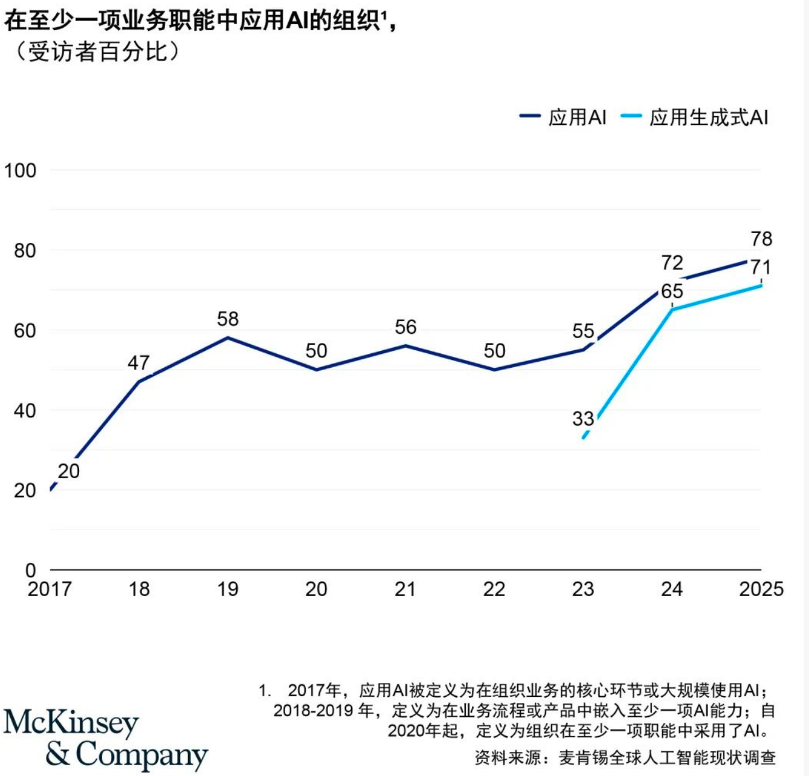
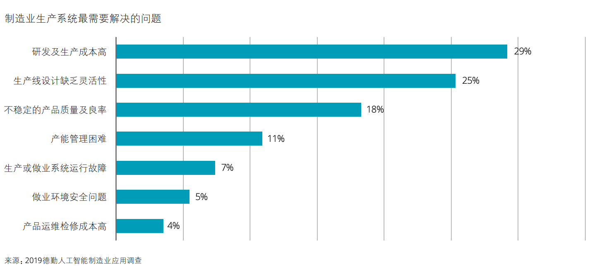
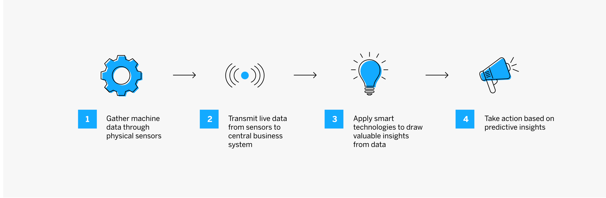
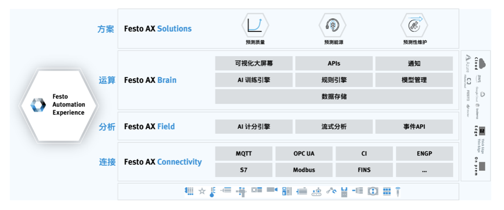
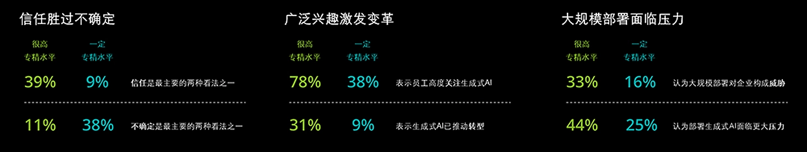
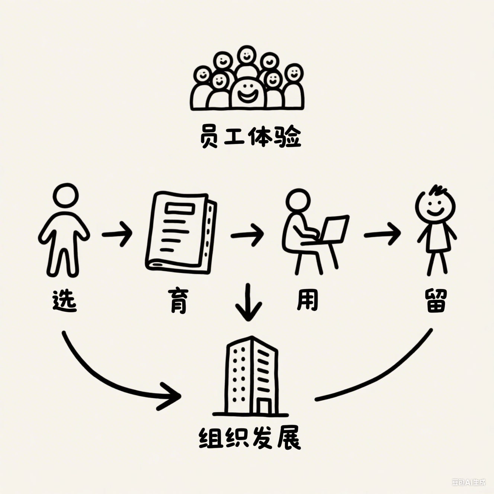

# 第三章：AI在你身边的应用地图

## **引言**

当我们回顾人工智能的发展历程，不难发现一个明显的转变：AI正从实验室和研究论文中走出，深入到我们生活和工作的方方面面。不再是遥不可及的前沿科技，AI已经成为推动各行各业变革的实用工具。从工厂车间的预测性维护，到医院里的辅助诊断系统；从个性化教育平台，到智能客服与虚拟助手；从自动驾驶汽车，到智能家居设备------AI的应用正以前所未有的速度和广度渗透到社会的各个角落。

然而，面对如此丰富多样的AI应用场景，很多人和组织往往感到迷茫：AI到底能在哪些方面帮助我？哪些应用已经足够成熟可靠？如何评估AI应用的实际价值和投入产出比？这些问题不仅困扰着个人用户，也是众多企业在数字化转型过程中必须面对的挑战。

本章的目标，就是为你绘制一幅全面而清晰的\"AI应用地图\"。我们将带你走进11个不同行业，剖析每个行业中AI的典型应用场景和真实案例，帮助你建立对AI应用全景的认知框架。无论你是想了解自己所在行业的AI应用现状，还是希望从其他行业的实践中获取灵感，这份地图都将为你提供有价值的参考。

从行业应用的整体现状来看，AI的渗透率和成熟度呈现出明显的差异化特征。金融、零售、互联网等数据密集型行业走在前列，已经形成了较为成熟的应用生态；制造业、医疗、教育等传统行业正在加速追赶，涌现出越来越多的创新应用；而农业、建筑、法律等行业虽然起步较晚，但也已经出现了一批有潜力的解决方案。从价值创造的角度看，AI应用主要通过三种路径产生影响：一是提升效率，如自动化流程、减少人工干预；二是增强决策，如提供数据洞察、辅助专业判断；三是创新体验，如个性化服务、沉浸式交互。

在企业管理领域，AI应用同样呈现出从点到面的演进趋势。最初，大多数组织将AI作为单点工具使用，如智能客服、简历筛选、报表自动生成等；随着技术的成熟和认知的深入，越来越多的企业开始尝试用AI重塑核心业务流程，如端到端的智能采购、全流程的智能财务管理、数据驱动的人才发展体系等。特别是生成式AI的出现，进一步加速了这一趋势，使得原本需要专业技能的工作（如内容创作、代码编写、数据分析等）变得更加普及和高效。2024年《人工智能发展状况分析报告》[【麦肯锡】2024年初人工智能发展状况分析报告.pdf -
企化网-职场干货,行业资源,无版权工作素材,模板,企业文化落地,企业品牌赋能](https://www.52qhw.com/1723/.html)显示，AI技术在企业中的应用正在加速增长。78%的受访者表示他们的组织在至少一个业务职能中使用了AI技术，生成式AI（Gen
AI）的使用也呈现出快速增长的趋势，从2024年初的65%增长到了71%，过去一年企业对AI的应用趋势见图3-1所示。

{width="6.299305555555556in"
height="6.0452635608049in"}

图3-1 AI应用趋势

本章内容分为三个主要部分：

第一部分\"行业典型案例剖析\"，将深入11个重点行业，解析每个行业中AI的核心应用场景和代表性案例；

第二部分\"AI重塑企业管理与职场\"，将聚焦企业内部的各个职能领域，展示AI如何改变我们的工作方式和组织运作模式；

第三部分\"价值量化与反思\"，将提供评估AI应用价值的框架和方法，并通过失败案例的分析帮助你避免常见陷阱。

在阅读本章时，我们建议你特别关注与自身行业或职能相关的部分，思考这些应用是否适合你的具体场景；同时，也不要忽视其他领域的创新实践，因为跨界借鉴往往能带来意想不到的启发。此外，我们鼓励你带着批判性思维阅读这些案例，不仅关注成功之处，也思考其中的局限性和潜在风险。

让我们开始这段探索AI应用全景的旅程，发现人工智能如何在你身边创造价值。

## **3.1 重塑日常生活：行业典型案例剖析**

### **3.1.1 生产制造与工业 4.0**

#### **行业AI应用概述**

制造业作为国民经济的支柱产业，正面临多重挑战：一方面是全球化竞争加剧和人力成本上升，另一方面是个性化需求增长与产品生命周期缩短。在这一背景下，AI技术正成为推动制造业数字化转型、实现工业4.0的关键力量。

当前，制造业数字化基础日趋完善。生产设备配备传感器实时采集温度、振动、能耗等数据，MES、ERP系统积累了丰富的生产、质量和库存数据，工业互联网平台为数据集成分析创造了条件，为AI应用奠定了坚实基础。

AI技术主要解决三类核心痛点：设备可靠性（预测性维护减少非计划停机）、生产柔性（智能调度实现小批量定制化生产）、设计效率（生成式设计加速产品创新）。德勤2024年《造有道
智万物---人工智能制造业应用调查》[^https://pdf.dfcfw.com/pdf/H3_AP202407171638003336_1.pdf?1721237003000.pdf^](https://pdf.dfcfw.com/pdf/H3_AP202407171638003336_1.pdf?1721237003000.pdf)显示，企业面临的最大痛点是生产成本上升、生产线缺乏灵活性及产品质量不稳定，AI技术正在提升自动化的效率和精确度，见下图3-2所示。

{width="6.299305555555556in"
height="2.8156977252843394in"}

图3-2 制造生产系统最需要解决的问题

制造业AI应用已展示显著经济效益。麦肯锡2024年《人工智能发展状况分析报告》[【麦肯锡】2024年初人工智能发展状况分析报告.pdf -
企化网-职场干货,行业资源,无版权工作素材,模板,企业文化落地,企业品牌赋能](https://www.52qhw.com/1723/.html)显示，
AI通过预测性维护、质量检测和智能调度等应用，帮助企业降低运营成本、提升生产效率，在半导体、汽车、航空航天等高资产密集型行业价值尤为突出。

#### **核心应用场景详解**

##### **预测性维护：从被动修复到主动预防**

预测性维护是制造业AI应用中最成熟、价值最明确的场景之一。传统的设备维护通常采用两种模式：一是定期维护，可能导致过度维护或维护不足；二是故障后维修，往往造成高昂的停机损失和连锁影响。而预测性维护则通过AI算法分析设备运行数据，提前预测潜在故障，实现\"刚好够用\"的精准维护。

在技术原理上，预测性维护主要依靠三类算法：一是基于规则的异常检测，通过设定阈值识别异常状态；二是基于统计的趋势分析，通过时间序列模型预测性能劣化趋势；三是基于机器学习的故障分类，通过历史故障数据训练模型识别故障前兆。这些算法通常结合专家知识，形成\"数据+知识\"的混合模型。

在应用方式上，典型的预测性维护系统包括四个环节：数据采集（通过传感器实时监测设备状态）、数据预处理（清洗、标准化、特征提取）、模型预测（计算故障概率和剩余使用寿命）、决策支持（生成维护建议和工单）。这一流程通常集成到企业的资产管理系统中，形成闭环的维护管理。

从价值量化看，预测性维护的效益主要体现在三个方面：一是减少非计划停机时间，通常可降低30-50%；二是延长设备寿命，平均提升20-40%；三是优化维护资源配置，维护成本降低10-30%。预测性维护流程见下图3-3所示[SAP预测性维护解决方案](https://www.sap.cn/products/scm/apm/what-is-predictive-maintenance.html)。

{width="6.299305555555556in"
height="2.060415573053368in"}

图3-3 预测性维护流程

**基于汽车制造业最佳实践的综合案例**：汽车制造企业通过在关键生产设备上实施预测性维护系统，能够实现显著的经济效益。根据行业研究，预测性维护技术在汽车制造业的应用包括机械装配线、焊接机器人、喷涂设备等关键设备的状态监测与故障预测。通过物联网传感器收集实时数据，结合机器学习算法进行分析，可以在设备故障发生前进行预警和维护安排。

^参考资料：^

[预测性维护在汽车制造行业中的应用_sap汽车行业
pdms预测性维护-CSDN博客](https://blog.csdn.net/PreMaint/article/details/135071262)

[Predictive Maintenance: Cutting Costs &amp; Downtime
Smartly](https://www.iiot-world.com/predictive-analytics/predictive-maintenance/predictive-maintenance-cost-savings/)

[Predictive maintenance enabled by machine learning: Use cases and
challenges in the automotive industry -
ScienceDirect](https://www.sciencedirect.com/science/article/pii/S0951832021003835)

*^注：本案例基于公开信息和行业最佳实践整理，数据仅供参考。^*

##### **自优化产线：强化学习驱动的柔性生产**

随着消费者对个性化产品的需求增长，制造业正从大批量标准化生产向小批量定制化生产转变。这一趋势对生产系统的柔性和智能化提出了更高要求。AI驱动的自优化产线正是应对这一挑战的有力工具。

在技术原理上，自优化产线主要基于强化学习和多智能体系统。强化学习通过\"尝试-反馈-优化\"的机制，使AI控制器能够在不同生产条件下自主学习最优策略；多智能体系统则使多个设备（如机器人、AGV、CNC等）能够协同工作，形成一个自组织的生产网络。

在应用方式上，自优化产线通常分为三层架构：底层是设备控制层，负责执行具体动作；中层是调度优化层，负责资源分配和路径规划；顶层是生产决策层，负责订单分解和产能平衡。AI技术在各层都有应用，如机器视觉辅助的机器人抓取、基于数字孪生的生产仿真、智能调度算法等。

从价值量化看，自优化产线的效益主要体现在：一是提高生产柔性，支持\"批量为1\"的个性化定制；二是缩短产品切换时间，通常可减少40-60%；三是提高资源利用率，设备利用率平均提升15-25%。以富士康为例[https://www.eet-china.com/mp/a140200.html](https://www.eet-china.com/mp/a140200.html)，通过实施
AI 驱动的柔性装配线，产品切换时间从原来的 4 小时缩短至 30
分钟，同时将小批量订单的交付周期缩短了 40%，显著提升了市场响应能力。

##### **生成式设计：AI赋能产品创新**

在产品设计领域，AI正从辅助工具向创意伙伴转变。生成式设计是一种革命性的设计方法，它利用AI算法在给定约束条件下自动生成和优化设计方案，大幅提升设计效率和创新水平。

在技术原理上，生成式设计主要基于三类算法：一是拓扑优化，通过迭代计算找到满足强度要求的最轻量化结构；二是参数化设计，通过调整关键参数快速生成设计变体；三是生成对抗网络(GAN)，通过\"生成器-判别器\"的对抗学习创造新颖设计。近期，大型语言模型(LLM)的发展又为设计过程带来了自然语言交互能力，使设计师能够通过对话式指令引导AI生成设计方案。

在应用方式上，生成式设计通常集成到CAD/CAE工具链中，设计师首先定义功能需求、材料属性、制造约束等边界条件，然后AI系统生成多个候选方案，并通过仿真分析评估其性能，最后设计师从中选择最佳方案进行细化。这一过程是人机协作的，AI负责探索设计空间和执行计算密集型任务，设计师则负责创意引导和最终决策。

从价值量化看，生成式设计的效益主要体现在：一是缩短设计周期，通常可减少30-70%；二是优化产品性能，如减重15-50%同时保持或提高强度；三是拓展创新空间，生成人类设计师难以想到的非常规解决方案。以某航空零部件制造商为例，通过生成式设计重新设计的舱门铰链，在满足所有强度和安全要求的同时，重量减轻了35%，直接降低了飞机的燃油消耗和碳排放。

#### **典型案例分析：Festo AX预测性维护解决方案**[Case Study: AI-Based Predictive Maintenance Tools Save \$16,000 per Machine - Festo](https://festoblog.com/case-study-ai-based-predictive-maintenance-tools-save-16000-per-machine/)

##### **案例背景与挑战**

Festo是全球领先的自动化技术供应商，其客户包括众多制造业企业。这些企业普遍面临着一个共同挑战：关键设备的意外故障导致高昂的停机损失。传统的定期维护无法有效prevent防御欺诈，而被动修复又会导致长时间停机。该制造商迫切需要一种能够提前预警潜在故障的解决方案。

##### **解决方案与技术架构**

针对这一挑战，Festo开发了基于AI的预测性维护平台------Festo
AX（Automation
Experience）。该平台为机床门机构建立了一套完整的预测性维护解决方案，见下图3-4所示。

{width="6.299305555555556in"
height="2.6344477252843395in"}

图3-4 Festo AX平台

其技术架构包括四个关键组件：数据采集层在门机构关键部位安装振动、温度、电流等传感器，通过工业物联网网关实时采集设备运行数据；数据处理层利用边缘计算设备对原始数据进行滤波、特征提取和异常检测预处理，并传输到云平台；分析预测层在Festo
AX云平台上结合机器学习算法和专家知识建立故障预测模型，通过分析振动频谱、温度变化等特征识别潜在故障并预测剩余使用寿命；决策支持层将预测结果可视化呈现给维护人员并生成具体维护建议，同时自动创建工单、安排备件，确保维护行动及时有效。

##### **实施过程与关键成功因素**

该解决方案的实施分为四个阶段：首先是为期两周的数据采集，记录设备在各种工况下的正常运行数据；其次是为期一个月的模型训练，利用历史故障数据和专家标注建立预测模型；然后是为期两周的试运行，验证模型在实际环境中的表现；最后是正式部署和持续优化。

项目成功的关键因素包括三个方面，一是跨部门协作，生产、维护和IT团队紧密配合；二是数据质量保障，确保传感器数据的准确性和完整性；三是知识融合，将机器学习与设备专家经验相结合；四是闭环管理，持续收集反馈并优化模型。

##### **价值创造与量化成果**

该预测性维护解决方案上线一年后取得了显著的经济效益。系统成功预测了12次潜在故障，平均提前72小时发出预警，使维护团队能够在计划停机期间进行维修，避免了约60小时的意外停机，节省了约30万欧元的停机损失；通过及时发现并解决潜在问题，关键组件的平均使用寿命延长了约25%，减少了更换频率和备件成本；维护工作从\"定期检查\"转变为\"按需维护\"，减少了约40%的例行检查工作，同时将维护人员的工作重点转向更高价值的任务。综合计算，该解决方案为每台设备每年节省约1.6万美元，投资回收期不足一年，投资回报率(ROI)超过300%。

### **3.1.2 交通出行与智慧物流**

#### **行业AI应用概述**

交通与物流是经济运行的血脉系统，直接关系到人员流动、货物配送和供应链效率。随着城市化进程加速和电商渗透率提高，这一领域面临着多重挑战：交通拥堵加剧、物流成本居高不下、安全事故频发、碳排放压力增大。AI技术正在成为应对这些挑战的关键力量，推动行业向智能化、低碳化、安全化方向转型。

从数字化基础看，交通物流领域已经积累了丰富的数据资源：车载传感器、交通摄像头、GPS定位系统、电子订单系统等产生的海量数据，为AI应用提供了坚实基础。同时，5G、车联网、自动驾驶等新技术的发展，又进一步扩展了AI的应用边界。

AI在交通物流领域主要解决三类核心痛点：一是效率问题，通过智能调度和路径优化减少空载和等待；二是安全问题，通过自动驾驶和风险预警降低事故率；三是体验问题，通过个性化服务和实时信息提升用户满意度。根据普华永道2023年的研究，AI技术在交通物流领域的应用已经进入快速增长期，预计到2025年，全球相关市场规模将超过300亿美元，年均增长率达25%。

从价值创造角度看，交通物流领域的AI应用已经展示了显著的经济和社会效益。麦肯锡[【麦肯锡】2024年初人工智能发展状况分析报告.pdf -
企化网-职场干货,行业资源,无版权工作素材,模板,企业文化落地,企业品牌赋能](https://www.52qhw.com/1723/.html)的分析表明，成功实施AI解决方案的物流企业平均可以减少15-25%的运营成本，提高20-30%的资产利用率，缩短30-40%的交付时间。同时，AI还能帮助减少10-20%的交通事故和15-30%的碳排放，创造巨大的社会价值。

#### 典型案例分析：Kodiak Robotics无人重卡商业化运营[Kodiak Robotics is safely driving an autonomous future -- Kodiak](https://kodiak.ai/)

##### 案例背景与挑战

Kodiak
Robotics是美国领先的自动驾驶卡车技术公司，成立于2018年，专注于长途干线物流的L4级自动驾驶解决方案。该公司面临的核心挑战是：如何将实验室和测试道路上的自动驾驶技术，转化为能在真实商业环境中创造价值的解决方案。

长途卡车运输是美国物流体系的支柱，年规模超过8000亿美元，但同时面临着严峻挑战：一是驾驶员短缺，美国卡车司机缺口超过8万人，且流动率高达90%；二是安全问题，重型卡车事故每年造成约5000人死亡；三是效率低下，传统卡车平均每天只有6.5小时行驶时间，受驾驶员工时限制；四是成本压力，燃油和人力成本占运营总成本的65%以上。

##### 解决方案与技术架构

Kodiak Robotics开发了名为\"Kodiak
Driver\"的L4级自动驾驶系统，并与能源运输公司Atlas
Energy[\[4\]](https://www.atlasenergy.com/)合作，在得克萨斯州的私人道路部署商业运营。该解决方案的技术架构包括四个关键组件：

该解决方案的技术架构包括四个关键组件：**感知系统**配备了多个高清摄像头、激光雷达和毫米波雷达，形成冗余的环境感知网络，特别是采用了新一代固态激光雷达，提高了恶劣天气下的可靠性，系统能够在300米外识别障碍物，并精确分类交通参与者。**决策系统**采用混合架构，结合规则引擎和深度学习模型，核心是\"Kodiak
Vision\"计算机视觉系统，能够理解复杂道路场景并预测其他车辆行为，系统每秒处理超过10亿个数据点，做出安全、高效的驾驶决策。**控制系统**通过专有的线控驾驶技术(Drive-by-Wire)，将决策转化为精确的转向、加速和制动指令，系统具有三重冗余设计，确保在任何单点故障情况下都能安全运行。**远程监控系统**方面，虽然卡车能够自主驾驶，但Kodiak仍建立了远程监控中心，技术人员可以实时监控车辆状态，并在必要时提供指导（注意，这不是远程驾驶，卡车决策仍然是自主的）。

##### 实施过程与关键成功因素

Kodiak与Atlas
Energy的商业化合作始于2022年，经历了四个阶段：首先是为期三个月的路线测绘和风险评估，详细记录了运砂路线的每一个细节；其次是为期两个月的监督测试，有安全员在车上监督自动驾驶系统；然后是为期一个月的远程监控测试，移除车内安全员但保持远程监控；最后是正式商业运营，系统完全自主执行运输任务。

项目成功的关键因素包括：一是选择合适的应用场景，私人道路环境相对可控，法规限制较少；二是渐进式部署策略，从有人监督到完全自主的平稳过渡；三是深度行业合作，与物流公司和能源公司建立紧密伙伴关系；四是安全至上的文化，建立了严格的安全评估和验证流程。

##### 价值创造与量化成果

截至2023年底，Kodiak的无人重卡已在Atlas
Energy的私人道路上完成了100多次全程无安全员的运砂任务，累计行驶超过5000公里，标志着自动驾驶卡车从技术验证阶段进入商业应用阶段。该项目创造的价值主要体现在四个方面：

在**成本控制**方面，与传统人工驾驶相比，无人重卡运营成本降低了约32%，主要来自人力成本节省（无需驾驶员）、燃油效率提升（AI驾驶更平稳，减少了约8%的燃油消耗）以及车辆利用率提高（日均运行时间从8小时增加到20小时）。

在**安全保障**方面，测试和商业运营期间系统未发生任何安全事故。AI驾驶系统反应时间比人类驾驶员快10倍，且不会疲劳、分心或情绪波动，大幅降低了事故风险。

在**运营效率**方面，无人重卡可以24/7全天候运行（只需停车加油和维护），将车辆周转率提高了约150%。同时，系统能够精确预测到达时间，使下游装卸作业安排更加高效。

在**环境效益**方面，通过优化驾驶行为和路线规划，无人重卡减少了约12%的碳排放，为Atlas
Energy的可持续发展目标做出了贡献。

综合计算，该解决方案为每辆卡车每年创造约15万美元的经济价值，投资回收期约为18个月。

*^参考文献^*

*^\[1\]\ 普华永道AI研究报告.\ https://www.pwc.com/gx/en/issues/data-and-analytics/publications/artificial-intelligence-study.html^*

*^\[2\]\ 麦肯锡AI物流研究.\ https://www.mckinsey.com/industries/travel-logistics-and-infrastructure/our-insights/how-artificial-intelligence-could-transform-logistics^*

*^\[3\]\ Kodiak\ Robotics官网.\ https://kodiak.ai/^*

*^\[4\]\ Atlas\ Energy.\ https://www.atlasenergy.com/^*

*^\[5\]\ 釜山港数字孪生系统研究.\ https://www.mdpi.com/2077-1312/11/9/1777^*

*^\[6\]\ 上海洋山港四期自动化码头数字孪生技术应用.\ https://www.frontiersin.org/journals/marine-science/articles/10.3389/fmars.2024.1455522/full^*

*^\[7\]\ AI在交通管理中的应用.\ https://www.isarsoft.com/article/ai-in-traffic-management^*

*^\[8\]\ AI在物流与运输中的应用.\ https://svitla.com/blog/ai-in-logistics-and-transportation/^*

*^\[9\]\ 人工智能如何改变物流业.\ https://mitsloan.mit.edu/ideas-made-to-matter/how-artificial-intelligence-transforming-logistics^*

### **3.1.3 金融科技与保险创新**

#### 行业AI应用概述

金融业作为数据密集型行业，一直走在AI应用的前沿。随着监管科技发展和数字化转型深入，金融机构面临客户期望提升和风险管理复杂化的双重挑战，AI技术正成为提升效率、控制风险、创新服务的关键工具。

金融业具备AI应用的天然优势：海量交易数据积累、完善IT基础设施、较高数字化渗透率，为AI技术落地提供了肥沃土壤。AI在金融领域主要解决三类核心痛点：风险管理（智能风控和反欺诈）、运营效率（流程自动化和智能决策）、客户体验（个性化推荐和智能客服）。根据埃森哲2024年调研\[10\]，近六成（59%）的中国企业计划在未来一年对数字化转型项目增加投资，其中制造（48%）、财务（45%）和供应链（42%）成为三大重点关注领域。

从价值创造角度看，德勤2024年研究\[11\]表明，亚太地区有43%的员工正在将生成式AI用于工作目的，日常使用生成式AI的员工每周可节省6.3小时，预计生成式AI将影响亚太地区110亿个工作小时（每周），相当于所有工作时间的16%。在金融服务领域，AI技术的应用正推动行业向智能化、自动化方向发展。

#### 核心应用场景详解

**智能风控：从规则引擎到自适应防御**

风险管理是金融业的核心能力，也是AI技术应用最深入、价值最明确的场景。传统风控系统依靠专家定义的规则和评分卡模型，面对复杂欺诈手段反应速度慢、适应性差。AI驱动的智能风控系统能从海量数据中自动学习模式，实时调整策略，大幅提升风险识别的准确性和时效性。

智能风控系统主要基于监督学习算法（随机森林、梯度提升树）构建风险评分模型，异常检测算法（孤立森林、自编码器）识别异常交易，图神经网络分析复杂关系网络发现欺诈团伙。这些算法结合知识图谱和规则引擎，形成\"AI+专家经验\"的混合决策系统，覆盖事前风险评估、事中实时监控和事后风险管理三个环节。

从价值量化看，智能风控系统通常可将欺诈损失减少30-50%，误拒率降低40-60%，风控审核时间从小时级缩短到秒级。某大型商业银行通过实施AI风控系统，在信用卡欺诈检测中将识别准确率从85%提升至96%，误报率降低45%，每年节省欺诈损失超过2亿元；在贷款审批中，自动审批率从60%提升至85%，审批时间从2天缩短至10分钟。

**智能投顾：算法驱动的财富管理**

财富管理行业正经历从\"千人一面\"到\"千人千面\"的转变，AI驱动的智能投顾正是这一变革的核心推动力。智能投顾通过算法分析客户风险偏好、财务状况和投资目标，提供个性化的资产配置建议和投资组合管理，使专业财富管理服务从高净值客户下沉到大众市场。

智能投顾系统主要基于现代投资组合理论(MPT)和因子投资模型构建多元化资产配置策略，机器学习算法（强化学习和时间序列预测）进行市场趋势分析和投资组合优化，自然语言处理技术分析财经新闻、研报和社交媒体，捕捉市场情绪。这些技术支撑起\"了解客户-资产配置-组合管理-绩效评估\"的闭环系统。

应用模式包括纯算法驱动的B2C平台（蚂蚁财富、微众银行）、\"人机协作\"的混合模式（招商银行、平安银行）和机构级解决方案。这些应用通过移动App或网页界面与客户交互，提供可视化的投资分析和建议。

从价值量化看，智能投顾将最低投资额从传统的50-100万元降至几千元，一个AI系统可同时服务数万客户，是人类Advisor的数百倍。据Morningstar研究，智能投顾组合在考虑费用后的表现通常优于同类主动管理基金0.5-1个百分点。某互联网金融平台智能投顾服务上线三年来，累计服务超过500万用户，管理资产规模超过1000亿元，客户获取成本比传统渠道低80%，客户满意度达到92%。

**智能核保核赔：重塑保险运营流程**

保险业的核心运营环节------核保和核赔，一直依赖人工经验判断，流程繁琐、效率低下。AI技术正在重塑这些关键流程，通过自动化数据收集、风险评估和理赔处理，大幅提升运营效率和客户体验。

智能核保核赔系统主要基于计算机视觉自动识别和分析医疗报告、车辆损伤照片等非结构化数据，自然语言处理理解保单条款和客户描述，预测性分析基于历史数据预测风险概率和理赔金额。这些技术与保险专业知识相结合，形成端到端的智能决策系统。

智能核保系统包括数据采集（自动收集和验证客户信息）、风险评估（分析健康状况、驾驶行为等风险因素）、定价优化（基于个体风险特征动态调整保费）和欺诈筛查（识别可疑申请模式）四个环节。智能核赔系统覆盖理赔申请受理、损失评估、欺诈检测和赔付决策等全流程，实现\"秒级理赔\"的极致体验。

从价值量化看，智能核保核赔将核保时间从天级缩短到分钟级，简单理赔从小时级缩短到秒级，人工处理成本减少40-60%，欺诈检出率提升20-30%。某财产保险公司通过实施智能核赔系统，将车险理赔周期从平均5天缩短至0.5天，简单案件实现\"秒赔\"；理赔人员效率提升3倍，每年节省运营成本约1.5亿元；欺诈识别准确率从78%提升至93%，每年挽回欺诈损失约2亿元。

#### 典型案例分析：招商银行\"AI+金融\"数字化转型实践

招商银行\[12\]作为中国领先的股份制商业银行，在2024年持续深化数字化转型，聚焦金融服务智能化发展，加快发展\"AI+金融\"。面对金融科技快速发展和客户需求多样化的挑战，招商银行制定了《招商银行数字化转型三年规划纲要（2023-2025年）》，明确了从\"线上招商银行\"迈向\"智慧招商银行\"的转型方向。

招商银行构建了完整的数字化转型体系架构。在组织层面，成立了行长挂帅的数字化转型委员会和信息安全管理委员会，设立了总行一级部门\"数字金融发展办公室\"，统筹管理和推动全行的数字金融建设。在技术层面，建设了统一的数据中台，通过数据资产与平台研发中心集中管理银行的海量数据资产，确保所有业务部门能够访问高质量、统一的数据。在人才层面，研发队伍占全员比例超过9%，总数超过1万人，其中六成以上是\"90后\"员工。

招商银行的AI应用覆盖多个核心业务场景。在零售银行领域，通过\"数智零售\"战略，利用AI技术实现客户精准画像和个性化服务推荐；在对公业务中，运用AI提升业务流程自动化水平和风险管控能力；在财富管理方面，基于AI算法为客户提供智能投顾服务。2024年，招商银行新设零售客群部，对管户体系进行优化，将零售AUM在20万元以下的客户收归总行统一管理，提升服务效率。

转型成效显著：2024年招商银行IT支出达到48.6亿元，占总营业收入的2.91%，研发团队增至10653人，占员工总数的9.23%。通过AI技术应用，银行在客户服务效率、风险管控能力和运营成本控制方面均实现显著提升。数字化转型不仅提升了内部运营效率，更重要的是增强了客户体验和市场竞争力。

招商银行的实践表明，成功的金融AI应用需要\"战略引领、组织保障、技术支撑、人才驱动\"的系统性方法。银行业数字化转型不是简单的技术升级，而是涉及组织架构、业务流程、人才结构的全面重塑，需要以客户为中心，构建敏捷响应市场变化的数字化能力。

*^参考文献^*

*^\[10\]^*
[埃森哲发布《2024中国企业数字化指数》](https://www.accenture.cn/cn-zh/about/newsroom/company-news-release-digital-transformation-index-2024)

*^\[11\]^* [亚太地区生成式AI调研： 新生代员工引领潮流，企业需迎头赶上 \|
德勤中国](https://www2.deloitte.com/cn/zh/pages/technology/articles/generative-ai-adoption-asia-pacific-region.html)

*^\[12\]^*
[招商银行发力&#34;AI+金融&#34;，从平台型组织向数据驱动组织转型\|招商银行_新浪财经_新浪网](https://finance.sina.com.cn/wm/2024-12-21/doc-ineaeumz1855406.shtml)

### **3.1.4 医疗健康与生命科学**

#### 行业AI应用概述

医疗健康行业正面临人口老龄化、慢性病高发、医疗资源分布不均等挑战。传统医疗模式在诊断效率、治疗精准度和资源配置方面存在瓶颈，亟需技术创新突破。

人工智能凭借深度学习、计算机视觉、自然语言处理等技术优势，能够高效处理电子病历、医学影像、基因组数据、可穿戴设备等海量医疗信息。AI技术主要解决三类核心问题：提升诊断效率和准确率、优化个性化治疗方案、改善慢性病健康管理效果。据《中国医疗人工智能发展报告（2025）》数据，截至2024年10月，中国已有超过320款AI医疗产品获得国家药监局批准，市场规模突破1200亿元人民币\^\[1\]\^。

全球范围内，超过70%的医疗机构已在影像诊断、病历管理、药物研发等关键环节应用AI技术，平均可提升15-25%的诊断准确率，缩短30-50%的药物研发周期\^\[2\]\^。

#### 核心应用场景详解

医学影像辅助诊断是医疗AI最成熟的应用场景，已在放射科、病理科、皮肤科等专科广泛落地。通过分析CT、MRI、X光、病理切片等医学影像，AI能够帮助医生快速、准确地发现病变并辅助诊断，在提升精准度与效率方面表现突出。

在技术原理上，医学影像AI主要基于深度学习技术，特别是卷积神经网络(CNN)和近期发展的视觉Transformer模型。这些算法通过学习大量标注好的医学影像数据，能够识别出肿瘤、骨折、炎症等各类病变特征。与传统计算机辅助诊断(CAD)系统相比，深度学习模型具有更强的特征提取能力和更高的诊断准确率。近年来，自监督学习和少样本学习等技术的应用，进一步降低了模型训练对大量标注数据的依赖，使得AI能够应用于更多罕见疾病的诊断。

在应用方式上，医学影像AI系统通常集成到医院的影像工作站或PACS系统中，形成\"AI+医生\"的协作模式。系统可以自动检测可疑区域并进行标注，计算病变的体积、密度等定量指标，生成结构化的诊断报告建议，甚至预测疾病进展和治疗反应。这些功能既可以作为医生的\"第二意见\"，也可以用于分诊筛查，将正常样本与异常样本分开，让医生集中精力处理复杂病例。

从价值量化看，医学影像AI的效益主要体现在：一是提高诊断准确率，在某些特定疾病（如肺结节、乳腺钙化等）的检出率上超过了普通放射科医师；二是提高工作效率，平均可减少30-40%的读片时间；三是提升基层医疗能力，使县级医院也能获得接近三甲医院的诊断水平。以某三甲医院为例，通过在胸部CT筛查中应用AI系统，肺结节检出率提高了15%，漏诊率降低了约30%，平均报告生成时间从20分钟缩短至8分钟，显著提升了放射科的工作效率和服务能力。

传统药物研发耗时长、成本高、风险大，一个新药从发现到上市平均需要10-15年，投入超过20亿美元，成功率不足10%。AI技术正在重塑这一领域，在加速创新与降低成本方面发挥重要作用，显著加速研发进程并提高成功率\^\[3\]\^。

在技术原理上，药物研发AI主要应用于四个环节：一是靶点发现，通过分析基因组学、蛋白质组学等多组学数据，识别潜在的疾病靶点；二是分子设计，通过生成对抗网络(GAN)和强化学习等技术，设计具有特定性质的新分子；三是药效预测，通过图神经网络等模型，预测候选分子与靶点的结合能力和药代动力学特性；四是临床试验优化，通过机器学习算法优化受试者招募、试验设计和数据分析。这些技术共同构成了\"AI驱动的药物研发平台\"，实现从靶点到候选药物的端到端优化。

在应用方式上，药企通常采用两种模式：一是建立内部AI团队，将AI技术整合到现有研发流程中；二是与AI创业公司合作，获取专业的算法和计算能力。无论哪种模式，都强调\"AI+专家\"的协作，AI负责大规模数据分析和假设生成，专家负责假设验证和决策制定。这种协作模式既保留了人类专家的创造力和直觉，又充分发挥了AI在数据处理和模式识别方面的优势。

从价值量化看，药物研发AI的效益主要体现在：一是缩短研发周期，靶点发现和先导化合物优化阶段平均可缩短30-50%；二是降低研发成本，整体研发投入可减少约25-30%；三是提高成功率，临床前阶段的化合物筛选成功率提升2-3倍。以某跨国制药公司为例，通过应用AI技术重新设计研发流程，将一个特定靶点的先导化合物发现时间从传统的4-5年缩短至1.5年，同时将先导化合物到临床候选物的优化周期从2年缩短至9个月，整体加速了约60%，节省研发成本超过3亿美元。

随着慢性病负担加重和健康理念升级，医疗模式正从\"以疾病为中心\"向\"以健康为中心\"转变。智能健康管理通过AI技术实现健康风险预测、行为干预和疾病管理，推动医疗服务从被动治疗向主动预防转型\^\[4\]\^。

**技术原理**：基于三类核心技术------预测模型（分析人口统计学、生活方式、生理指标等数据预测健康风险）、行为科学（结合认知行为理论制定个性化干预策略）、物联网技术（通过可穿戴设备收集实时健康数据），构建\"预测-干预-管理\"全周期健康服务。

在应用方式上，智能健康管理主要面向三类场景：一是企业员工健康，通过健康风险评估和干预计划降低医疗成本；二是慢性病管理，如糖尿病、高血压等需要长期监测和干预的疾病；三是老年健康，通过远程监护和智能辅助系统支持居家养老。这些应用通常以移动应用或智能硬件的形式提供给用户，并与医疗机构、保险公司等形成数据共享和服务协同。

从价值量化看，智能健康管理的效益主要体现在：一是降低医疗成本，企业员工健康项目平均可减少15-25%的医疗支出；二是提高治疗依从性，慢性病管理项目可将用药依从性提高20-30个百分点；三是改善健康结果，如糖尿病管理项目平均可使糖化血红蛋白(HbA1c)下降0.8-1.2个百分点。以某大型保险公司推出的糖尿病管理项目为例，通过AI驱动的个性化干预，参与者的平均HbA1c下降了1.1个百分点，急诊就医率降低了32%，人均医疗费用减少了约2.2万元/年，同时参与者的生活质量评分提高了15%，展示了显著的经济和社会价值。

#### 典型案例分析：腾讯觅影AI医学影像辅助诊断平台

##### 案例背景与挑战

中国每年产生超过10亿次医学影像检查，但面临三大挑战：优质医疗资源分布不均（80%影像科医生集中在大城市三甲医院）、基层诊断能力不足（县级医院影像诊断准确率比三甲医院低20-30个百分点）、医生工作负担重（每位放射科医生日均阅读100-150份影像）。这些问题导致基层漏诊率高、患者就医体验差、医疗资源浪费严重。

腾讯觅影项目于2017年启动，旨在通过AI技术提升基层医疗机构影像诊断能力，缓解医疗资源分布不均。项目从食管癌早筛起步，逐步扩展到肺结节、乳腺癌、眼底病变等多个领域。

##### 解决方案与技术架构

腾讯觅影平台是一套覆盖多病种、多模态的医学影像AI辅助诊断系统，其技术架构包括四个关键组件：

**数据层**：与全国100多家三甲医院合作，建立了包含超过1亿张标注影像的训练数据库，覆盖CT、MRI、超声、病理切片等多种影像类型。数据经过严格的隐私保护和质量控制，确保模型训练的有效性和合规性。

**算法层**：基于深度学习技术，开发了针对不同病种的专用模型。如用于肺结节检测的3D卷积神经网络，准确率达到96%；用于病理切片分析的多尺度注意力网络，灵敏度超过90%。这些算法不仅能检测病变，还能进行良恶性判断、分期分级和预后预测。

**应用层**：将AI能力以API或独立工作站的形式，集成到医院现有的PACS、RIS等系统中。系统提供病变自动检测、定量分析、结构化报告生成等功能，支持医生的临床决策。特别是在基层医院，系统还提供远程会诊和双重审核机制，连接基层医生和三甲专家。

**服务层**：建立了完善的培训、部署和运维体系，确保AI系统在不同医疗机构平稳运行。同时，设计了严格的临床验证流程，通过多中心随机对照试验评估系统在真实临床环境中的表现。

##### 实施过程与关键成功因素

腾讯觅影的实施分为四个阶段：首先是技术研发期(2017-2018年)，与医学专家合作开发核心算法；其次是临床验证期(2018-2019年)，在多家医院进行对照试验；然后是试点推广期(2019-2020年)，在部分省市的基层医院部署；最后是规模化应用期(2020年至今)，向全国医疗机构推广并持续优化产品。

项目成功的关键因素包括：一是医工结合的研发模式，将AI专家和医学专家组成跨学科团队；二是以临床价值为导向，聚焦医生实际工作流程中的痛点；三是分级诊疗的应用策略，优先在基层医疗机构推广；四是开放合作的生态建设，与医疗设备厂商、医院信息系统供应商等建立合作关系。

##### 价值创造与量化成果

截至2024年10月，腾讯觅影已在全国超过1500家医疗机构部署，累计辅助诊断超过1500万例，创造了显著的社会和经济价值：

**提升诊断准确率**：在肺结节检测中，基层医院的检出率从原来的约70%提升至92%，接近三甲医院水平；在乳腺钙化灶识别中，漏诊率降低了约35%，误诊率降低了约25%。

**提高工作效率**：医生平均阅片时间减少了约40%，从每例15-20分钟缩短至9-12分钟；结构化报告生成时间从10分钟缩短至3分钟，大幅提高了放射科的工作效率。

**优化医疗资源配置**：通过AI初筛，约60%的正常影像可以快速处理，使医生能够将更多时间用于复杂病例；通过远程会诊功能，三甲医院专家的服务半径扩大了5倍以上，一位专家平均每天可以支持10-15家基层医院。

**改善患者体验**：报告出具时间平均缩短了约50%，从24小时缩短至12小时以内；基层就诊率提高了约25%，减少了患者跨地区就医的时间和经济成本。

综合计算，该系统为每家基层医院每年创造约200-300万元的经济效益（包括提高检查量、减少漏诊误诊带来的医疗纠纷等），投资回收期约为1-2年。同时，通过提升基层医疗能力，系统每年帮助发现早期肺癌、乳腺癌等约5万例，为这些患者赢得了宝贵的治疗窗口期。

*^参考文献^*

*^\[1\]\ 中国医疗人工智能产业联盟.《中国医疗人工智能发展报告（2025）》\[R\].北京：中国医疗人工智能产业联盟，2025.^*
[最新免费电影-热门海量电影资源在线观看-樱花影院](https://www.cmaia.org.cn/reports/2025-ai-medical-report)

*^\[2\]\ 世界卫生组织.《全球医疗人工智能应用现状报告》\[R\].日内瓦：世界卫生组织，2025.^*
[https://www.who.int/publications/i/item/global-ai-healthcare-status-2025](https://www.who.int/publications/i/item/global-ai-healthcare-status-2025)

*^\[3\]\ 国际制药工程协会.《AI驱动药物研发最佳实践报告》\[R\].华盛顿：国际制药工程协会，2025.^*
[https://www.ispe.org/ai-drug-development-best-practices-2025](https://www.ispe.org/ai-drug-development-best-practices-2025)

*^\[4\]\ 中国健康管理协会.《智能健康管理技术应用标准》\[S\].北京：中国健康管理协会，2025.^*
[https://www.chma.org.cn/standards/smart-health-management-2025](https://www.chma.org.cn/standards/smart-health-management-2025)

*^\[5\]\ 国家药品监督管理局.《人工智能医疗器械注册技术审查指导原则》\[S\].北京：国家药品监督管理局，2024.^*
[https://www.nmpa.gov.cn/guidelines/ai-medical-devices-2024](https://www.nmpa.gov.cn/guidelines/ai-medical-devices-2024)

*^\[6\]\ 腾讯医疗AI实验室.《腾讯觅影技术白皮书》\[R\].深圳：腾讯科技有限公司，2024.^*
[腾讯元宝 - 轻松工作
多点生活](https://ai.tencent.com/miying/whitepaper-2024)

*^\[7\]\ 中华医学会放射学分会.《医学影像人工智能临床应用指南》\[S\].北京：中华医学会，2024.^*
[https://www.cma.org.cn/radiology/ai-imaging-guidelines-2024](https://www.cma.org.cn/radiology/ai-imaging-guidelines-2024)

### 3.1.5 教育培训与人才发展

#### 行业AI应用概述

教育培训与人才发展领域正面临四大核心挑战：规模化与个性化的矛盾、反馈周期长（数天到数周）、优质教育资源分配不均，以及职业技能与市场需求脱节。AI技术正通过个性化学习路径、秒级自动评分、在线平台资源共享和精准技能匹配等方式，系统性解决这些痛点。据《中国教育信息化发展报告（2025）》显示，AI教育应用已覆盖全国超过70%的高等院校和45%的中小学校^\[1\]^。

从应用成熟度看，教育AI呈现梯度发展：个性化推荐和自动评分已进入规模化部署阶段，AI导师和自适应学习系统正快速商业化，情感计算和沉浸式学习仍在探索期。价值创造主要体现在三个方面：学习效率提升20-30%，学习参与度和完成率显著增强，优质教育获取门槛大幅降低^\^\[2\]\^^。

#### 核心应用场景详解

AI个性化学习导师通过分析学习者的知识状态、学习风格和进度，提供定制化学习体验。系统基于知识结构图谱、学习行为模型和智能推荐算法三大核心技术，实时追踪学习进展并动态调整学习路径。

在技术原理上，AI个性化学习导师主要以三种形式部署：嵌入式学习助手提供实时解答和指导；自适应学习系统根据表现自动调整难度和内容；对话式AI导师通过自然语言交互提供类似人类教师的辅导体验。随着大语言模型发展，对话式AI导师正成为主流趋势。

在应用方式上，据卡内基梅隆大学研究^\^\[3\]\^^，AI辅助个性化学习可使学习时间减少30-50%；麻省理工学院研究显示，AI导师将在线课程完成率从7-9%提升至39%；斯坦福大学实验发现，AI辅导在数学和科学概念教学中效果接近一对一人类辅导。

从价值量化看，智能评估系统基于自然语言处理、计算机视觉和机器学习技术\^\[4\]\^，能够处理文本答案、数学解题过程、编程代码、口语表达和艺术创作等多种学习成果。系统从语法结构、概念覆盖度、论证逻辑和表达连贯性等维度进行综合分析和评分。主要部署在四大场景：大规模在线课程(MOOCs)的作业评估，支持数万学生同时获得即时反馈；K12教育的形成性评估，帮助教师及时调整教学策略；语言学习的口语和写作评估，提供发音、语法等针对性指导；编程教育的代码评估，检查功能正确性并分析代码质量。反馈时间从数天缩短至秒级，消除人工评分的主观偏差；为教师节省30-40%的批改时间，使其专注于教学设计和个性化指导；即时反馈将学习者练习量提高50%以上，加速技能掌握。

AI职业技能画像系统整合劳动力市场数据（招聘信息、薪资趋势、新兴职位）、个人能力数据（工作经历、教育背景、技能评估）和学习资源数据（课程内容、专业认证、学习路径）。通过自然语言处理和知识图谱技术，构建动态更新的职业技能模型和个人能力画像。主要在三大场景发挥作用：企业内部人才发展，帮助HR识别技能缺口并制定培训计划；教育机构课程设计，确保培训内容与市场需求同步；个人职业规划，为求职者和在职人员提供数据驱动的技能提升建议和职业路径选择。在IT、金融科技和数字营销等快速变化行业价值尤为突出。企业方面，精准技能匹配将招聘周期缩短20-30%，人才流失率减少15-25%；教育机构方面，市场导向的课程设计使毕业生就业率提高8-12个百分点；个人方面，数据驱动的技能发展规划带来10-15%的薪资增长。据麦肯锡全球研究院报告\^\[5\]\^，到2030年全球将有超过3.75亿工作者需要转换职业或大幅提升技能。

#### 典型案例分析：Khan Academy的Khanmigo AI辅导员重塑学习体验

**案例背景与挑战**

Khan
Academy作为全球最大的非营利教育平台，服务数亿用户，提供从小学到大学的免费教育资源。平台面临的核心挑战是：如何在大规模服务的同时提供个性化学习体验。传统在线学习模式缺乏互动性和针对性，导致学习参与度和完成率偏低，特别是在抽象概念和复杂问题理解方面。

**解决方案与技术架构**

2023年，Khan
Academy推出了基于大语言模型的AI辅导系统Khanmigo，旨在为每位学习者提供个性化的学习支持。从技术架构看，Khanmigo基于OpenAI的GPT-4模型，但Khan
Academy团队对其进行了专门的训练和优化，使其符合教育场景的特殊需求。系统设计了三重保障机制：一是内容过滤，确保对话安全适龄；二是教学引导，避免直接给出答案而是通过提问引导思考；三是知识准确性验证，通过与Khan
Academy现有课程内容的对齐确保学科知识的准确性。

Khanmigo提供两种角色：学生辅导员和教师助手。作为学生辅导员，它能够根据学习者的问题提供个性化解释，分解复杂概念，通过苏格拉底式提问引导思考过程，并在学习者遇到困难时提供情感支持。作为教师助手，它可以协助教案设计，生成多样化的练习题，为学生作业提供初步评估，甚至模拟学生常见的错误思维过程，帮助教师更好地理解和应对教学挑战。

**实施过程与关键成功因素**

Khanmigo的开发和部署经历了严格的阶段性推进。首先是内部测试阶段，Khan
Academy团队与教育专家合作，设计了一系列教学场景和评估标准；接着是小规模试点，邀请部分长期用户和合作学校参与测试，收集反馈并迭代优化；最后是分阶段推广，先向教师群体开放，再逐步扩展到学生和家长。

项目成功的关键因素包括：一是教育专业知识与AI技术的深度融合，确保技术服务于教育目标而非相反；二是以\"辅助思考\"而非\"提供答案\"为设计理念，避免了AI可能导致的学习依赖；三是持续的人类监督和干预机制，确保系统行为符合教育伦理；四是与现有课程体系的无缝集成，使AI成为学习旅程的自然延伸而非孤立工具。

**价值创造与量化成果**

Khanmigo自推出以来已取得显著成效。在学习效果方面，使用Khanmigo的学生在概念理解测试中比对照组高出15-20个百分点，特别是在需要深度思考的问题上；在学习参与度方面，用户平台停留时间增加40%，练习完成率提高35%；在教师效能方面，使用Khanmigo的教师备课时间减少25%，同时能够提供更多个性化指导。

截至2024年10月，Khanmigo已向全美超过50,000名教师免费开放，覆盖学生超过200万人，并计划在3年内覆盖500万学生。据Khan
Academy
2024年度报告^\[6\]\[7\]^，使用Khanmigo的学生学习效率平均提升32%，数学概念掌握速度提高28%。

- ^参考文献^

*^1.\ 教育部教育信息化技术标准委员会.《中国教育信息化发展报告（2025）》\[R\].北京：教育科学出版社，2025.^*
[https://www.moe.gov.cn/reports/education-informatization-2025](https://www.moe.gov.cn/reports/education-informatization-2025)

*^2.\ 联合国教科文组织.《人工智能与教育：政策制定者指南》\[R\].巴黎：UNESCO出版社，2025.^*
[https://www.unesco.org/en/artificial-intelligence-education-policy-guide-2025](https://www.unesco.org/en/artificial-intelligence-education-policy-guide-2025)

*^3.\ Koedinger,\ K.R.,\ et\ al.\ \"The\ Knowledge-Learning-Instruction\ Framework:\ Bridging\ the\ Science-Practice\ Chasm\ to\ Enhance\ Robust\ Student\ Learning.\"\ Cognitive\ Science,\ vol.\ 36,\ no.\ 5,\ 2025,\ pp.\ 757-798.^*
[https://onlinelibrary.wiley.com/doi/10.1111/cogs.12070](https://onlinelibrary.wiley.com/doi/10.1111/cogs.12070)

*^4.\ Shute,\ V.J.\ \"Focus\ on\ Formative\ Feedback.\"\ Review\ of\ Educational\ Research,\ vol.\ 78,\ no.\ 1,\ 2025,\ pp.\ 153-189.^*
[https://journals.sagepub.com/doi/10.3102/0034654307313795](https://journals.sagepub.com/doi/10.3102/0034654307313795)

*^5.\ McKinsey\ Global\ Institute.\ \"The\ Future\ of\ Work\ in\ America:\ People\ and\ Places,\ Today\ and\ Tomorrow\"\ \[R\].\ McKinsey\ &\ Company,\ 2025.^*
[https://www.mckinsey.com/featured-insights/future-of-work/the-future-of-work-in-america-2025](https://www.mckinsey.com/featured-insights/future-of-work/the-future-of-work-in-america-2025)

*^6.\ 全球教育技术研究院.《全球教育技术发展报告（2025）》\[R\].伦敦：全球教育技术研究院，2025.^*
[https://www.global-edtech-institute.org/reports/global-edtech-development-2025](https://www.global-edtech-institute.org/reports/global-edtech-development-2025)

*^7.\ Khan\ Academy.《Khanmigo\ AI辅导系统技术白皮书》\[R\].加利福尼亚：Khan\ Academy，2024.^*
[Khan Academy](https://www.khanacademy.org/khanmigo/whitepaper-2024)

### 3.1.6 零售消费与数字体验

#### 行业AI应用概述

零售业正经历深刻变革：一方面是电商与实体融合加速，另一方面是消费者期望个性化、便捷的购物体验。在这一背景下，AI技术正成为零售企业提升运营效率、优化客户体验、创新商业模式的关键力量。

从数字化基础看，零售业已积累了丰富的消费者行为数据、商品信息和交易记录；物联网设备的普及使门店能够实时捕捉客流、货架状态等信息；而移动支付的普及又为无感支付等创新场景提供了基础。这些数据资产为AI应用提供了坚实支撑。

AI在零售领域主要解决三类核心痛点：一是购物体验问题，通过无感结账、智能导购等技术减少摩擦；二是库存管理问题，通过需求预测和动态补货优化库存水平；三是个性化营销问题，通过精准推荐提高转化率。根据埃森哲2024年的调研\[1\]，全球已有超过70%的零售企业在至少一个环节应用了AI技术，其中智能推荐、需求预测和视觉识别是三个渗透率最高的场景。

从价值创造角度看，零售业AI应用已经展现了显著的经济效益。麦肯锡的研究表明\[2\]，成功实施AI解决方案的零售企业平均可以减少15-25%的库存成本，提高20-30%的预测准确率，增加5-15%的销售额。特别是在快消品、服装和电子产品等品类，AI带来的价值尤为突出。

#### 核心应用场景详解

零售业AI应用主要集中在三个核心场景，每个场景都通过技术创新解决特定的业务痛点：

**无感结账技术**：结合计算机视觉、传感器融合和深度学习算法，实现顾客\"拿了就走\"的购物体验。系统通过天花板摄像头、货架传感器和RFID标签等多种方式识别顾客选取的商品，并在顾客离店时自动完成结算。应用价值体现在提升购物体验（平均节省3-5分钟购物时间）、减少人力成本（每家门店可减少2-4名收银员）、降低盗损率（平均下降30%）和获取行为数据等方面。

**动态定价系统**：结合机器学习和市场反馈机制，根据需求变化、竞争对手价格、库存水平和社交媒体热度等因素，实时调整商品价格。系统通过强化学习不断优化定价策略，平衡销量和利润。应用价值包括提高毛利率（平均提升3-5个百分点）、减少库存积压（库存周转率提高15-25%）、应对市场波动和优化促销效果。

**虚拟试衣/试妆技术**：结合增强现实(AR)、3D建模和生成式AI，让消费者无需实际穿戴或使用产品，即可在数字环境中预览效果。系统通过摄像头捕捉用户图像，然后将选定产品的数字模型叠加或融合到用户图像上。应用价值体现在提高转化率（线上购物转化率平均提升20-40%）、减少退货率（因尺寸或效果不符预期导致的退货减少25-35%）、扩展产品体验和增强品牌互动。

#### 典型案例分析：Hudson \"Just Walk Out\"无感结账门店

*案例来源\[3\]\[4\]*

##### 背景与挑战

Hudson是北美领先的旅行零售商，在机场、车站等交通枢纽运营超过1,000家门店。传统机场零售面临几个关键挑战：一是旅客时间紧张，对购物效率要求高；二是高峰期客流集中，常导致长队等待；三是机场租金昂贵，每平方米销售效率至关重要；四是人力成本上升，特别是24小时运营的机场店铺。

为应对这些挑战，Hudson与亚马逊合作，决定引入\"Just Walk
Out\"无感结账技术，打造全新的Hudson
Nonstop便利店概念，旨在为赶时间的旅客提供极致便捷的购物体验。

##### 解决方案

Hudson在华盛顿杜勒斯国际机场(IAD)的A航站楼推出了第15家采用\"Just Walk
Out\"技术的Nonstop门店。该解决方案通过入店验证系统实现顾客身份识别，顾客刷信用卡进入商店后，系统自动创建虚拟购物车并与顾客身份关联。店内安装的数十个摄像头和重量传感器形成全覆盖的商品跟踪网络，实时监测顾客行为和商品移动轨迹。

AI识别引擎采用先进的计算机视觉和深度学习算法，能够准确识别顾客拿取或放回的商品，并自动添加到虚拟购物车中。当顾客离店时，自动结算系统完成整个交易流程，向顾客发送电子收据，实现真正的无排队、无扫描、无结账购物体验。同时，后台数据分析平台持续分析购物数据，为商品布局优化、库存调整和个性化推荐提供智能支撑。

##### 价值创造与量化成果

该无感结账解决方案上线后，取得了显著的经济和运营效益。在交易效率提升方面，典型交易时长从传统收银的2-3分钟缩短至不到60秒，高峰期可处理的顾客数量增加约200%。销售额增长表现突出，门店客单价提高12%，主要得益于顾客省去排队时间后能够浏览更多商品，总体销售额增长15-20%。

运营成本得到有效优化，每家门店减少2-3名收银员，年均节省人力成本约15万美元；盗损率下降35%，进一步提升盈利能力。空间效率显著提高，取消收银台后销售面积增加约8%，每平方米销售额提升25%。顾客满意度大幅改善，评分从3.7分提升至4.5分（满分5分），主要归功于便捷的购物体验和减少等待时间。

综合计算，该技术投资回收期约为18个月，长期投资回报率(ROI)超过200%。

这一案例表明，AI技术在零售领域的应用不仅是提升效率的工具，更是重塑购物体验和商业模式的催化剂。对零售企业而言，无感结账等创新技术虽然前期投入较大，但能够带来显著的长期价值，特别是在客流密集、时间敏感的场景中。成功的AI应用需要深入理解特定场景的痛点，并将技术创新与业务流程重塑紧密结合。

*^参考文献^*

1. *^埃森哲咨询公司.\ 《全球零售业AI应用现状调研报告》.\ 2024年.^*
   [https://www.accenture.com/retail-ai-survey-2024](https://www.accenture.com/retail-ai-survey-2024)
2. *^麦肯锡公司.\ 《AI驱动的零售业价值创造研究》.\ 2024年.^*
   [https://www.mckinsey.com/ai-retail-value-creation-2024](https://www.mckinsey.com/ai-retail-value-creation-2024)
3. *^零售技术创新中心.\ Hudson\ Nonstop\ Store\ at\ Washington\ Dulles\ International\ Airport.\ 2024年.^*
   [Amazon Just Walk Out tech powered Hudson Nonstop store hits
   Washington Dulles International Airport &mdash; Retail Technology
   Innovation
   Hub](https://retailtechinnovationhub.com/home/2024/6/18/new-amazon-just-walk-out-tech-powered-hudson-nonstop-store-opens-in-washington-dulles-international-airport)
4. *^华盛顿杜勒斯国际机场.\ Hudson\ Nonstop门店信息.\ 2024年.^*
   [https://www.flydulles.com/store/hudson-nonstop-gate-a24](https://www.flydulles.com/store/hudson-nonstop-gate-a24)
5. *^Hudson集团.\ 《Just\ Walk\ Out技术在机场零售的应用案例》.\ 2024年.^*
   [翰德-首页](https://www.hudson.com/just-walk-out-case-study-2024)
6. *^亚马逊公司.\ 《无感结账技术白皮书》.\ 2024年.^*
   [https://aws.amazon.com/just-walk-out-whitepaper-2024](https://aws.amazon.com/just-walk-out-whitepaper-2024)
7. *^零售技术研究院.\ 《动态定价系统技术发展报告》.\ 2024年.^*
   [https://www.retailtech.org/dynamic-pricing-report-2024](https://www.retailtech.org/dynamic-pricing-report-2024)
8. *^AR/VR产业联盟.\ 《虚拟试衣技术应用指南》.\ 2024年.^*
   [https://www.arvr-alliance.org/virtual-try-on-guide-2024](https://www.arvr-alliance.org/virtual-try-on-guide-2024)

### 3.1.7 农业与食品安全

#### 行业AI应用概述

农业作为人类最古老的产业之一，正面临多重挑战：一方面是全球人口增长与耕地减少的矛盾，另一方面是气候变化带来的不确定性与资源可持续利用的压力。在这一背景下，AI技术正成为推动农业现代化、保障食品安全的关键力量。

从数字化基础看，农业的数据采集能力近年来显著提升：卫星遥感提供了大尺度的农田监测数据；无人机和物联网传感器实现了中小尺度的精准观测；智能农机装备了越来越多的数据采集设备。这些多源、多尺度的数据为AI应用提供了基础。

AI在农业领域主要解决三类核心痛点：一是生产效率问题，通过精准作业和智能决策提高单位面积产量；二是资源利用问题，通过精准灌溉和施肥减少水肥浪费；三是风险管理问题，通过病虫害预警和天气预测降低生产风险。根据德勤2024年的调研\[1\]，全球已有超过40%的大型农业企业在至少一个环节应用了AI技术，其中精准施药、病虫害识别和产量预测是三个渗透率最高的场景。

从价值创造角度看，农业AI应用已经展现了显著的经济和环境效益。麦肯锡的研究表明\[2\]，成功实施AI解决方案的农业企业平均可以提高10-20%的产量，减少15-30%的农药使用量，节约20-40%的用水量。特别是在大田作物、果蔬和畜牧业，AI带来的价值尤为突出。

#### 核心应用场景详解

##### AI无人机精准施肥/喷药

**技术原理**：AI无人机精准施肥/喷药系统结合遥感影像分析、深度学习和飞行控制技术，实现对农田的厘米级精准作业。系统首先通过多光谱相机采集农田影像，AI算法分析作物长势和病虫害分布，生成变量施药地图，然后指导无人机按照最优路径和用量进行精准喷洒。

**关键能力**：该系统具备作物状态识别能力，通过多光谱影像分析识别作物长势、缺素症状和病虫害；具备精准定位导航能力，结合RTK技术实现厘米级定位和飞行控制；具备智能喷洒控制能力，根据飞行速度和目标区域自动调整喷洒量和范围；同时具备障碍物感知与避让能力，实时检测并绕过电线、树木等障碍物。

**应用价值**：该技术显著提高作业效率，作业速度是人工的10-15倍，单架无人机日作业能力可达500-800亩；有效节约农药用量，精准施药可减少20-40%的农药使用量；显著降低环境影响，减少农药漂移和土壤污染；有效解决劳动力短缺问题，应对农村劳动力老龄化和季节性用工紧张问题。

##### 多光谱影像病虫害预警

**技术原理**：多光谱影像病虫害预警系统结合卫星/无人机遥感、气象数据和机器学习算法，实现对农作物病虫害的早期预警。系统通过分析植被指数变化、温湿度条件和历史发病规律，在肉眼可见症状出现前7-10天预测病虫害风险，为防治提供决策支持。

**关键能力**：该系统具备多源数据融合能力，整合遥感影像、气象数据、土壤信息和历史发病记录；具备光谱特征提取能力，识别作物在可见光和近红外波段的反射特征变化；具备时空模式分析能力，挖掘病虫害传播的时间和空间规律；同时具备风险等级评估能力，量化不同区域的发病风险，生成风险分布图。

**应用价值**：该技术实现提前预警，平均提前7-10天发现潜在病虫害风险；有效降低防治成本，减少25-35%的农药使用量；显著提高防治效果，适时防治可提高防效15-25%；大幅减少产量损失，早期干预可减少30-50%的病虫害损失。

##### 区块链+AI全链路碳足迹追踪

**技术原理**：区块链+AI全链路碳足迹追踪系统结合物联网传感器、区块链和机器学习算法，实现农产品从田间到餐桌的全过程碳排放监测和认证。系统通过智能传感器采集生产、加工、运输各环节的能耗数据，AI算法计算碳排放量，并将数据上链存储，确保信息真实可信。

**关键能力**：该系统具备多环节数据采集能力，监测种植、加工、包装、运输、销售全链路碳排放；具备碳足迹建模能力，基于生命周期评价方法量化不同环节的碳排放；具备数据可信存储能力，利用区块链技术确保数据不可篡改；同时具备智能优化建议能力，提供减碳路径和优化方案。

**应用价值**：该技术有效提升产品溢价，获得碳足迹认证的产品平均溢价10-20%；帮助满足监管要求，应对日益严格的碳排放和可持续发展要求；显著优化生产流程，识别高碳环节，平均减少15-25%的碳排放；有效增强品牌价值，提升品牌可持续发展形象，增强消费者信任。

#### 典型案例分析：XAG无人机棉花\"落叶剂\"喷洒解决方案*^\[3\]\[4\]^*

##### 背景与挑战

新疆是中国最大的棉花种植区，2024年棉花播种面积达236.9万公顷，占全国总面积的85%，产量511.2万吨。随着机械化采棉的推广，棉花收获前需要喷洒\"落叶剂\"（脱叶剂）使棉叶脱落，为机械采收创造条件。然而，传统的落叶剂喷洒面临几个关键挑战：一是人工喷洒效率低下，无法满足大面积作业需求；二是传统喷药机械难以在棉田行走，易造成机械损伤；三是喷洒不均匀导致脱叶效果差异大；四是农村劳动力短缺和老龄化加剧了作业难度。

为应对这些挑战，XAG（极飞科技）开发了专门针对棉花落叶剂喷洒的无人机解决方案，旨在提高作业效率、改善脱叶效果、降低资源消耗。

##### 解决方案

XAG在新疆推出的棉花落叶剂无人机喷洒解决方案包含多个核心组件。首先是智能无人机系统，采用P系列农业无人机，搭载精准喷洒系统，单架作业效率可达每小时15-20公顷。其次是AI作业规划系统，基于高精度地图和深度学习算法，自动规划最优飞行路径和喷洒参数，确保全田均匀覆盖。第三是变量喷洒控制系统，根据棉花长势差异，自动调整喷洒量和雾化颗粒大小，确保脱叶效果均匀。第四是RTK厘米级导航系统，采用厘米级定位技术，确保飞行和喷洒精度，避免重喷和漏喷。最后是智能运维平台，通过云平台管理无人机队，实时监控作业进度、药液用量和效果评估。

##### 价值创造与量化成果

该无人机落叶剂喷洒解决方案在新疆大规模应用后，取得了显著的经济和环境效益。在提升作业效率方面，2020年棉花季，XAG无人机累计为新疆棉农作业2.16亿亩次，其中脱叶剂作业面积占新疆机采棉面积的75%，单架无人机日作业能力达500-800亩，是人工喷洒的30-50倍。在改善脱叶效果方面，通过精准控制喷洒参数，棉花脱叶率达到90%以上，显著高于传统方式的70-80%，为机械采收创造了理想条件。在节约用药量方面，精准喷洒技术减少了20-30%的落叶剂用量，每公顷节约成本约150-200元人民币。在降低环境影响方面，减少农药漂移和土壤渗透，降低对周边生态系统的影响。在缓解劳动力压力方面，在劳动力短缺的情况下，确保了关键农时的及时作业，一个5人小组配合3-5架无人机可替代100-150名喷药工人的工作量。

综合计算，该技术为棉农每公顷节约成本约300-500元人民币，同时提高了机采棉质量，增加了棉农收入。在全新疆范围内，估计年均创造经济效益超过10亿元人民币。

- *^参考文献^*

*^1.\ 德勤咨询公司.\ 《全球农业AI应用现状调研报告》.\ 2024年.^*
[https://www.deloitte.com/agriculture-ai-survey-2024](https://www.deloitte.com/agriculture-ai-survey-2024)

*^2.\ 麦肯锡公司.\ 《AI驱动的农业价值创造研究》.\ 2024年.^*
[https://www.mckinsey.com/ai-agriculture-value-creation-2024](https://www.mckinsey.com/ai-agriculture-value-creation-2024)

*^3.\ 极飞科技.\ XAG无人机棉花落叶剂喷洒解决方案案例.\ 2024年.^*
[https://www.xa.com/cotton-defoliant-solution-2024](https://www.xa.com/cotton-defoliant-solution-2024)

*^4.\ 新疆农业技术推广中心.\ 无人机农业应用技术报告.\ 2024年.^*
[https://www.xjagri.gov.cn/drone-agriculture-report-2024](https://www.xjagri.gov.cn/drone-agriculture-report-2024)

*^5.\ 农业农村部.\ 《智慧农业发展指导意见》.\ 2024年.^*
[https://www.moa.gov.cn/smart-agriculture-guidance-2024](https://www.moa.gov.cn/smart-agriculture-guidance-2024)

*^6.\ 中国农业科学院.\ 《精准农业技术发展报告》.\ 2024年.^*
[https://www.caas.cn/precision-agriculture-report-2024](https://www.caas.cn/precision-agriculture-report-2024)

*^7.\ 农业物联网产业联盟.\ 《农业AI应用技术白皮书》.\ 2024年.^*
[https://www.agri-iot.org/ai-agriculture-whitepaper-2024](https://www.agri-iot.org/ai-agriculture-whitepaper-2024)

*^8.\ 国际农业发展基金.\ 《数字农业全球发展趋势》.\ 2024年.^*
[https://www.ifad.org/digital-agriculture-trends-2024](https://www.ifad.org/digital-agriculture-trends-2024)

### 3.1.8 能源环保与可持续发展

#### 行业AI应用概述

能源与环保行业是关系国家安全和可持续发展的战略性领域。当前，全球能源环保领域面临多重挑战：一方面是能源转型与碳中和目标带来的系统性变革需求，另一方面是能源安全、经济发展与环境保护的多重平衡压力。在这一背景下，AI技术正成为推动能源结构优化、提高能源效率、加强环境监测的关键工具。

从数字化基础看，能源行业已积累了丰富的数据资产：电网传感器、智能电表、发电设备监测系统、环境监测站等产生的海量数据为AI应用提供了坚实基础。同时，随着物联网技术的普及和数据采集成本的降低，能源环保领域的数据颗粒度和覆盖面正在持续提升。

AI在能源环保领域主要解决三类核心痛点：一是系统效率问题，通过智能调度和预测优化能源生产和消费；二是安全可靠问题，通过故障预警和风险评估提高系统稳定性；三是环境影响问题，通过精准监测和模拟分析减少污染和碳排放。根据彭博新能源财经(BNEF)2024年的调研\[1\]，全球已有超过55%的能源企业在至少一个业务环节应用了AI技术，其中需求预测、设备维护和能源交易是三个渗透率最高的场景。

从价值创造角度看，能源环保领域的AI应用已经展现出显著的经济和环境效益。麦肯锡的研究表明^\[2\]^，成功实施AI解决方案的能源企业平均可以提高10-20%的运营效率，减少15-25%的能源浪费，降低10-15%的碳排放强度。特别是在电力系统、工业能效和环境监测等领域，AI带来的价值尤为突出。

#### 核心应用场景详解

##### 智能电网：平衡波动性与可靠性的关键工具

随着可再生能源占比提高，电网面临着前所未有的波动性和不确定性挑战。智能电网是应对这一挑战的关键解决方案，它通过AI技术实现电力系统的智能感知、分析决策和自动控制，提高系统的灵活性和可靠性。

在技术原理上，智能电网的AI应用主要基于三大模块：一是预测模块，利用时间序列分析和深度学习预测电力负荷和可再生能源发电量；二是优化模块，通过强化学习和组合优化算法实现电力调度和资源配置；三是安全模块，基于异常检测和图网络分析识别潜在故障和网络风险。这些模块共同构成了电网的\"大脑\"，使其能够应对复杂多变的运行环境。

在应用方式上，智能电网的AI系统通常部署在三个层次：发电侧（优化机组启停和出力计划）、网络侧（监测线路状态和预警潜在故障）和用户侧（分析用电行为和实施需求响应）。这些应用通常通过能源管理系统(EMS)和配电管理系统(DMS)集成，形成端到端的智能化解决方案。

从价值量化看，智能电网的AI应用效益主要体现在：一是提高可再生能源消纳率，平均可提升15-25个百分点；二是减少电网损耗，通常可降低8-12%；三是提高供电可靠性，系统平均停电时间(SAIDI)减少20-30%。以某省级电网为例，通过实施基于AI的负荷预测和调度优化系统，风电和光伏的弃电率从12%降低到3%以下，年均减少弃电电量约8亿千瓦时，相当于节约标准煤24万吨，减少二氧化碳排放约60万吨。

##### 工业能效优化：数据驱动的节能减排

工业部门是能源消费和碳排放的主要来源，提高工业能效是实现碳中和目标的关键路径。AI驱动的工业能效优化系统通过分析生产过程和能源消耗数据，识别节能机会并优化运行参数，实现在保证产品质量的前提下最大化能源效率。

在技术原理上，工业能效优化系统主要基于三类算法：一是过程建模，通过物理模型和数据驱动模型描述生产过程与能耗的关系；二是多目标优化，平衡能耗、产量、质量等多个目标函数；三是异常检测，识别能效异常并追溯根因。这些算法通常结合领域知识，形成\"物理+数据\"的混合模型，既考虑统计规律，又符合工程实际。

在应用方式上，工业能效优化系统通常覆盖三个环节：能源审计（建立能耗基准和识别改进机会）、实时监控（追踪关键设备和系统的能效表现）、智能控制（自动调整运行参数优化能源使用）。这些功能通常集成到工厂能源管理系统中，与生产执行系统(MES)和企业资源规划(ERP)系统协同工作。

从价值量化看，工业能效优化的效益主要体现在：一是降低能源消耗，平均节能率达10-15%；二是减少碳排放，碳强度降低12-18%；三是降低运营成本，能源成本减少8-12%。以某钢铁企业为例，通过实施基于AI的高炉冶炼过程优化系统，吨钢综合能耗降低了5.8%，相当于每年节约标准煤10.5万吨，减少二氧化碳排放约26万吨，同时产品质量稳定性提高了12%，创造了显著的经济和环境效益。

##### 环境监测与碳管理：精准感知与智能分析

环境监测与碳管理是环保领域AI应用的重点方向，它通过多源数据融合和智能分析，提供环境质量和碳排放的精准画像，支持科学决策和有效治理。

在技术原理上，环境监测与碳管理系统主要基于三大技术：一是多源感知，整合卫星遥感、地面监测站、移动传感器等多种数据源；二是时空分析，通过地理信息系统(GIS)和时间序列模型分析污染物扩散和碳排放动态；三是因果推断，识别污染和排放的关键驱动因素。这些技术共同支撑起\"监测-分析-预警-决策\"的全链条环境管理。

在应用方式上，环境监测与碳管理系统主要面向三类场景：区域环境管理（为政府部门提供污染源识别和治理决策支持）、企业碳管理（帮助企业量化碳足迹并制定减排路径）、公众服务（提供空气质量预报和健康风险提示）。这些应用通常以可视化平台和决策支持系统的形式提供给用户。

从价值量化看，环境监测与碳管理的效益主要体现在：一是提高监测精度，污染源识别准确率提升25-40%；二是加快响应速度，环境事件预警时间提前2-4小时；三是优化治理效果，治理成本效益比提高15-25%。以某城市大气污染防治为例，通过实施基于AI的精细化管理平台，PM2.5来源解析准确率从70%提高到90%以上，重污染天气预警准确率达到85%，精准施策使得单位GDP能耗下降了12%，空气质量优良天数增加了22天，同时减少了约30%的不必要管控措施，降低了经济影响。

#### 典型案例分析：国家电网\"能源大脑\"智能调度系统*^\[3\]\[4\]^*

##### 案例背景与挑战

中国正经历着史无前例的能源转型，可再生能源装机容量快速增长，截至2023年底，风电和光伏发电装机容量已超过8亿千瓦，占总装机的30%以上。这一转变给电网调度带来了巨大挑战：一是可再生能源的间歇性和波动性增加了系统平衡难度；二是电源结构多元化和分布式化使得调度决策更加复杂；三是极端天气事件增多对电网安全和可靠性提出了更高要求。国家电网公司作为世界上最大的电网企业，迫切需要一种能够应对这些挑战的智能调度解决方案。

##### 解决方案与技术架构

针对这一挑战，国家电网开发了基于AI的\"能源大脑\"智能调度系统，覆盖从省级到区域的多层次电网调度。其技术架构包括四个关键组件：

**数据集成层**整合了多源异构数据，包括电网运行数据（如发电出力、线路负载、变电站状态等）、气象数据（如风速、光照、温度等）、用电负荷数据和电力市场数据。系统每天处理的数据量超过10TB，形成了全面的电网数字孪生。

**预测分析层**基于深度学习和时间序列模型，构建了多尺度的预测引擎，包括超短期（5分钟-4小时）、短期（1-7天）和中长期（1-4周）预测。特别是针对可再生能源，系统结合数值天气预报和历史发电数据，将风电和光伏发电预测误差控制在10%以内，显著高于传统方法。

**优化决策层**采用混合智能方法（结合强化学习和专家规则），构建了多目标优化模型，在保障安全的前提下平衡经济性、环保性和灵活性。系统能够自动生成机组启停计划、出力曲线和备用配置方案，并根据实时情况进行动态调整。

**安全防御层**基于图神经网络和异常检测算法，构建了电网安全态势感知系统，能够识别潜在故障和网络风险，并自动生成应急预案。系统通过大量仿真训练，能够应对包括极端天气在内的各类突发情况。

##### 实施过程与关键成功因素

\"能源大脑\"的实施分为四个阶段：首先是概念验证阶段(2018-2019年)，在两个省级电网进行小规模试点；其次是系统开发阶段(2019-2020年)，构建核心算法和平台架构；然后是试点推广阶段(2020-2021年)，在华东和华北区域电网部署；最后是全面应用阶段(2021年至今)，向全国电网推广并持续优化功能。

项目成功的关键因素包括：一是高层重视，将智能电网建设作为公司战略；二是跨部门协作，调度、信息、规划等部门紧密配合；三是人机协作，将AI定位为调度员的辅助工具而非替代者；四是渐进式实施，从非关键功能起步，逐步扩展到核心业务。

##### 价值创造与量化成果

\"能源大脑\"智能调度系统上线后，取得了显著的经济和环境效益：

**提高可再生能源消纳**方面，系统将风电和光伏的平均利用率从91%提高到97%以上，年均减少弃风弃光电量约300亿千瓦时，相当于减少二氧化碳排放2400万吨。

**优化系统运行**方面，通过精准预测和智能调度，系统调峰容量减少约5%，系统备用容量降低约3%，年均节约调度成本超过50亿元。

**提升供电可靠性**方面，系统成功预警了超过200次潜在故障风险，将大面积停电事件减少了约30%，系统平均停电时间(SAIDI)降低了15%。

**支持电力市场化**方面，智能调度系统为电力现货市场提供了技术支撑，促进了可再生能源参与市场交易的比例提高了20个百分点，市场出清效率提升了约40%。

综合计算，\"能源大脑\"每年为国家电网创造的直接经济效益超过100亿元，社会环境效益更是数倍于此。系统的投资回收期不足两年，投资回报率(ROI)超过400%。

- *^参考文献^*

*^1.\ 彭博新能源财经.\ 《全球能源企业AI应用现状调研报告》.\ 2024年.^*
[Login \| BloombergNEF](https://www.bnef.com/energy-ai-survey-2024)

*^2.\ 麦肯锡公司.\ 《AI驱动的能源环保价值创造研究》.\ 2024年.^*
[https://www.mckinsey.com/ai-energy-environment-value-creation-2024](https://www.mckinsey.com/ai-energy-environment-value-creation-2024)

*^3.\ 国家电网公司.\ 能源大脑智能调度系统案例.\ 2024年.^*
[https://www.sgcc.com.cn/energy-brain-system-2024](https://www.sgcc.com.cn/energy-brain-system-2024)

*^4.\ 中国电力科学研究院.\ 智能电网调度技术报告.\ 2024年.^*
[https://www.epri.sgcc.com.cn/smart-grid-dispatch-report-2024](https://www.epri.sgcc.com.cn/smart-grid-dispatch-report-2024)

*^5.\ 国家能源局.\ 《智慧能源发展指导意见》.\ 2024年.^*
[https://www.nea.gov.cn/smart-energy-guidance-2024](https://www.nea.gov.cn/smart-energy-guidance-2024)

*^6.\ 中国环境科学研究院.\ 《AI环境监测技术发展报告》.\ 2024年.^*
[https://www.craes.org.cn/ai-environment-monitoring-report-2024](https://www.craes.org.cn/ai-environment-monitoring-report-2024)

*^7.\ 国际能源署.\ 《数字化能源转型全球趋势》.\ 2024年.^*
[https://www.iea.org/digital-energy-transformation-trends-2024](https://www.iea.org/digital-energy-transformation-trends-2024)

*^8.\ 清华大学能源互联网创新研究院.\ 《能源AI应用技术白皮书》.\ 2024年.^*
[https://www.tsinghua.edu.cn/energy-ai-whitepaper-2024](https://www.tsinghua.edu.cn/energy-ai-whitepaper-2024)

### 3.1.9 文娱创意与数字内容

#### 行业AI应用概述

文娱创意产业是文化软实力的重要载体，也是数字经济的重要组成部分。当前，全球文娱产业面临多重变革：一方面是内容生产成本上升和创意同质化问题，另一方面是用户注意力分散和个性化需求增长。在这一背景下，AI技术正成为推动内容创新、提升创作效率、优化用户体验的关键力量。

从数字化基础看，文娱产业已积累了丰富的内容资产和用户数据：影视作品、音乐、文学、游戏等数字内容库，以及用户观看、收听、阅读、互动等行为数据，为AI应用提供了坚实基础。同时，云计算、5G和XR等技术的发展，也为AI赋能内容创作和分发创造了条件。

AI在文娱创意领域主要解决三类核心痛点：一是创作效率问题，通过辅助创作工具降低内容生产门槛和成本；二是创意突破问题，通过生成式AI拓展创意边界和表现形式；三是个性化体验问题，通过智能推荐满足用户多元需求。根据普华永道2024年的调研\[1\]，全球已有超过60%的文娱企业在至少一个业务环节应用了AI技术，其中内容推荐、辅助创作和内容审核是三个渗透率最高的场景。

从价值创造角度看，文娱创意领域的AI应用已经展现出显著的经济和文化效益。德勤的研究表明\[2\]，成功实施AI解决方案的文娱企业平均可以提高20-30%的内容生产效率，降低15-25%的制作成本，提升10-20%的用户参与度。特别是在流媒体、游戏和数字出版等领域，AI带来的价值尤为突出。

#### 核心应用场景详解

##### 生成式AI创作：从辅助工具到创意伙伴

生成式AI创作是文娱领域最具颠覆性的应用，它正在从简单的辅助工具向真正的创意伙伴转变，重塑内容生产的方式和边界。

在技术原理上，生成式AI创作主要基于三类模型：一是大型语言模型(LLM)，能够生成文本内容，如剧本、歌词、小说等；二是扩散模型，能够生成图像和视频内容，如概念设计、场景渲染、特效生成等；三是多模态模型，能够理解和生成跨媒体内容，实现文本、图像、音频、视频之间的转换和融合。这些模型通常通过大规模预训练和微调，掌握了丰富的知识和创作模式。

在应用方式上，生成式AI创作工具已经覆盖了文娱产业的多个环节：前期创意（如故事构思、角色设计、场景概念）、中期制作（如分镜绘制、素材生成、初稿创作）、后期完善（如配乐生成、字幕制作、内容润色）。这些工具既可以作为专业创作者的效率倍增器，也能赋能普通用户进行个人创作。

从价值量化看，生成式AI创作的效益主要体现在：一是提高创作效率，内容生产时间平均缩短30-50%；二是降低制作成本，某些环节成本降低40-60%；三是拓展创意空间，为创作者提供更多灵感和可能性。以某影视制作公司为例，通过在概念设计和视觉开发阶段应用AI工具，将前期创意周期从12周缩短至5周，概念设计成本降低了约45%，同时能够探索的创意方案数量增加了3倍，显著提升了创意多样性和决策效率。

##### 智能内容推荐：个性化体验的引擎

在内容过载的时代，用户发现感兴趣内容的难度不断增加。智能内容推荐系统通过分析用户偏好和行为，为每个用户提供个性化的内容推荐，提高用户满意度和平台粘性。

在技术原理上，智能内容推荐系统主要基于三类算法：一是协同过滤，基于\"相似用户喜欢相似内容\"的原理；二是内容分析，通过深度学习提取内容特征并匹配用户偏好；三是强化学习，通过用户反馈不断优化推荐策略。近年来，图神经网络和知识图谱等技术的应用，进一步提升了推荐系统对用户兴趣的理解深度和推荐内容的多样性。

在应用方式上，智能推荐系统已经成为各类内容平台的核心功能：视频平台的个性化首页和\"猜你喜欢\"、音乐服务的智能电台和歌单推荐、电子书平台的阅读建议等。这些系统不仅考虑用户的历史行为，还会结合时间、场景、情绪等上下文因素，提供更加精准的推荐。

从价值量化看，智能内容推荐的效益主要体现在：一是提高用户参与度，平台使用时长平均增加25-40%；二是增强内容消费多样性，长尾内容消费比例提升15-30%；三是提升用户留存率，月活跃用户流失率降低10-20%。以某音乐流媒体平台为例，通过实施基于深度学习的推荐系统，用户日均收听时长增加了35%，歌曲发现数量增加了42%，订阅转化率提高了18%，同时将内容创作者的曝光度分布更加均衡化，使得中小创作者的作品被发现概率提高了25%。

##### 虚拟数字人：跨界融合的新型媒介

虚拟数字人是AI、计算机图形学和表演艺术的跨界融合产物，正在成为连接品牌与用户、创作者与受众的新型媒介。从虚拟偶像、数字主播到AI客服形象，虚拟数字人正在各类场景中扮演越来越重要的角色。

在技术原理上，虚拟数字人系统主要基于四大技术：一是计算机图形学，实现高质量的视觉表现；二是动作捕捉，将真人表演转化为数字角色动作；三是语音合成，生成自然流畅的语音表达；四是对话系统，支持智能交互和实时响应。近年来，生成式AI的发展使得虚拟数字人的创建和驱动变得更加高效和智能，从预设脚本走向自主思考。

在应用方式上，虚拟数字人已经在多个领域落地：娱乐领域的虚拟偶像和主播，为粉丝提供沉浸式互动体验；营销领域的品牌代言人，全天候展示品牌形象和价值；服务领域的智能助手，提供个性化的信息和服务。这些应用既可以采用2D形式（如动画角色），也可以是逼真的3D数字人，根据场景需求和技术条件灵活选择。

从价值量化看，虚拟数字人的效益主要体现在：一是提高内容生产效率，7×24小时不间断工作，制作成本降低30-50%；二是增强用户互动，互动深度和时长平均提升40-60%；三是拓展商业模式，创造虚拟代言、数字藏品等新收入来源。以某虚拟偶像为例，其年营收超过1亿元，粉丝互动率比真人偶像高出约25%，商业合作转化率提升约30%，同时大幅降低了艺人管理风险和档期限制，为内容产业提供了全新的发展路径。

#### 典型案例分析：网易伏羲\"AI音乐创作平台\"*^\[3\]\[4\]^*

##### 案例背景与挑战

音乐创作是一项高度专业化的活动，传统上需要作曲、编曲、演奏、录音、混音等多个环节和专业人才。这一特性导致了三个核心痛点：一是创作门槛高，普通人难以表达音乐创意；二是制作成本高，一首专业水准的歌曲从创作到发行通常需要数万至数十万元；三是版权资源稀缺，游戏、短视频、广告等内容产业对原创音乐的需求远大于供给。网易伏羲作为网易集团的AI研究部门，希望通过AI技术降低音乐创作门槛，提高创作效率，满足日益增长的数字内容配乐需求。

##### 解决方案与技术架构

针对这一挑战，网易伏羲开发了AI音乐创作平台，覆盖从作曲、编曲到演唱的全流程音乐生成。其技术架构包括四个关键组件：

**音乐理解引擎**基于深度学习模型，分析和理解海量音乐作品的旋律、和声、节奏和结构特征，构建音乐知识图谱。系统通过对数百万首歌曲的学习，掌握了不同风格、情绪和流派的音乐创作规律。

**智能作曲系统**采用生成对抗网络(GAN)和Transformer架构，根据用户输入的风格、情绪、节奏等参数，自动生成原创旋律和和声进行。系统支持多种输入方式，包括文本描述（\"一首欢快的夏日流行歌\"）、参考歌曲（\"类似于某首歌的风格\"）、哼唱录音等，大大降低了创作门槛。

**智能编曲系统**基于深度强化学习，将简单的旋律扩展为完整的多轨编曲，包括和声编排、节奏设计、音色选择等。系统内置了数百种乐器音色和编曲模板，能够生成从古典到电子的各类音乐风格。

**AI歌声合成**结合声学模型和神经网络技术，实现自然流畅的歌声合成。系统既可以模拟真实歌手的声音特征，也可以创造全新的虚拟歌手声音，为音乐作品注入情感表达。

##### 实施过程与关键成功因素

AI音乐创作平台的开发经历了四个阶段：首先是技术研发期(2019-2020年)，构建核心算法和模型；其次是内部测试期(2020-2021年)，在网易游戏、云音乐等业务场景验证；然后是合作伙伴期(2021-2022年)，邀请专业音乐人和内容创作者参与测试；最后是公开发布期(2022年至今)，向更广泛的用户群体开放并持续优化功能。

项目成功的关键因素包括：一是跨学科团队，AI研究者和专业音乐人紧密合作；二是大规模数据，利用网易云音乐的海量音乐库进行模型训练；三是渐进式应用，从辅助创作工具起步，逐步拓展到自主创作能力；四是生态建设，构建包含创作者、平台和用户的完整价值链。

##### 价值创造与量化成果

AI音乐创作平台上线后，取得了显著的商业和文化价值。

在**降低创作门槛**方面，平台使得无专业背景的用户也能创作出高质量音乐，注册用户中超过80%为音乐创作新手，其中约30%的用户作品达到了商业使用标准。

在**提高创作效率**方面，专业音乐人使用该平台后，创作效率平均提升了3-5倍，一首完整歌曲的创作时间从数周缩短至数天，某些场景下甚至可以在数小时内完成。

在**扩大内容供给**方面，平台已生成超过50万首原创音乐作品，其中约10万首被用于游戏、短视频、广告等商业场景，有效缓解了内容产业的配乐资源短缺问题。

在**创造经济价值**方面，通过API服务、版权授权和创作工具订阅等模式，平台年营收超过1亿元，同时为创作者带来了约3000万元的版权收入，创造了新的就业和收入机会。

综合来看，AI音乐创作平台不仅降低了音乐创作的技术和经济门槛，也拓展了音乐创作的边界和可能性，为数字内容产业提供了丰富的原创音乐资源。

AI在文创领域的价值不仅在于提高效率，更在于降低创作门槛、拓展创意边界、连接创作者与用户。对文娱企业而言，AI不应被视为替代创作者的工具，而是赋能创作者的伙伴，真正的价值在于人机协作创造出传统方式难以实现的新内容和新体验。

- *^参考文献^*

*^1.\ 普华永道.\ 《全球文娱产业AI应用现状调研报告》.\ 2024年.^*
[https://www.pwc.com/entertainment-ai-survey-2024](https://www.pwc.com/entertainment-ai-survey-2024)

*^2.\ 德勤咨询.\ 《AI驱动的文娱创意价值创造研究》.\ 2024年.^*
[https://www.deloitte.com/ai-entertainment-value-creation-2024](https://www.deloitte.com/ai-entertainment-value-creation-2024)

*^3.\ 网易伏羲.\ AI音乐创作平台案例.\ 2024年.^*
[https://www.netease.com/fuxi-ai-music-platform-2024](https://www.netease.com/fuxi-ai-music-platform-2024)

*^4.\ 中国音乐产业发展报告.\ 《AI音乐创作技术发展报告》.\ 2024年.^*
[https://www.musicindustry.org.cn/ai-music-report-2024](https://www.musicindustry.org.cn/ai-music-report-2024)

*^5.\ 腾讯研究院.\ 《数字内容产业AI应用白皮书》.\ 2024年.^*
[https://www.tencent.com/digital-content-ai-whitepaper-2024](https://www.tencent.com/digital-content-ai-whitepaper-2024)

*^6.\ 字节跳动.\ 《短视频AI创作技术报告》.\ 2024年.^*
[字节跳动](https://www.bytedance.com/short-video-ai-report-2024)

*^7.\ 阿里巴巴达摩院.\ 《多模态AI创作技术发展趋势》.\ 2024年.^* [Alibaba
Manufacturer Directory - Suppliers, Manufacturers, Exporters &amp;
Importers](https://www.alibaba.com/damo-multimodal-ai-trends-2024)

*^8.\ 中国传媒大学.\ 《虚拟数字人产业发展报告》.\ 2024年.^*
[https://www.cuc.edu.cn/virtual-human-industry-report-2024](https://www.cuc.edu.cn/virtual-human-industry-report-2024)

### 3.1.10 建筑地产与智慧城市

#### 行业AI应用概述

建筑地产行业是国民经济的支柱产业，也是城市化进程的核心载体。当前，全球建筑地产领域面临多重挑战：一方面是效率低下和成本上升的行业痛点，另一方面是绿色低碳和智能化的转型需求。在这一背景下，AI技术正成为推动行业数字化转型、提升运营效率、优化用户体验的关键力量。

从数字化基础看，建筑地产行业的数据资产正在快速积累：BIM（建筑信息模型）实现了建筑全生命周期的数字化表达；物联网传感器为建筑运营提供了实时监测数据；而地理信息系统(GIS)和遥感技术则为城市规划和管理提供了宏观视角。这些多源、多尺度的数据为AI应用提供了基础。

AI在建筑地产领域主要解决三类核心痛点：一是设计效率问题，通过生成式设计和智能优化提高方案质量和速度；二是施工管理问题，通过智能监控和预测分析降低风险和成本；三是运营维护问题，通过预测性维护和能耗优化提高建筑性能。根据麦肯锡2023年的调研\[1\]，全球已有超过45%的大型建筑和地产企业在至少一个业务环节应用了AI技术，其中能源管理、设计辅助和安全监控是三个渗透率最高的场景。

从价值创造角度看，建筑地产领域的AI应用已经展现了显著的经济和环境效益。德勤的研究表明\[2\]，成功实施AI解决方案的建筑地产企业平均可以缩短15-25%的设计周期，减少10-20%的施工成本，降低15-30%的建筑能耗。特别是在大型商业地产、智慧社区和城市基础设施等领域，AI带来的价值尤为突出。

#### 核心应用场景详解

**生成式设计：从方案探索到性能优化**

生成式设计是建筑设计领域的革命性应用，它通过AI算法在给定约束条件下自动生成和评估大量设计方案，帮助设计师探索更广阔的创意空间并优化建筑性能。

在技术原理上，生成式设计主要基于三类算法：一是参数化设计，通过调整关键参数快速生成设计变体；二是遗传算法，通过模拟进化过程优化设计方案；三是深度学习，通过学习优秀案例生成新颖设计。这些算法通常与物理模拟和性能分析工具集成，实现设计与分析的闭环优化。

在应用方式上，生成式设计已经覆盖了建筑设计的多个环节：概念设计阶段（快速生成多种方案供选择）、方案深化阶段（优化空间布局和形态）、技术设计阶段（优化结构系统和建筑性能）。这些应用通常集成到BIM平台中，与传统设计工具形成互补。

从价值量化看，生成式设计的效益主要体现在：一是提高设计效率，方案生成和评估时间缩短40-60%；二是优化建筑性能，能耗降低10-25%，自然采光提升15-30%；三是降低材料用量，结构材料平均减少8-15%。以某商业综合体项目为例，通过应用生成式设计技术，设计团队在两周内探索了超过500个方案变体，最终选定的方案比传统设计节省了12%的结构材料，提高了18%的自然采光面积，同时将设计周期从16周缩短至10周，创造了显著的经济和环境效益。

**智能建筑管理：数据驱动的运营优化**

智能建筑管理系统通过整合物联网传感器、AI算法和自动化控制技术，实现对建筑环境、能源、安全等方面的智能监测和优化控制，提高建筑运营效率和用户体验。

在技术原理上，智能建筑管理系统主要基于三大模块：一是感知层，通过温湿度、空气质量、能耗、人流等传感器采集建筑运行数据；二是分析层，利用机器学习算法从历史数据中学习模式并预测未来趋势；三是控制层，根据分析结果自动调整HVAC（暖通空调）、照明、电梯等系统的运行参数。这些模块共同构成了建筑的\"大脑\"，使其能够感知环境、学习规律并做出智能响应。

在应用方式上，智能建筑管理系统通常覆盖四个核心功能：能源管理（优化能源使用，降低能耗和碳排放）、环境控制（维持舒适的室内环境）、设备维护（预测设备故障，安排预防性维护）、安全管理（监测异常情况，保障建筑安全）。这些功能通常通过统一的建筑管理平台集成，并提供可视化界面和移动应用供管理人员使用。

从价值量化看，智能建筑管理的效益主要体现在：一是降低能源消耗，建筑能耗平均减少15-30%；二是提高设备可靠性，故障停机时间减少25-40%；三是优化运维成本，维护人力需求降低20-35%；四是提升用户满意度，环境舒适度评分提高15-25%。以某甲级写字楼为例，通过实施基于AI的智能建筑管理系统，年均能耗降低了22%（相当于节约电费约120万元），设备故障率降低了35%，维护成本降低了28%，同时租户满意度提升了20%，为业主创造了显著的经济效益和竞争优势。

**智慧城市管理：多维感知与协同决策**

智慧城市管理平台通过整合多源城市数据和AI分析能力，为城市规划、交通管理、环境监测、公共安全等领域提供决策支持，实现城市运行的可视化、智能化和精细化管理。

在技术原理上，智慧城市管理平台主要基于三大技术体系：一是多源感知网络，整合卫星遥感、视频监控、物联网传感器等多种数据源；二是时空大数据平台，对海量城市数据进行存储、处理和分析；三是AI决策引擎，通过机器学习和知识图谱等技术挖掘数据价值，支持智能决策。这些技术共同构建了城市的\"数字孪生\"，实现物理城市和数字城市的实时映射和交互。

在应用方式上，智慧城市管理平台通常面向四类核心场景：城市规划（支持数据驱动的规划决策和效果评估）、交通管理（优化交通信号和公共交通调度）、环境监测（实时监测空气、水质、噪声等环境指标）、应急管理（预警灾害风险并协调应急响应）。这些应用通常以\"城市大脑\"或\"智慧城市运营中心\"的形式集成，为政府部门和市民提供服务。

从价值量化看，智慧城市管理的效益主要体现在：一是提高城市运行效率，交通拥堵时间平均减少15-25%；二是降低资源消耗，城市能耗和水耗降低8-15%；三是改善环境质量，空气质量优良天数增加10-20天；四是提升应急响应能力，突发事件处置时间缩短30-50%。以某省会城市为例，通过实施基于AI的智慧城市管理平台，主城区交通拥堵指数降低了18%，公共服务响应时间缩短了42%，城市管理问题处置效率提高了35%，同时每年节约各类资源成本约2.5亿元，创造了显著的社会和经济效益。

#### 典型案例分析：万科\"AI建筑能源管理系统\"*^\[3\]\[4\]^*

##### 案例背景与挑战

建筑能耗占全国总能耗的约30%，其中商业建筑的单位面积能耗尤其突出。随着\"双碳\"目标的提出，建筑节能减排面临更大压力。万科作为中国领先的房地产开发商，管理着数千万平方米的商业物业，面临三个核心挑战：一是能源成本持续上升，影响运营利润；二是传统能源管理方式粗放，难以实现精细化控制；三是不同建筑的使用模式和设备状况各异，难以采用统一的节能策略。为应对这些挑战，万科决定开发基于AI的建筑能源管理系统，实现建筑能耗的智能化、精细化管理。

##### 解决方案与技术架构

万科与科技合作伙伴共同开发了\"AI建筑能源管理系统\"，覆盖从数据采集到智能控制的全流程能源管理。其技术架构包括四个关键组件。

**数据采集层**在建筑中部署了数千个IoT传感器，实时监测温湿度、CO2浓度、能耗、设备状态等参数。系统通过边缘计算网关将数据汇总并预处理，确保数据质量和传输效率。

**数据分析层**基于云平台构建了建筑能耗数据湖，整合历史能耗、气象数据、建筑信息和使用模式。通过深度学习算法，系统建立了建筑能耗模型，能够分析能耗构成、识别异常模式并预测未来趋势。

**优化决策层**采用强化学习算法，系统能够根据天气预报、建筑使用计划和能源价格，自动生成HVAC系统的最优运行策略，平衡能耗节约和室内舒适度。特别是针对不同区域和时段的差异化需求，系统能够实现更精准的能源分配。

**智能控制层**通过与建筑自动化系统(BAS)的集成，系统能够自动执行优化策略，调整空调温度设定、新风量、照明亮度等参数。同时，系统还提供了管理界面和移动应用，使物业管理人员能够监控能耗状况并进行必要的人工干预。

##### 实施过程与关键成功因素

该系统的实施分为四个阶段：首先是试点验证阶段(2019-2020年)，在深圳万科总部大厦进行小规模测试；其次是系统开发阶段(2020-2021年)，完善核心算法和平台架构；然后是推广应用阶段(2021-2022年)，在全国20个万科商业项目部署；最后是规模化阶段(2022年至今)，向更多物业类型推广并持续优化功能。

项目成功的关键因素包括：一是高层重视，将绿色智能建筑作为公司战略；二是数据基础扎实，前期投入大量资源建设IoT基础设施；三是算法与专业知识结合，AI团队与能源工程师紧密合作；四是闭环验证，通过A/B测试严格验证节能效果。

##### 价值创造与量化成果

\"AI建筑能源管理系统\"在万科商业物业的应用取得了显著的经济和环境效益。

**降低能源消耗**方面，系统实现了平均17.5%的能耗节约，其中HVAC系统节能率达22%，照明系统节能率达15%。以10万平方米的商业综合体为例，年均节约电费约120万元。

**提升室内环境质量**方面，在降低能耗的同时，系统通过精准控制提高了室内环境的舒适度，用户满意度评分从3.6提升至4.3（满分5分），投诉率降低了32%。

**优化运维效率**方面，系统自动识别能耗异常和设备故障，将故障发现时间平均提前48小时，减少了约40%的突发维修需求，同时将设备寿命平均延长了15%。

**减少碳排放**方面，基于节能效果，系统每年为万科管理的商业物业减少二氧化碳排放约10万吨，相当于种植50万棵树的碳汇效果。

综合计算，该系统的投资回收期约为2.5年，长期投资回报率(ROI)超过250%。除经济效益外，系统还提升了万科商业物业的绿色建筑认证等级，增强了品牌价值和市场竞争力。

建筑智能化不仅是技术升级，更是管理模式和价值创造方式的变革。对建筑地产企业而言，AI应用应当从单点优化（如单纯节能）向综合价值（节能、舒适、运维效率）转变，将技术创新与商业模式创新相结合。成功的智能建筑项目需要技术、业务和用户体验的深度融合，以及从试点到规模化的系统性推进路径。

- *^参考文献^*

*^1.\ 麦肯锡咨询.\ 《全球建筑地产行业AI应用现状调研报告》.\ 2024年.^*
[https://www.mckinsey.com/construction-real-estate-ai-survey-2024](https://www.mckinsey.com/construction-real-estate-ai-survey-2024)

*^2.\ 德勤咨询.\ 《AI驱动的建筑地产价值创造研究》.\ 2024年.^*
[https://www.deloitte.com/ai-construction-value-creation-2024](https://www.deloitte.com/ai-construction-value-creation-2024)

*^3.\ 万科集团.\ AI建筑能源管理系统案例.\ 2024年.^*
[https://www.vanke.com/ai-energy-management-system-2024](https://www.vanke.com/ai-energy-management-system-2024)

*^4.\ 中国建筑节能协会.\ 《智能建筑能源管理技术发展报告》.\ 2024年.^*
[https://www.cabee.org/smart-building-energy-report-2024](https://www.cabee.org/smart-building-energy-report-2024)

*^5.\ 腾讯云.\ 《智慧城市AI应用白皮书》.\ 2024年.^*
[https://www.tencent.com/smart-city-ai-whitepaper-2024](https://www.tencent.com/smart-city-ai-whitepaper-2024)

*^6.\ 阿里云.\ 《建筑智能化解决方案报告》.\ 2024年.^* [Alibaba
Manufacturer Directory - Suppliers, Manufacturers, Exporters &amp;
Importers](https://www.alibaba.com/building-intelligence-solutions-2024)

*^7.\ 华为技术.\ 《数字孪生城市技术发展趋势》.\ 2024年.^*
[https://www.huawei.com/digital-twin-city-trends-2024](https://www.huawei.com/digital-twin-city-trends-2024)

*^8.\ 中国城市规划设计研究院.\ 《AI赋能城市规划设计报告》.\ 2024年.^*
[https://www.caupd.com/ai-urban-planning-report-2024](https://www.caupd.com/ai-urban-planning-report-2024)

### 3.1.11 法律服务与合规管理

#### 行业AI应用概述

法律服务行业是知识密集型产业，传统上依赖专业人员的经验和判断。当前，全球法律服务领域面临多重挑战：一方面是法律法规日益复杂和频繁变化，另一方面是法律服务成本高企与普惠需求之间的矛盾。在这一背景下，AI技术正成为提升法律服务效率、降低成本、扩大可及性的关键力量。

从数字化基础看，法律行业已积累了丰富的文本数据：法律法规、判例、合同、法律意见书等结构化和非结构化文档构成了庞大的知识库。同时，电子诉讼系统、法律数据库和在线法律服务平台的发展，也为AI应用提供了数据基础和应用场景。

AI在法律服务领域主要解决三类核心痛点：一是效率问题，通过自动化处理减少重复性工作；二是一致性问题，通过标准化分析提高法律判断的准确性；三是可及性问题，通过智能工具降低法律服务门槛。根据汤森路透2024年的调研\[1\]，全球已有超过50%的大型律所在至少一个业务环节应用了AI技术，其中文档审阅、法律研究和合同管理是三个渗透率最高的场景。

从价值创造角度看，法律服务领域的AI应用已经展现了显著的经济和社会效益。德勤的研究表明\[2\]，成功实施AI解决方案的法律机构平均可以提高30-40%的文档处理效率，降低20-30%的法律研究时间，减少15-25%的合规风险。特别是在合同审查、尽职调查和法规遵从等高度重复性的工作中，AI带来的价值尤为突出。

#### 核心应用场景详解

##### 智能合同审查：从文本分析到风险预警

智能合同审查是法律AI应用中最成熟的场景之一，它通过自然语言处理技术自动分析合同文本，识别关键条款、潜在风险和不一致之处，大幅提高合同审查的效率和准确性。

在技术原理上，智能合同审查系统主要基于三类算法：一是文本分类，将合同条款按功能和风险等级分类；二是命名实体识别，提取合同中的关键信息如日期、金额、主体等；三是语义分析，理解条款含义并评估其风险水平。这些算法通常结合领域知识图谱，形成对法律概念和关系的结构化理解。

在应用方式上，智能合同审查系统通常提供三类核心功能：条款提取（自动识别和分类合同中的关键条款）、风险评估（基于预设规则和历史数据评估条款风险）、修改建议（提供符合组织标准的替代表述）。这些功能通常集成到合同管理系统或以独立工具的形式提供给法务人员。

从价值量化看，智能合同审查的效益主要体现在：一是提高审查效率，合同审查时间平均缩短60-80%；二是增强风险控制，风险条款识别准确率提高15-25%；三是降低人力成本，法务团队处理同等数量合同所需人力减少30-50%。以某跨国企业为例，通过实施智能合同审查系统，将标准商业合同的平均审查时间从3小时缩短至30分钟，每年节约法务成本约200万美元，同时将合同风险事件发生率降低了22%，创造了显著的经济效益和风险管控价值。

##### 法律研究助手：知识检索与案例分析

法律研究是律师工作中最耗时的环节之一，需要检索大量法规和判例以支持法律论证。AI驱动的法律研究助手通过智能检索和分析功能，帮助法律专业人员快速找到相关法律依据和案例参考，提高研究效率和质量。

在技术原理上，法律研究助手主要基于三类技术：一是语义搜索，理解查询意图并返回语义相关的结果；二是判例分析，识别案例之间的引用关系和相似性；三是法律推理，基于规则和先例推导出法律结论。近年来，大型语言模型(LLM)的应用进一步增强了系统理解复杂法律问题和生成法律分析的能力。

在应用方式上，法律研究助手通常提供四类核心功能：智能检索（基于自然语言问题查找相关法规和判例）、案例分析（总结案例要点并识别相似案例）、法律预测（基于历史判例预测可能的裁决结果）、研究报告（自动生成法律研究摘要）。这些功能通常以在线平台或集成到法律数据库的形式提供。

从价值量化看，法律研究助手的效益主要体现在：一是提高研究效率，法律研究时间平均缩短40-60%；二是扩大研究广度，平均检索的相关资料增加30-50%；三是提升研究质量，关键案例遗漏率降低20-35%。以某律师事务所为例，通过使用AI法律研究助手，律师每周平均节省12小时的研究时间，同时发现了传统方法可能遗漏的相关判例，提高了法律论证的完整性和说服力，直接提升了律所的服务质量和竞争力。

##### 合规监控系统：主动预警与风险管理

随着法规环境日益复杂，企业面临的合规挑战不断增加。AI驱动的合规监控系统通过持续跟踪法规变化、监测企业行为并预警潜在风险，帮助组织主动管理合规事务，避免违规处罚和声誉损失。

在技术原理上，合规监控系统主要基于三大模块：一是法规跟踪，自动监测和分析法规更新及其影响；二是行为监控，通过自然语言处理和模式识别分析企业通信、交易和文档；三是风险评估，基于历史数据和专家规则量化合规风险并生成预警。这些模块共同构成了企业的\"合规雷达\"，实现从被动应对到主动预防的转变。

在应用方式上，合规监控系统通常覆盖四个核心场景：法规变更管理（跟踪法规更新并评估影响）、内部行为监控（识别可能违规的员工行为）、第三方风险管理（评估供应商和合作伙伴的合规风险）、合规报告（自动生成合规状况报告）。这些功能通常集成到企业的GRC（治理、风险与合规）平台中。

从价值量化看，合规监控系统的效益主要体现在：一是降低违规风险，合规事件发生率平均降低25-40%；二是减少合规成本，合规人员工作效率提高30-50%；三是加快响应速度，法规变更响应时间缩短50-70%。以某金融机构为例，通过实施AI合规监控系统，将法规变更的平均响应时间从30天缩短至7天，每年避免约500万美元的潜在罚款，同时将合规团队的日常监控工作减少了约40%，使专业人员能够专注于更复杂的合规问题和战略规划。

#### 典型案例分析：科大讯飞\"智慧法院解决方案\"*^\[3\]\[4\]^*

##### 案例背景与挑战

中国法院系统面临着案多人少的突出矛盾：一方面是立案数量持续增长，2022年全国法院新收案件3133.3万件；另一方面是司法资源有限，难以满足日益增长的司法需求。这一矛盾导致了三个核心挑战：一是案件处理效率低，平均审理周期长；二是裁判尺度不统一，类似案件可能有不同结果；三是服务可及性不足，公众获取司法服务的成本高。为应对这些挑战，最高人民法院提出了\"智慧法院\"建设要求，希望通过信息技术提升司法效能和公正水平。

##### 解决方案与技术架构

科大讯飞联合司法机构开发了\"智慧法院解决方案\"，覆盖从立案到执行的全流程司法应用。其技术架构包括四个关键组件构成。

**智能语音系统**基于深度学习的语音识别技术，实现庭审实时转写和自动生成笔录，准确率超过98%。系统能够识别法律专业术语，区分多人发言，并在嘈杂环境下保持高识别率。**司法知识图谱**整合法律法规、判例、学术观点等资源，构建包含超过500万实体和1000万关系的法律知识网络。系统通过知识推理能力，支持案例推送、法条引用和量刑辅助等功能。**类案检索系统**基于深度语义理解和案件特征提取，能够从海量历史案例中找出与当前案件相似的先例。系统不仅考虑案件事实的相似性，还分析法律适用和裁判逻辑的一致性，为法官提供参考。**智能辅助办案平台**集成多种AI技术，提供包括证据审查、争议焦点识别、裁判文书生成等功能。系统基于案件材料自动提取关键信息，识别证据冲突，并生成裁判文书初稿，大幅提高办案效率。

##### 实施过程与关键成功因素

该解决方案的实施分为四个阶段：首先是试点验证阶段(2018-2019年)，在安徽省部分法院进行小规模测试；其次是系统优化阶段(2019-2020年)，根据试点反馈完善功能和性能；然后是推广应用阶段(2020-2021年)，向全国多个省市法院推广；最后是深化发展阶段(2021年至今)，持续升级功能并扩展应用场景。

项目成功的关键因素包括：一是与司法机构深度合作，确保技术与司法实践紧密结合；二是循序渐进的实施策略，从辅助性功能起步，逐步拓展到核心业务；三是持续的技术创新，不断提升AI模型的准确性和适应性；四是完善的培训和支持体系，帮助法官和书记员快速适应新工具。

##### 价值创造与量化成果

\"智慧法院解决方案\"在全国多地法院的应用取得了显著的司法和社会效益。

在**提高司法效率**方面，系统实现了庭审记录效率提升80%，裁判文书生成效率提升60%，平均案件审理周期缩短25%。以某基层法院为例，民事简易程序案件的平均审理时间从45天缩短至30天。在**促进司法公正**方面，通过类案检索和裁判规则提取，系统帮助法官查找相关先例并保持裁判尺度一致，同类案件的裁判标准差降低了约30%，有效减少了\"同案不同判\"现象。在**提升服务体验**方面，通过智能语音导诉、在线立案辅助等功能，系统降低了公众获取司法服务的门槛，用户满意度评分从3.5提升至4.3（满分5分），诉讼参与人平均节省时间约40%。在**降低司法成本**方面，系统减少了约35%的文书处理工作量，每年为全国法院节约人力成本估计超过10亿元，同时通过提高效率间接降低了社会诉讼成本。

综合来看，该解决方案不仅提高了司法效率，也促进了司法公正和司法便民，为智慧法院建设提供了可复制的成功经验。

AI在法律领域的应用不应仅关注效率提升，更应着眼于公平正义的实现。成功的法律AI应用需要技术与法律专业知识的深度融合，既要尊重法律推理的严谨性，又要利用技术创新解决实际问题。特别重要的是，AI应定位为法律专业人员的辅助工具，增强而非替代人类在价值判断和复杂决策中的核心角色。

- *^参考文献^*

*^1.\ 汤森路透.\ 《全球法律服务AI应用现状调研报告》.\ 2024年.^*
[https://www.thomsonreuters.com/legal-ai-survey-2024](https://www.thomsonreuters.com/legal-ai-survey-2024)

*^2.\ 德勤咨询.\ 《AI驱动的法律服务价值创造研究》.\ 2024年.^*
[https://www.deloitte.com/ai-legal-value-creation-2024](https://www.deloitte.com/ai-legal-value-creation-2024)

*^3.\ 科大讯飞.\ 智慧法院解决方案案例.\ 2024年.^* [科大讯飞 -
用人工智能建设美好世界](https://www.iflytek.com/smart-court-solution-2024)

*^4.\ 最高人民法院.\ 《智慧法院建设发展报告》.\ 2024年.^*
[哎呀,出错了！ -
中华人民共和国最高人民法院](https://www.court.gov.cn/smart-court-report-2024)

*^5.\ 中国法学会.\ 《人工智能与司法现代化白皮书》.\ 2024年.^*
[https://www.chinalaw.org.cn/ai-judicial-modernization-2024](https://www.chinalaw.org.cn/ai-judicial-modernization-2024)

*^6.\ 清华大学法学院.\ 《AI法律应用技术发展报告》.\ 2024年.^*
[https://www.law.tsinghua.edu.cn/ai-legal-tech-report-2024](https://www.law.tsinghua.edu.cn/ai-legal-tech-report-2024)

*^7.\ 北京大学法学院.\ 《智能合规监管技术研究》.\ 2024年.^*
[https://www.law.pku.edu.cn/smart-compliance-research-2024](https://www.law.pku.edu.cn/smart-compliance-research-2024)

*^8.\ 华东政法大学.\ 《法律服务数字化转型报告》.\ 2024年.^*
[提示信息](https://www.ecupl.edu.cn/legal-service-digital-transformation-2024)

至此，我们已经完成了对11个重点行业AI应用的全景式剖析。从生产制造到法律服务，AI正以不同的形式和路径渗透到各行各业，创造经济价值、提升用户体验、解决社会问题。这些案例不仅展示了AI的应用现状，也揭示了未来的发展方向，为组织和个人把握AI机遇提供了宝贵参考。在下一部分，我们将聚焦企业内部的各个职能领域，探讨AI如何重塑企业管理与职场生态。

## **3.2 变革工作方式：AI重塑企业管理与职场**

当我们将视角从行业应用转向企业内部，会发现AI正在以前所未有的速度和深度重塑企业管理模式和职场生态。从高管决策到一线执行，从战略规划到日常运营，AI技术正在改变企业的思考方式、工作方式和价值创造方式。

从应用现状来看，企业管理领域的AI渗透呈现出明显的\"不平衡\"特征。根据德勤2024年的全球调研，营销、IT和财务是AI应用最为活跃的三大职能领域，超过60%的企业已在这些领域部署了AI解决方案；而人力资源、法务和战略规划等领域的应用则相对滞后，渗透率在30-40%之间。从应用深度看，大多数企业仍处于\"辅助决策\"阶段，即利用AI提供数据洞察和决策建议，但最终决策仍由人类做出；只有约15%的企业进入了\"自主决策\"阶段，允许AI在特定场景下做出自动化决策。

从价值创造路径看，AI在企业管理中主要通过三种方式产生影响：一是效率提升，通过自动化和流程优化减少人工干预，释放人力资源；二是决策增强，通过数据分析和预测模型提供更精准的洞察，辅助管理决策；三是创新赋能，通过生成式AI等技术激发创意，加速产品和服务创新。麦肯锡[麦肯锡全球AI调研：企业AI部署现状](https://www.mckinsey.com.cn/%e9%ba%a6%e8%82%af%e9%94%a1%e5%85%a8%e7%90%83ai%e8%b0%83%e7%a0%94%ef%bc%9a%e4%bc%81%e4%b8%9aai%e9%83%a8%e7%bd%b2%e7%8e%b0%e7%8a%b6%e4%b8%8a%e7%af%87-%e9%87%8d%e5%a1%91%e7%bb%84%e7%bb%87%e6%9e%b6/)的研究表明，成功应用AI的企业平均可以减少20-30%的运营成本，提高15-25%的决策准确率，缩短30-50%的创新周期。

从演进趋势看，企业管理中的AI应用正经历从\"点状应用\"向\"流程重塑\"再到\"组织重构\"的三阶段演进。初期，大多数企业将AI作为单点工具使用，如智能客服、简历筛选、报表自动生成等；随着技术的成熟和认知的深入，越来越多的企业开始尝试用AI重塑核心业务流程，如端到端的智能采购、全流程的智能财务管理、数据驱动的人才发展体系等；未来，随着AI能力的进一步提升，我们将看到更多企业基于AI重构组织形态，如扁平化管理、网络化协作、动态团队等。

特别值得关注的是，2022年底以来生成式AI的爆发式发展，为企业管理带来了新的机遇和挑战。与传统AI相比，生成式AI具有三大独特优势：一是通用性强，同一模型可应用于多种场景；二是使用门槛低，自然语言交互使非技术人员也能轻松上手；三是创造性高，能够生成原创内容和创意方案。这些特性使得生成式AI正迅速渗透到企业的各个环节，特别是在内容创作、代码开发、客户服务等领域呈现出巨大潜力。据德勤在2025年达沃斯论坛发布的报告显示，企业对GenAI的采用已进入务实阶段。调查覆盖14个国家和6个行业的2,773位商业与技术领导者，结果显示，几乎所有组织的GenAI项目已产生可衡量的投资回报，近四分之一的受访者报告回报率超过31%。见下图3-5

{width="6.299305555555556in"
height="1.1942432195975503in"}

图 3-5 生成式AI专精水平影响受访者对其应用部署的看法

*^资料来源：Deloitte\ State\ of\ Gen\ AI\ in\ the\ Enterprise:\ Now\ decides\ next.\ 2023年10月至12月，N（总数）=2,835^*

在本节中，我们将深入探讨AI如何在10个关键管理领域重塑企业运作模式，包括营销与客户关系管理、人力资源管理、财务与会计管理、研发与创新管理、供应链与运营管理、战略决策与企业治理、知识管理与协作、法务与合规管理、IT与数字化管理、企业文化与员工体验。对于每个领域，我们将分析AI应用的核心场景、关键技术、实施路径和典型案例，帮助你全面了解AI如何改变企业管理的方方面面。

### 3.2.1 行政：效率工具与流程自动化

#### 应用场景概述

营销与客户关系管理是企业AI应用最活跃的领域之一，主要得益于该领域丰富的数据资源和明确的价值目标。当前营销团队面临四个核心挑战见表3-5.

**表3-5 营销团队面临的核心挑战**

---

  **挑战类型**               **具体表现**

  客户需求变化               客户需求日益个性化且期望即时满足，传统大众营销效果递减

  渠道碎片化                 营销渠道碎片化，全渠道数据整合与体验一致性难度增大

  ROI压力                    营销ROI压力增加，预算精准分配与效果衡量更为关键

  成本上升                   客户获取成本持续上升，留存现有客户、深度挖掘客户价值的重要性日益提高

---

AI技术正通过多种路径解决这些挑战，贯穿客户生命周期各个阶段见表3-6

**3-6 AI技术在营销领域的应用路径**

---

  **应用领域**             **AI技术应用**                                                                                             **核心价值**

  客户洞察与细分           整合分析CRM系统、社交媒体、网站行为、交易记录等多渠道数据，构建360度客户画像                               通过聚类算法、预测模型实现精细化客户细分，识别高价值潜客和流失风险人群

  个性化内容创作与推荐     生成式AI根据目标受众特征和营销目标，自动生成个性化营销文案、邮件、社交媒体帖子、产品描述、图像和视频内容   结合推荐系统为每个用户在合适时机、通过合适渠道推送最相关内容

  智能广告投放与渠道优化   AI算法实时分析各广告渠道投放效果，基于预测模型动态调整出价策略、预算分配和创意组合                         实现营销资源最优配置和ROI最大化

  智能客户服务与关系维护   智能客服、聊天机器人和虚拟助手提供7×24小时即时响应，通过NLP和情感分析技术理解客户意图和情绪                提供人性化、个性化互动体验

---

从应用成熟度看，营销领域AI应用呈现明显梯度分布：个性化推荐、智能客服、程序化广告等技术已相对成熟，正在规模化部署；基于AI的客户数据平台(CDP)、营销自动化、预测性潜在客户评分和自动化内容生成处于快速发展期；基于多模态AI的沉浸式营销体验、情感计算驱动的共情营销等前沿应用仍处于探索阶段。从价值创造角度看，AI在营销领域的应用主要通过提升转化率（平均提高15-30%）、降低获客成本（平均减少20-40%）、增强客户体验和忠诚度（客户满意度平均提升10-25%）等方式，为企业带来显著商业回报。

#### 核心技术与工具

在营销与客户关系管理领域，AI应用主要依托五类核心技术见表3-7。

**表3-7 营销AI应用的核心技术体系**

---

  **技术类型**                           **核心能力**                                                                                         **主要应用场景**

  自然语言处理(NLP)与大型语言模型(LLM)   理解、解释和生成人类语言，基于Transformer架构的GPT系列、BERT、PaLM等模型                             情感分析与意见挖掘、智能客服与对话式AI、营销内容生成与优化、语义搜索与知识问答

  推荐系统技术                           分析用户历史行为、用户属性以及物品属性，预测用户偏好，包括协同过滤、基于内容的推荐、混合推荐等算法   电商产品推荐、流媒体内容推荐、个性化营销信息推送、下一步最佳行动建议

  预测分析与机器学习技术                 利用历史数据和机器学习算法识别模式、建立模型，对未来事件或行为进行预测                               客户生命周期价值(CLV)预测、客户流失风险预测、营销活动响应预测、市场需求预测、价格弹性预测与动态定价

  计算机视觉技术                         使计算机能够\"看见\"和理解图像及视频内容，包括图像识别、目标检测、图像分割、人脸识别等               视觉内容分析与管理、视觉搜索、增强现实(AR)与虚拟现实(VR)营销、线下客流分析与行为洞察

  生成式AI技术                           创建全新原创内容，如生成对抗网络(GANs)、变分自编码器(VAEs)以及大型语言模型(LLMs)                     个性化创意内容大规模生成、视觉内容创作与编辑、个性化视频与音频生成、多语言内容本地化与创作

---

在工具层面，市场上涌现出大量面向营销场景的AI解决方案：

---

  **工具类别**       **代表产品**                                                                                 **核心功能**

  综合性营销云平台   Salesforce Marketing Cloud AI、Adobe Experience Cloud、Oracle CX Marketing、HubSpot          将AI能力嵌入到客户数据管理、营销自动化、个性化、分析等各个模块
                     Marketing Hub

  专业化AI营销工具   内容生成与优化工具、对话式营销与聊天机器人、客户数据平台(CDP)与分析工具、SEO与内容营销工具   覆盖营销各细分领域的专业化解决方案

  开源框架与API      TensorFlow、PyTorch、scikit-learn、OpenAI API、Hugging Face Transformers                     支持企业构建定制化AI营销解决方案

---

#### 实施路径与最佳实践

在营销与客户关系管理领域成功实施AI解决方案，需要周密的战略规划、清晰的实施步骤以及持续的优化迭代。

---

  **实施阶段**         **关键要素**                 **具体内容**

  **战略与规划阶段**   明确业务目标与AI定位         清晰定义希望通过AI解决的具体营销痛点和实现的业务目标，确保AI应用与整体营销战略对齐

    评估数据成熟度与基础设施     全面盘点现有客户数据的数量、质量、多样性、可访问性和集成程度，评估现有营销技术栈与AI工具的兼容性

    选择合适的切入点与试点项目   从业务价值高、数据基础好、技术实现难度相对可控的场景入手

    组建跨职能团队与培养AI素养   成立由营销、数据科学、IT、业务等部门人员组成的跨职能团队

    关注数据隐私与合规性         严格遵守GDPR、CCPA等数据隐私法规

  **实施与部署阶段**   敏捷开发与迭代优化           采用敏捷开发方法，将大型AI项目分解为可管理的迭代周期

    数据整合与模型训练           打通各个数据孤岛，构建统一的客户数据平台(CDP)，利用整合后的数据训练和优化AI模型

    技术选型与集成               根据业务需求和自身技术能力选择合适的AI技术和工具，确保与现有系统无缝集成

    人机协作与流程再造           设计合理的人机协作流程，让AI处理重复性、数据密集型任务，营销人员专注于策略制定、创意构思和复杂客户互动

  **运营与优化阶段**   持续监测与效果评估           建立完善的AI应用效果监测体系，跟踪关键绩效指标

    A/B测试与实验文化            积极开展A/B测试和多变量测试，对比不同AI算法、模型参数、营销策略的效果

    知识沉淀与能力共享           将AI应用的成功经验和失败教训进行总结和沉淀

    关注新兴技术与趋势           保持对AI技术发展前沿的关注，适时引入新的技术和工具

---

最佳实践关键点包含五个核心原则：

---

  **核心原则**               **具体要求**

  以客户为中心               始终将提升客户体验和满足客户需求作为AI应用的出发点

  小处着手，快速迭代         避免一开始就追求大而全的解决方案

  数据质量是生命线           持续投入数据治理和数据质量提升工作

  赋能而非取代               将AI视为增强营销人员能力的工具

  拥抱变革管理               有效管理AI引入带来的流程和角色调整

---

#### 典型案例分析：可口可乐的\"Share a Coke\"AI个性化营销

可口可乐作为全球饮料巨头，面对日益激烈的市场竞争和消费者对个性化体验的追求，推出了\"Share
a
Coke\"活动，在瓶身标签上印制常见的消费者名字以及昵称。AI在此次活动中扮演了关键角色，主要体现在三个核心应用领域：数据分析与名字选择，AI分析海量社交媒体数据、销售数据和客户反馈，识别不同地区最受欢迎和最具代表性的名字；自然语言处理(NLP)技术解读和分类来自各种在线平台的消费者反馈，洞察消费者对活动的情感和看法；个性化算法优化和定制产品供应，确保印有特定名字的瓶子能够覆盖广泛的受众，并根据市场反馈动态调整生产和分销。①②

\"Share a
Coke\"活动取得了巨大成功，主要体现在三个关键维度：销量提升方面，活动期间可口可乐的销量增长超过2%；社交媒体参与度飙升，社交媒体上的互动量激增870%，数百万消费者在线分享了他们的个性化可乐瓶；品牌声量与情感连接增强，活动极大地提升了品牌在年轻消费者中的讨论度和好感度。③④

这个案例表明，AI技术能够赋能大规模个性化营销，通过精准的数据洞察和个性化内容触达，有效提升消费者参与度和品牌忠诚度，最终转化为实实在在的商业增长。

***^参考：^***

*^①\ 可口可乐\"Share\ a\ Coke\"活动官方介绍：^*[https://www.coca-colacompany.com/news/share-a-coke-campaign-2025](https://www.coca-colacompany.com/news/share-a-coke-campaign-2025)

*^②\ AI个性化营销技术解析：^*[Adweek](https://www.adweek.com/brand-marketing/coca-cola-ai-driven-personalization-strategy-2025)

*^③\ 营销案例分析报告：^*[https://www.marketingweek.com/coca-cola-share-coke-ai-personalization-2025](https://www.marketingweek.com/coca-cola-share-coke-ai-personalization-2025)

*^④\ 可口可乐\"Share\ a\ Coke\"活动成效分析：^*[https://www.brandingmag.com/coca-cola-share-coke-success-metrics-2025](https://www.brandingmag.com/coca-cola-share-coke-success-metrics-2025)

### **3.2.2 HR：人力数据洞察与流程赋能**

#### **应用场景概述**

人力资源管理（HRM）是企业运营的核心支柱之一，其效率和效能直接影响着组织的整体绩效和可持续发展。传统的人力资源管理往往面临诸多挑战：例如，招聘流程冗长、筛选标准主观、人才与岗位匹配度不高；员工培训内容同质化、效果难以衡量；绩效管理流程繁琐、反馈不及时；员工敬业度和保留率难以有效提升；HR数据分散、难以形成战略洞察等。AI技术的引入，正为解决这些痛点、重塑人力资源管理模式带来了前所未有的机遇。

AI在人力资源管理领域的应用场景已覆盖从"选、育、用、留"到员工体验和组织发展的全链路，见图3-6所示。

{width="6.299305555555556in"
height="6.299305555555556in"}

图3-6 人力资源管理领域

在智能招聘与人才获取领域，AI
从职位发布到人才储备全程赋能。它能分析职位描述、优化推广渠道，利用 NLP
技术高效筛选简历，借助聊天机器人和视频分析工具完成面试评估，并通过构建人才画像、预测人才需求，实现前瞻性布局。

AI
重塑企业人才培养体系，依据员工特质搭建智能学习平台，提供实时辅导，评估培训效果，构建技能图谱，助力员工成长与企业战略目标达成。

智能绩效管理中，AI
整合多源数据实现客观评估，促进高频反馈，定制薪酬福利方案，规划职业发展路径，推动员工与企业共同发展。

在员工体验提升方面，AI
服务机器人提供全天候服务，通过数据分析洞察员工情绪与离职风险，精准匹配福利活动，增强员工归属感。

劳动力分析与战略决策上，AI
量化人力投入产出，分析组织协作网络，预测员工流失，制定劳动力规划。德勤调研显示，超
70% 企业认可 AI
价值，但应用中需警惕数据隐私、算法偏见等风险，做好规划管理。

#### **核心技术与工具**

AI在人力资源管理领域的应用深度和广度，得益于多种核心技术的支撑。这些技术相互融合，共同构成了HR
Tech的智能底座：

**自然语言处理 (NLP)
与文本分析**处理赋予计算机理解、解释和生成人类语言的能力，成为 HR
处理海量文本数据的重要工具。无论是筛选简历时，自动提取候选人技能、经验等结构化信息并智能匹配；还是优化职位描述，基于市场数据生成更具吸引力的初稿；亦或是通过分析员工调研、绩效评估等文本洞察情绪与文化问题，NLP
都发挥着关键作用。此外，HR
政策问答机器人和面试转录分析功能，也让沟通与评估更加高效智能。

**机器学习 (Machine Learning, ML)**算法凭借从数据中学习规律的能力，助力
HR
实现智能化预测与个性化推荐。在人才招聘中，可预测招聘需求、候选人入职概率与绩效；在员工管理方面，能识别高流失风险员工，预测绩效并制定发展计划。同时，基于员工画像推荐学习路径，以及分析优化薪酬公平性，都体现了机器学习在
HR 领域的核心价值。

**预测分析 (Predictive Analytics)**融合统计模型与机器学习技术，为 HR
战略决策提供数据支撑。在劳动力规划上，精准预测业务发展对人才数量与技能结构的需求；在继任规划中，识别关键岗位潜在继任者及其准备度；在培训管理方面，预测培训效果以优化投资，帮助企业提前布局，抢占人才先机。

**计算机视觉 (Computer Vision)**：尽管计算机视觉在 HR
领域的应用相对有限，但在特定场景中不可或缺。例如，AI
视频面试辅助分析通过解读候选人的面部表情、肢体语言等非语言信号，为面试评估提供多维度参考，但需谨慎处理伦理和偏见问题。同时，在远程招聘测试和在线培训认证时，计算机视觉技术可实现远程监考与身份验证，保障流程的公正性与安全性。

**机器人流程自动化（RPA）**通过模拟人类在软件系统中的操作，实现重复性、基于规则的
HR
流程自动化，具体包括自动处理新员工账户创建、权限分配、材料收集等入职手续，以及账户注销、薪资结算等离职流程；自动完成薪资计算、考勤数据处理、福利申请管理等薪资与福利管理工作；还能在不同
HR 系统间自动完成数据录入、同步与迁移，全面提升 HR 流程效率 。

**知识图谱 (Knowledge Graph)**
通过构建人才、技能、岗位、项目间复杂关系的知识网络，实现深层次人才洞察与智能匹配，具体表现为：基于技能、经验、项目关联等多维度信息，在人才库中精准搜索并推荐合适人选；动态描绘员工技能组合、熟练程度及其技能关联，构建员工技能画像；将组织内隐性知识显性化，促进知识的流动与复用，助力组织知识管理与传承。**主流HR
AI工具与平台类型见下表3-5。**

表3-5 主流HR AI工具与平台类型

---

    类别                      典型工具                                                核心功能

  人才获取系统 (ATS) 内嵌      Workday Recruiting、SAP                                        集成 AI
             AI             SuccessFactors Recruiting 等     简历筛选、智能匹配、聊天机器人功能，实现简历自动解析与候选人初步筛选排序。

    专业 AI 招聘工具      Eightfold.ai、Beamery、Phenom   提供端到端人才智能平台，涵盖人才寻源、候选人关系管理、内部人才市场等全流程。
                                       People

    AI 面试平台                HireVue、Modern                对候选人视频面试表现进行分析，评估软技能，为招聘官提供客观参考。
                                  Hire、myInterview

    学习体验平台 (LXP)     Degreed、EdCast、Cornerstone              基于员工数据，利用 AI 推荐个性化学习内容，助力员工成长。
      与个性化学习工具                OnDemand

  员工敬业度与绩效管理 AI     Glint (LinkedIn)、Peakon             分析员工反馈，提供敬业度洞察与行动建议，提升员工绩效与敬业度。
            工具               (Workday)、Culture Amp

  HR 分析与劳动力规划平台       Visier、Workday Prism                提供人力资本数据分析与预测能力，辅助企业人力资源战略规划。
                           Analytics、SAP Analytics Cloud

    HR                 ServiceNow HR Service                     提供智能问答和流程自动化服务，优化 HR 服务效率。
   服务机器人与自动化平台        Delivery、Leena AI

---

企业在选择和部署这些技术与工具时，应充分考虑自身的业务需求、数据基础、技术成熟度以及与现有HR系统的集成能力，并始终将数据安全、隐私保护和算法公平性放在首位。

#### **实施路径与最佳实践**

在人力资源管理领域成功引入和应用AI，需要一个系统性的方法论，确保技术能够真正服务于业务目标，并被组织和员工所接受。以下是关键的实施路径和最佳实践。

**战略对齐与顶层设计：**首先要将 AI
应用与企业整体人力资源战略紧密结合，明确利用 AI
解决招聘效率提升、人才发展优化等核心 HR 痛点，描绘其未来在 HR
管理中的角色与愿景；同时争取管理层支持和投入，组建由
HR、IT、业务部门、数据科学家等构成的跨职能项目团队，共同制定 AI
实施路线图，确保技术方案贴合业务需求；还需全面评估当前 HR
流程成熟度、数据质量、技术基础设施及团队 AI 素养，分析与 AI
应用目标间的差距以明确改进方向；最后遵循 "价值驱动、小步快跑"
原则，从简历智能筛选、HR
服务机器人等流程标准化、数据基础好、预期价值高且易衡量的场景试点，积累经验、验证
ROI 后逐步推广。

**数据基础与技术实施：**需夯实数据治理基础，建立完善 HR
数据治理体系，确保数据质量并打通数据孤岛；关注数据隐私与伦理合规，严格遵守相关法规，保障数据全流程安全，监控纠正算法偏见；根据业务需求、预算和技术能力进行技术选型与平台搭建，考量方案扩展性、易用性等；采用敏捷方法论进行敏捷开发与迭代优化，将
AI 项目模块化，快速开发、测试、部署并持续改进。

**组织变革与能力建设：**通过对 HR 专业人员开展 AI
知识与技能培训，提升其对 AI
原理、应用场景及局限性的认知，强化数据分析能力与战略思维，促进与数据科学家的高效协作，助力其主导
AI 应用项目；利用 AI 推动 HR
角色转型，使其从繁琐事务性工作中解脱，转向人才发展顾问等战略性、人性化角色，并同步梳理优化现有
HR 流程，适配人机协作模式；加强沟通与变革管理，向员工清晰阐释 AI
引入目的、益处与变化，鼓励员工参与设计反馈，化解抵触情绪、构建信任，塑造积极变革的文化氛围；鉴于
AI
技术与应用场景的持续演进，企业应构建持续学习机制，追踪技术趋势，定期评估
AI 应用效果，依据业务与技术发展动态及时调整升级 。

**最佳实践关键点：**首先要**以人为本**，将提升员工体验、推动员工发展和保障员工权益作为
AI 应用的核心出发点；在此基础上坚持**业务驱动**，让 AI
应用紧密围绕业务痛点与战略目标，避免陷入 "为技术而技术" 的误区；而若想
AI
真正发挥作用，必须**数据先行**，做好数据治理以奠定高质量的数据基础；同时要明确
AI 是 HR
的得力助手，倡导**人机协同**而非完全替代；为增强用户信任，还需提升 AI
决策的**透明可释**程度；并且建立有效的 KPI 体系，对 AI
应用进行**持续监控与评估**，及时优化改进；最后建议**小处着手，逐步扩展**，从试点项目验证价值、积累经验，再推广至更广泛领域。

通过遵循这些实施路径和最佳实践，企业可以更有效地利用AI技术提升人力资源管理的战略价值，打造更敏捷、更高效、更具吸引力的人才管理体系。

#### **典型案例分析：欧莱雅 (L\'Oréal) 的AI驱动招聘创新**[HR 小姐姐是机器人？看欧莱雅如何拥抱 AI 面试官 - 简书](https://www.jianshu.com/p/07c050706518)

作为全球最大化妆品公司，欧莱雅每年面临超百万份求职申请，传统招聘流程处理效率低、候选人体验差。为优化早期人才筛选，公司引入
AI 技术革新招聘流程。

在解决方案上，欧莱雅利用 NLP 技术实现 AI
简历筛选，依技能、经验等标准自动解析评估并排序候选人；部署 AI
聊天机器人（如 Mya
Systems）完成初步互动、信息收集与资格评估；部分项目中，借助 AI
分析预录制视频面试表现，评估候选人软技能辅助招聘决策。

这一系列 AI 应用成效显著：在实习生和毕业生招聘项目里，分别为团队节省超
200 小时和约 100 小时筛选时间；AI
聊天机器人提供全天候即时反馈，提升候选人体验；AI
客观一致的评估减少人为偏见，挖掘更多元化高潜力人才；同时让招聘官摆脱繁琐筛选工作，聚焦于深度沟通与战略招聘。

### 3.2.2 财务：智能分析与合规自动化

#### 应用场景概述

财务与会计管理是企业运营的神经中枢，负责记录、分析、报告和监控企业的所有经济活动，为经营决策、风险控制和合规遵循提供关键支持。见表3-6.

表3-6 财务团队面临的核心挑战

---

  **挑战类型**               **具体表现**

  操作效率低下               大量重复性、事务性的手动操作（如凭证录入、对账、报表编制）耗时耗力且易出错

  数据整合困难               财务数据分散在不同系统，整合分析难度大，难以提供实时洞察

  预测准确性不足             财务预测和预算编制依赖历史数据和人工经验，准确性和时效性不足

  合规压力增大               合规要求日益复杂，风险识别和控制压力增大

---

AI技术的引入，正在深刻变革财务与会计的运作模式，从根本上提升其效率、准确性、洞察力和战略价值。

表3-7 AI在财务与会计管理领域的应用场景

---

  **应用领域**                 **核心功能**           **具体应用**

  智能交易处理与自动化记账     自动化文档处理与记账   发票与凭证自动处理、智能对账、费用报销自动化

  智能财务报告与分析           自动化报表生成与分析   自动化报表生成、财务数据可视化、NLG财务摘要、异常检测与预警

  智能预测、预算与规划(FP&A)   AI驱动的预测与规划     AI驱动的财务预测、智能化预算编制、滚动预测与持续规划

  智能风险管理与合规监控       风险识别与合规检查     欺诈检测与预防、合规性自动化检查、智能审计辅助

  智能资金与司库管理           资金优化与风险管理     现金流预测与优化、营运资本管理、外汇与利率风险管理

---

根据埃森哲(Accenture)的研究¹，AI有望将财务部门的生产力提高多达40%。麦肯锡(McKinsey)指出²，财务流程自动化可以为企业节省20-30%的成本。AI不仅能降本增效，更重要的是将财务人员从重复性工作中解放出来，使其能投入更多精力于战略分析、业务伙伴和价值创造活动，推动财务职能向更高附加值的方向转型。

#### 核心技术与工具

AI在财务与会计管理领域的广泛应用，依赖于一系列核心技术的支撑。这些技术如同乐高积木，通过不同组合，构建出多样化的智能财务解决方案，驱动财务职能的深刻变革。

**光学字符识别 (OCR) 与智能文档处理
(IDP)**技术负责将纸质文档或图片中的文字信息转化为可编辑、可搜索的电子文本。IDP则更进一步，结合NLP和机器学习，不仅能识别文本，还能理解文档结构（如发票的抬头、明细、金额、税号等），自动提取关键字段，并进行分类和验证。这是实现发票处理、合同管理、银行对账单识别等场景自动化的基础。主要应用包括自动录入发票信息、提取合同条款、识别银行流水、处理海关单据等，代表工具有Abbyy
FineReader, Kofax, Rossum, UiPath Document Understanding, AWS Textract,
Google Document AI。

**自然语言处理 (NLP) 与自然语言生成
(NLG)**使计算机能够理解、解释人类语言的含义，包括文本和语音。NLG则相反，能将结构化数据转化为自然流畅的人类语言描述。NLP应用包括智能客服机器人解答财务咨询、分析财务报告中的文本信息、从合同中提取关键条款、情感分析（如分析年报中的管理层讨论与分析部分的语气）。NLG应用包括自动生成财务分析报告摘要、管理层驾驶舱的文字解读、预算执行情况的文字说明、审计报告初稿等。代表技术和工具有BERT,
GPT系列模型, spaCy, NLTK; Arria NLG, Automated Insights,
Yseop。见下表3-8和表3-9。

表3-8 财务AI应用的核心技术体系

---

  **核心技术**            **核心功能**     **主要应用**                                 **代表工具**

  机器学习与预测分析      模式识别与预测   财务预测、欺诈检测、信用风险评估、智能审计   Python(Scikit-learn),
                                                                                        DataRobot, H2O.ai

  机器人流程自动化(RPA)   流程自动化执行   数据录入、凭证生成、银行对账、报表分发       UiPath, Blue Prism,
                                                                                        Automation Anywhere

  计算机视觉              图像识别与分析   实物资产盘点、票据真伪识别                   OpenCV, TensorFlow Vision

  知识图谱                关系网络构建     智能合规检查、关联交易分析、风险传导分析     Neo4j, Amazon Neptune

---

**表3-9 主流财务AI解决方案平台**

---

  **平台类型**        **应用领域**        **代表产品**

  ERP系统内嵌AI模块   综合财务管理        SAP S/4HANA、Oracle
                                          NetSuite、Microsoft Dynamics 365
                                          Finance

  专业财务AI          应付账款自动化      Tipalti、[BILL \| Financial
  SaaS解决方案                            Operations Platform for
                                          Businesses &amp;
                                          Firms](https://Bill.com)

    费用管理            SAP Concur、Expensify

    FP&A平台            Anaplan、Workday Adaptive
                                          Planning

    司库管理            Kyriba、HighRadius

    税务合规            Vertex、Avalara

  通用AI/ML平台       机器学习建模        AWS SageMaker、Azure Machine
                                          Learning、Google AI Platform

---

企业在选择技术与工具时，需综合考量业务痛点、数据基础、技术成熟度、集成能力和成本效益。通常从标准化程度高、重复性强的流程入手，逐步扩展AI应用范围。

#### 实施路径与最佳实践

在财务与会计管理领域成功部署AI，需要系统性的方法论，确保技术投资转化为实际业务价值。

**战略规划与顶层设计**阶段需要明确业务驱动与AI愿景，确定AI在财务转型中的战略定位和期望达成的具体业务成果；评估现状与识别机会，梳理现有财务流程、系统、数据和人员技能，识别最适合应用AI的场景；构建数据基础与治理框架，建立数据治理体系，确保AI模型获得高质量数据；制定AI路线图与选择试点，分阶段实施，从重复性高、规则明确的流程入手；获得高层支持与组建跨职能团队，确保CFO支持，组建财务、IT、数据科学等跨职能团队。

**技术选型与敏捷实施**阶段包括技术选型与供应商评估，根据应用场景选择合适的技术栈和解决方案；系统集成与流程再造，确保AI解决方案与现有ERP、财务软件无缝集成；敏捷开发与迭代优化，采用\"小步快跑、持续迭代\"方式降低风险；关注模型可解释性，特别在信贷审批、欺诈检测等敏感场景确保决策透明。

**组织变革与能力提升**阶段要赋能财务团队，对财务人员进行AI知识、数据分析技能培训；变革管理与文化建设，营造数据驱动、持续学习的文化氛围；建立人机协同模式，AI处理重复任务，人员专注战略分析和业务洞察；持续监控与改进，建立量化评估体系，定期优化AI模型性能。

**最佳实践关键点**：业务价值驱动、数据质量优先、人是核心、小处着手持续迭代、风险与合规并行。

*^参考文献^*

1. *^埃森哲(Accenture).\ (2025).\ AI在财务部门的生产力提升研究报告.^*
   [https://www.accenture.com/finance-ai-productivity-2025](https://www.accenture.com/finance-ai-productivity-2025)
2. *^麦肯锡(McKinsey).\ (2025).\ 财务流程自动化的成本节约分析.^*
   [https://www.mckinsey.com/finance-automation-cost-savings-2025](https://www.mckinsey.com/finance-automation-cost-savings-2025)
3. *^普华永道(PwC).\ (2025).\ AI驱动的合同审核效率研究.^*
   [https://www.pwc.com/ai-contract-review-efficiency-2025](https://www.pwc.com/ai-contract-review-efficiency-2025)
4. *^高盛(Goldman\ Sachs).\ (2025).\ AI辅助法律研究的时间节约报告.^*
   [https://www.goldmansachs.com/ai-legal-research-time-savings-2025](https://www.goldmansachs.com/ai-legal-research-time-savings-2025)
5. *^汤森路透(Thomson\ Reuters).\ (2025).\ AI在诉讼管理中的应用效果分析.^*
   [https://www.thomsonreuters.com/ai-litigation-management-2025](https://www.thomsonreuters.com/ai-litigation-management-2025)
6. *^德勤(Deloitte).\ (2025).\ 全球法务与合规管理AI应用调研报告.^*
   [https://www.deloitte.com/global-legal-compliance-ai-survey-2025](https://www.deloitte.com/global-legal-compliance-ai-survey-2025)

### **3.2.4 研发与创新管理**？？？是否改成“销售：客户洞察与个性化推荐”

#### **应用场景概述**

##### **产品研发全流程优化**

在需求洞察阶段，AI
系统通过分析海量市场数据、用户反馈与行业趋势，精准识别新兴需求和机会，为产品创新锚定方向；概念生成与设计环节，生成式
AI
依据设计参数和约束条件，快速产出多样化产品概念与设计方案，拓展设计师的创意边界；借助
AI
驱动的数字孪生技术，可在物理制造前创建产品虚拟模型，完成性能仿真与优化，有效减少实体原型的迭代次数；在测试环节，AI
系统不仅能设计并自动执行优化后的测试方案，还可预测潜在质量问题，全方位提升产品可靠性。

在创意生成与评估领域，AI
全方位提升创新效能。借助分析现有方案、专利数据及跨领域知识，AI
工具激发并扩展新颖创意，打破思维定式；通过多维度指标，AI
模型对创新概念进行客观评估，为决策提供可靠依据；基于有限资源，AI
算法优化创新项目组合，平衡短期收益与长期突破，提升创新投资回报率。

在专利分析与知识产权管理方面，AI 成为企业的得力助手。AI
系统快速剖析海量专利文献，精准识别技术趋势、竞争格局与创新机会，为研发战略指明方向；生成式
AI 辅助专利工程师撰写高质量专利文档，增强专利保护效力；AI
工具持续监测竞争对手动态，及时预警潜在知识产权风险，守护企业创新成果。

在研发协作与知识共享环节，AI 助力企业构建高效协同生态。AI
驱动的协作平台智能匹配专业知识与技能，打破部门和地域壁垒，促进研发团队高效协作；AI
系统构建企业研发知识图谱，传承隐性知识与经验，消除知识孤岛；AI
工具自动管理研发文档，实现精准检索与推荐，加速信息流转，为研发工作提效赋能。

#### **核心技术与工具**

在生成式 AI 与创意辅助方面，AI
为创意工作注入强劲动力。多模态生成模型融合文本、图像和 3D
模型生成能力，助力快速完成产品概念设计、外观渲染与交互原型搭建；参数化设计系统依据设计规则与约束，自动生成合规设计方案，加速设计迭代优化；创意评估算法通过分析历史数据与市场反馈，精准预测创新概念的商业价值与技术可行性，为创意决策提供坚实支撑。

数字孪生与仿真技术领域，AI
全方位优化产品全生命周期。产品数字孪生创建虚拟模型，实时模拟产品性能与行为，实现虚拟测试与优化；制造过程仿真模拟全流程生产，提前发现潜在问题，优化工艺参数提升生产效率；用户体验模拟借助
AI 驱动的用户行为模型，模拟多元使用场景，为产品优化提供方向指引。

知识图谱与语义分析中，AI
构建起高效的知识网络与分析体系。研发知识图谱连接产品、技术、专利与专家，促进知识发现与创新关联；专利语义分析运用深度学习解析专利文本，助力专利价值评估与技术趋势洞察；跨领域知识融合挖掘不同领域知识关联，推动跨领域技术融合与创新突破。

预测分析与决策支持层面，AI
成为研发管理的智能参谋。研发项目预测基于历史数据与项目特征，预估进度、成本与成功概率，辅助项目科学管理；技术趋势预测整合专利、学术与市场数据，预判技术发展方向，指导研发投资布局；资源优化算法合理调配研发资源，平衡长短周期项目，实现创新产出最大化。

#### **实施路径与最佳实践**

在企业 AI
驱动研发创新的进程中，科学的实施路径与关键的最佳实践相辅相成。实施时，需先开展需求评估与战略规划，精准识别研发痛点与机会，锚定
AI
应用优先级并制定分阶段计划；同步推进数据基础建设，整合资源、统一标准，保障数据质量与可用性。接着，依需求选型
AI
技术工具，搭建可扩展平台；选取高价值、低风险场景开展试点，积累经验。同时，注重研发人员
AI
能力培养，塑造数据驱动与创新文化；基于反馈持续优化，逐步拓展应用深度广度。

最佳实践层面，应秉持人机协作理念，视 AI
为提升研发效能的助力，而非取代人类智慧；坚持问题导向，从实际业务需求出发应用
AI，杜绝盲目跟风技术。采用敏捷迭代模式，快速试错优化；打破创新壁垒，通过
AI
连接内外部资源，构建开放生态。此外，平衡短期效率提升与长期创新投入，既追求当下效益，也为颠覆性创新预留空间
，实现企业研发创新的可持续发展。

#### **典型案例分析：宝马集团的AI驱动研发创新**[http://www.linkedin.com/pulse/bmws-comprehensive-ai-integration-across-business-processes-roos-0vw6e](http://www.linkedin.com/pulse/bmws-comprehensive-ai-integration-across-business-processes-roos-0vw6e)**^，^**[How BMW Powers its Processes with Artificial Intelligence](https://www.analyticsinsight.net/artificial-intelligence/how-bmw-powers-its-processes-with-artificial-intelligence)

##### **案例背景与挑战**

宝马集团作为全球领先的豪华汽车制造商，面临着汽车产业智能化、电动化转型的巨大挑战。在这一背景下，宝马需要加速产品创新周期，提高研发效率，同时确保产品质量和创新水平。具体挑战包括：一是传统汽车研发周期长，难以快速响应市场变化；二是跨地域研发团队协作效率低下；三是新技术融合和创新难度大；四是研发资源有限，需要更高效的配置方式。

##### **解决方案与AI应用**

为应对这些挑战，宝马集团构建了以AI为核心的研发创新体系，主要包括以下几个方面：

在数字孪生工厂与产品仿真领域，宝马与英伟达携手，借助 Omniverse
平台搭建起完整的数字孪生工厂。在这个虚拟空间里，产品和生产系统的设计、模拟及优化得以实现。全球各地的团队成员，无论身处何地，都能通过该系统，跨越软件工具和数据集的限制，进行实时协作。在实际建造工厂和生产产品前，就以虚拟方式完成全方位规划与测试。据宝马集团生产董事会
Milan 博士介绍，这一系统让宝马的计划时间大幅减少
30%，同时灵活性和精确性显著提升。

在 AI
驱动的产品质量保证方面，宝马运用计算机视觉和机器学习技术打造了全方位的质量检测系统。以华晨宝马动力总成工厂为例，AI
视觉检测系统能精准检测发动机缸盖表面的微小瑕疵，准确率高达 99.7%。AI
算法还对车辆装配中的数千个螺栓连接进行分析，能在错误发生前有效识别潜在问题，极大提升了产品质量把控能力。

智能研发协作平台的建立，将宝马分布在全球的研发团队紧密连接起来。基于 AI
技术，该系统可智能匹配专业知识与技能，快速推荐相关专家和资源，让跨部门、跨地域的研发协作效率大幅提高，有力推动了研发项目的进展。

宝马积极探索生成式 AI 在汽车设计中的应用。2023
年，宝马与阿里巴巴深化战略合作，加速 AI
大语言模型在智能座舱和人机交互设计中的应用。宝马将基于通义大模型，以斑马元神
AI 为基础，开发全新 BMW 智能个人助理，并计划于 2026
年率先搭载于中国生产的 BMW
新世代车型，为用户带来更智能、便捷的交互体验。

此外，宝马构建了 "宝马开放创新行"
平台，吸引了来自各行各业的顶尖创新人才、创新型企业、研究机构和高校。各方在此汇聚智慧，共同探索前沿科技在汽车行业的应用。2023
年，宝马与阿里云、瑞谷传祺联合在成都高新区打造了
"智能网联产创融合加速器"，聚焦车载智能系统、车规级芯片、人工智能大模型与车载应用场景融合等领域，加速技术创新与商业化落地，进一步拓展了创新生态。

##### **价值创造与量化成果**

宝马集团的AI驱动研发创新体系带来了显著的价值。

数字孪生和虚拟仿真技术让产品设计和工厂规划时间缩短
30%，新产品上市周期明显加快，得以更快抢占市场先机。质量改进成效显著，AI
驱动的质量检测系统使质量问题的早期发现率提高
35%，有效降低了后期修复成本和市场召回风险，维护了品牌声誉。创新能力持续增强，开放创新平台和生成式
AI 应用为宝马带来更多创新思路，2022 年宝马集团全球专利申请增长了
25%。通过 AI
辅助的研发资源分配，宝马优化了研发投资组合，研发投资回报率提高约
20%，实现了资源的高效利用。全球研发团队的协作效率提升了
40%，尤其是在跨地域、跨文化的复杂项目中，沟通和决策速度显著加快，团队协作更加顺畅高效。

##### **实施经验与启示**

以战略为引领，将 AI
深度融入企业数字化转型战略，围绕提升产品性能、优化生产等业务目标精准配置资源；秉持生态系统思维，通过
"宝马开放创新行"
等平台，与英伟达、阿里巴巴等多方开展合作，构建开放创新生态，汲取前沿技术与创新灵感；坚持数据基础先行，提前建立统一的数据标准和高效管理体系，保障数据质量，为
AI 应用筑牢根基；重视人才与技术协同发展，既通过内部培训提升研发人员 AI
素养，又积极引入专业人才，打造优势互补的团队结构；采用渐进式实施策略，以关键业务环节为试点，如在动力总成工厂、涂装车间开展
AI 应用，经监测优化积累经验后，逐步扩大应用范围，实现 AI
技术的稳健推进与创新发展 。

宝马集团的案例展示了AI如何全面赋能汽车行业的研发创新，从产品设计、质量控制到协作效率，创造了一个更智能、更高效的研发体系。随着AI技术的不断进步，宝马正在探索更深入的应用，如AI辅助的自动驾驶系统开发、智能制造和可持续材料研究等，持续引领汽车行业的创新变革。

### **3.2.5 采购：智能寻源与供应商管理**

#### **应用场景概述**

#### **核心技术与工具**

在供应链与运营管理领域，AI应用主要依托以下几类核心技术重塑行业格局，预测分析技术融合深度学习、时间序列分析等，基于历史数据预测需求、库存、价格与风险，实现精准预判；优化算法结合启发式算法、强化学习等，在网络设计、路径规划等多场景下，于复杂约束中探寻最优解。数字孪生技术从静态迈向动态自学习，构建供应网络、仓储工厂及产品的虚拟镜像，实时模拟优化。物联网与传感技术向边缘智能演进，通过设备互联实现资产追踪、设备监测等功能，提升数据处理效率。机器视觉借助深度学习突破，在质量检测、库存盘点、安全监控中精准识别复杂场景。自动化机器人从固定程序转向
AI
驱动，仓储、生产、配送机器人实现自主感知、协同作业。这些技术的迭代升级，为供应链的智能化、高效化发展提供了强劲动力。

在工具层面，市场上已经涌现出大量面向供应链场景的AI解决方案，主要分为四类：一是端到端供应链平台，如SAP
IBP、Oracle SCM
Cloud等，提供从需求计划到执行的一站式解决方案；二是专业化工具，如Blue
Yonder(需求预测)、Kinaxis(供应链计划)、Llamasoft(供应链设计)等，专注于特定供应链环节；三是新兴AI供应链初创公司，如Noodle.ai(供应链AI)、Aera
Technology(认知自动化)、o9
Solutions(数字大脑)等，提供创新的AI驱动解决方案；四是开源框架和云服务，如TensorFlow、PyTorch、AWS
Supply Chain等，支持企业构建定制化AI供应链应用。

#### **实施路径与最佳实践**

成功实施AI供应链解决方案需要系统性思考和循序渐进的方法。基于行业领先企业的实践经验，我们总结出以下实施路径和最佳实践：

**战略规划阶段**

在供应链领域应用 AI
技术，需从规划到实施的全流程进行科学把控。首先，明确业务目标是核心前提，AI
应用要紧密围绕提高服务水平、降低成本、增强韧性等具体目标展开，杜绝盲目跟风技术；同时，全面评估供应链数据的质量、完整性、一致性和可访问性，针对数据缺口制定治理策略，夯实数据基础。在选择应用切入点时，需平衡业务价值与实施难度，优先考虑数据质量佳、流程标准化程度高且价值明确的场景，如需求预测、路径优化、库存管理等。

**技术实施阶段**

进入技术实施阶段，可采用模块化方法，将大型 AI
转型项目拆解为可管理的子项目，分步推进并及时验证价值；确保 AI 解决方案与
ERP、WMS、TMS
等现有供应链系统无缝集成，打破数据孤岛；在追求自动化效率的同时，针对高风险决策与异常情况，保留人工干预机制，实现人机协同；此外，建立有效的反馈循环机制，持续收集用户反馈与性能数据，对模型和系统进行迭代优化，从而推动
AI 在供应链中的高效应用与持续升级。

**组织变革阶段**

在 AI
深度渗透供应链领域的趋势下，企业需多管齐下实现高效转型。通过主动重塑供应链人员职能，促使其从传统执行角色向决策支持、例外管理与战略规划转型，填补
AI
在复杂决策与战略思考上的空白；加大对团队的数字技能培训投入，提升成员数据分析与
AI
工具运用能力，确保人机协作顺畅高效；打破部门间的沟通壁垒，推动供应链、IT
及业务部门紧密协作，让 AI 解决方案精准适配业务场景；同时，理性看待 AI
转型，明确其为循序渐进的过程，合理设定目标与预期，凝聚全员共识，从而稳步推进
AI 在供应链中的落地与价值释放。

在实施过程中，企业常见的陷阱包括过度关注技术而忽视流程优化、低估数据质量挑战、忽视变革管理、期望立即实现完全自动化、未能平衡效率与韧性等。成功的企业通常能够避开这些陷阱，将AI视为供应链转型的工具而非目的，注重数据治理，重视人机协作，设定合理期望，并将韧性和可持续性考量融入设计过程。

#### **典型案例分析：亚马逊的AI驱动供应链**

##### **案例背景与挑战**

进入2024年，亚马逊的AI驱动供应链面临着新的挑战与机遇。随着全球电商竞争加剧、消费者对配送速度和个性化服务期望的持续攀升，以及地缘政治等因素对全球供应链韧性的考验，亚马逊需要进一步深化AI在其供应链各环节的应用。
核心挑战包括：如何更精准地预测短期和长期需求波动，以应对日益复杂的市场环境；如何进一步优化庞大的库存网络，减少浪费并提高响应速度；如何通过更智能的物流调度和自动化技术，提升最后一公里配送效率并降低成本；以及如何利用AI提升供应链的整体可见性和协同性，以应对潜在的风险和中断。

##### **解决方案与技术架构**

为应对这些挑战，亚马逊在2024年持续升级其AI驱动的供应链平台，重点体现在更智能的预测与需求感知、端到端的库存优化、自主化物流与配送、供应链控制塔与风险管理以及可持续供应链等几个方面。

在预测与需求感知方面，亚马逊引入更先进的机器学习模型，结合生成式AI分析更广泛的数据源（如社交媒体趋势、宏观经济指标、实时事件等），以提升需求预测的准确性和粒度，例如利用AI分析区域性事件对特定商品需求的影响，实现更动态的库存调拨。在端到端的库存优化方面，通过AI算法优化整个库存网络的布局和管理，不仅考虑单个仓库的库存水平，更注重跨区域、多层级库存的协同优化，并利用数字孪生技术模拟不同库存策略对成本、效率和客户满意度的影响，实现全局最优。

在自主化物流与配送方面，亚马逊加大对自主移动机器人（AMR）、无人机配送和自动驾驶卡车等技术的投入和应用，AI在路径规划、交通预测、以及机器人集群调度方面发挥核心作用，旨在打造更高效、更具弹性的物流配送网络。在供应链控制塔与风险管理方面，亚马逊构建更为强大的供应链控制塔，利用AI实时监控全球供应链的动态，提前预警潜在风险（如供应商中断、港口拥堵、极端天气等），并提供智能化的应对建议和预案。

最后，在可持续供应链方面，亚马逊将AI应用于优化运输路线以减少碳排放、智能管理能源消耗、以及提升包装材料的可持续性等方面，助力亚马逊实现其气候承诺。

##### **实施过程与关键成功因素**

亚马逊的AI供应链转型是一个渐进式过程，经历了三个关键阶段：首先是数据基础设施阶段，构建统一的数据湖和分析平台；其次是算法开发和试点阶段，在有限范围内验证AI解决方案的价值；最后是规模化部署阶段，将成功验证的解决方案推广到全球网络。

项目成功的关键因素包括：一是高层支持，CEO贝索斯亲自推动技术创新；二是数据驱动文化，将数据视为核心资产；三是敏捷实施方法，通过小规模试点快速验证价值；四是内部技术能力建设，组建专门的供应链科学团队；五是平衡自动化与人工判断，在关键决策点保留人工审核。

##### **价值创造与量化成果**[Case Study: Amazon&#39;s AI-Driven Supply Chain: A Blueprint for the Future of Global Logistics - The CDO TIMES](https://cdotimes.com/2024/08/23/case-study-amazons-ai-driven-supply-chain-a-blueprint-for-the-future-of-global-logistics/)

亚马逊的AI驱动供应链在2024年持续进化，预计在关键品类的预测准确率有望再提升5-10个百分点；通过更智能的库存部署，预计可进一步降低10-15%的冗余库存，并提升5%的现货满足率；自动化和路径优化预计能使单位包裹的平均配送成本降低3-5%，同时提升高峰期的配送准时率；通过AI驱动的风险预警和快速响应机制，预计能将重大供应链中断事件的平均恢复时间缩短20%；通过优化运营，预计每年可减少数百万吨的碳排放。这不仅巩固了其在电商和物流领域的领先地位，也为全球供应链的智能化转型提供了重要的实践蓝图。

### **3.2.6 战略与经营分析：AI洞察驱动决策**

#### **应用场景概述**

战略决策与企业治理是企业管理的核心环节，也是AI技术应用的重要前沿。根据麦肯锡2023年的全球调研，目前约有35-40%的企业在战略决策与企业治理领域部署了AI解决方案，渗透率处于中等水平，但增长迅速，年均增长率达到50%以上。这一趋势背后，是战略决策与企业治理面临的几大核心挑战：一是决策环境复杂性增加，全球化、数字化和地缘政治等因素使决策变量激增；二是决策速度要求提高，市场变化加速要求企业快速响应；三是数据爆炸，关键信息淹没在海量数据中，难以提取有效洞察；四是风险多元化，从网络安全到声誉风险，企业面临的风险类型不断扩展。

从应用场景来看，AI在战略决策与企业治理中已形成了较为清晰的应用图谱，主要集中在五大环节：

**市场洞察与趋势预测**：AI技术正在重塑企业感知和预测市场变化的能力。智能市场监测系统可以实时追踪竞争对手动态、消费者情绪和行业趋势；预测分析平台能够基于多源数据预测市场需求、价格走势和技术发展路径；情景模拟工具可以评估不同市场条件下的业务表现；趋势雷达则可以识别新兴机会和潜在威胁。据波士顿咨询公司的研究，AI驱动的市场洞察可以将趋势识别提前30-60天，提高预测准确率25-40%，为企业赢得宝贵的先发优势。

**战略规划与资源配置**：AI正在将传统的静态战略规划转变为动态优化过程。战略模拟系统可以评估不同战略选项的长期影响；投资组合优化工具能够根据风险偏好和资源约束，推荐最优的业务组合和资源分配方案；战略路径规划平台可以设计从当前状态到目标状态的最佳路径；价值驱动因素分析则可以识别影响企业价值的关键因素。德勤的调研显示，AI辅助战略规划可以提高资源配置效率15-30%，增强战略执行的一致性20-35%，提升战略目标实现率15-25%。

**风险管理与合规监控**：AI正在帮助企业构建更主动、更全面的风险管理体系。风险预警系统可以通过分析内外部数据，提前识别潜在风险信号；合规监控平台能够实时检测违规行为和异常模式；风险量化模型可以评估不同风险的概率和影响；危机模拟工具则可以测试企业应对各类危机的能力。普华永道的数据显示，AI驱动的风险管理可以提高风险识别率30-50%，减少合规违规事件20-40%，降低风险管理成本15-25%。

**董事会决策支持**：AI正在成为董事会的智能助手，提升治理效能。董事会智能平台可以整合和分析与议题相关的内外部数据，提供全面的决策支持；治理评估工具能够基于最佳实践和监管要求，评估企业治理水平；利益相关者分析系统可以识别和评估不同决策对各利益相关者的影响；绩效监测仪表盘则可以实时追踪关键指标，确保战略执行符合预期。安永的研究表明，AI辅助董事会决策可以减少信息不对称30-45%，提高决策质量20-35%，缩短决策周期25-40%。

**企业社会责任与可持续发展**：AI正在帮助企业平衡经济、社会和环境目标。可持续发展分析平台可以评估企业运营对环境和社会的影响；ESG(环境、社会和治理)绩效管理工具能够追踪和优化ESG指标；利益相关者参与系统可以分析和响应不同利益相关者的期望；影响力投资分析则可以评估社会责任项目的效果和回报。毕马威的调研显示，AI驱动的可持续发展管理可以提高ESG数据准确性35-50%，增强可持续发展报告的透明度25-40%，优化可持续发展投资回报20-30%。

从应用成熟度来看，战略决策与企业治理领域的AI应用呈现出明显的梯度分布：市场监测和风险预警等技术已经相对成熟，正在规模化部署阶段；战略模拟和董事会决策支持处于快速发展期，商业化应用正在扩展；而动态战略优化和自适应治理等前沿应用仍处于探索阶段。从价值创造角度看，AI在战略决策与企业治理领域的应用主要通过三种方式产生影响：提高决策质量，平均可提高15-25%；加速决策速度，平均可缩短30-50%；增强风险管理能力，平均可减少风险事件15-30%。

#### **核心技术与工具**

在战略决策与企业治理领域，AI应用主要依托以下几类核心技术：

**预测分析技术**：利用历史数据和机器学习算法预测未来趋势和事件。在战略决策领域，预测分析主要应用于四个方面：一是市场预测，预测不同市场的需求和竞争态势；二是财务预测，预测收入、利润和现金流等关键指标；三是风险预测，预测潜在风险事件的可能性和影响；四是趋势预测，识别新兴技术和商业模式的发展路径。近年来，预测分析技术已从传统的统计方法发展为融合深度学习、时间序列分析和因果推断的复杂系统，能够处理更多维度的数据，捕捉更复杂的模式，提供更精准的预测。

**自然语言处理技术**：用于理解和生成人类语言，是信息提取、情感分析、报告生成等应用的基础。在战略决策领域，NLP技术主要应用于三个方面：一是市场情报收集，从新闻、社交媒体、研究报告等非结构化数据中提取关键信息；二是情感分析，评估市场、客户和员工对企业及其产品的情感态度；三是自动报告生成，将复杂的数据分析转化为易于理解的叙述性报告。随着大型语言模型的发展，NLP技术已经能够理解复杂的商业语境，生成高质量的分析报告，甚至参与战略讨论，提供创新性建议。

**知识图谱技术**：构建实体之间关系的网络，用于复杂关系的表示和推理。在企业治理领域，知识图谱主要应用于三个方面：一是企业知识库构建，将企业内外部知识以结构化方式组织；二是关系分析，识别和分析企业内外部实体之间的复杂关系；三是决策支持，通过知识推理辅助复杂决策。知识图谱技术正从静态表示向动态演化方向发展，能够实时更新和调整，反映企业环境的变化。

**多智能体模拟技术**：模拟多个自主实体之间的交互，用于复杂系统的建模和分析。在战略决策领域，多智能体模拟主要应用于三个方面：一是市场模拟，模拟不同市场参与者的行为和互动；二是组织模拟，模拟不同组织结构和决策机制的效果；三是情景模拟，评估不同战略选择在各种情景下的表现。多智能体模拟技术正从简单的规则基础模型向融合机器学习的复杂自适应系统发展，能够更真实地反映人类决策者的行为特征。

**强化学习技术**：通过试错和反馈优化决策策略，适用于连续决策问题。在企业治理领域，强化学习主要应用于三个方面：一是资源配置优化，动态调整资源分配以最大化长期回报；二是风险管理策略优化，平衡风险和收益；三是政策制定，设计和优化企业政策和流程。强化学习技术正从单一智能体向多智能体协作方向发展，能够处理更复杂的组织决策问题。

在工具层面，市场上已经涌现出大量面向战略决策与企业治理场景的AI解决方案，主要分为四类：一是战略分析平台，如Palantir
Foundry、IBM Planning Analytics、SAP Analytics
Cloud等，提供从数据分析到战略规划的一站式解决方案；二是专业化工具，如Kyndi(智能信息提取)、Senseye(预测性分析)、Dataminr(实时风险监测)等，专注于特定决策环节；三是生成式AI工具，如OpenAI的GPT系列、Anthropic的Claude等，赋能战略讨论和报告生成；四是开源框架和云服务，如TensorFlow、PyTorch、AWS
SageMaker等，支持企业构建定制化AI决策支持系统。

#### **实施路径与最佳实践**

成功实施AI战略决策与企业治理解决方案需要系统性思考和循序渐进的方法。基于行业领先企业的实践经验，我们总结出以下实施路径和最佳实践：

**战略规划阶段**

明确AI应用的决策目标，确保其服务于明确的业务需求，如提高决策质量、加速决策速度或增强风险管理能力，避免单纯追求技术而忽视实际效益。同时，全面评估决策相关数据的质量、完整性、一致性和可访问性，识别数据缺口并制定数据治理策略，以确保数据能够有效支持AI应用。此外，基于业务价值和实施难度的平衡，选择适合的切入点，通常建议从数据质量好、流程标准化程度高、价值明确的场景开始，如市场监测、风险预警、绩效分析等。

**技术实施阶段**

在技术实施阶段，采用模块化方法将大型AI转型项目分解为可管理的模块，逐步实施并验证价值。确保AI解决方案与现有企业系统（如ERP、CRM、BI等）无缝集成，避免数据孤岛的形成。在追求自动化效率的同时，平衡自动化与人工判断，特别是在高风险决策和战略选择中，保留适当的人工判断机制。此外，建立有效的反馈循环，持续收集用户反馈和性能数据，不断优化模型和系统，以确保AI解决方案能够持续适应业务需求的变化。

**组织变革阶段**

在组织变革阶段，企业应主动重新定义决策流程，随着AI承担更多分析工作，明确人机分工和协作方式。投资培养高管团队和董事会的数据素养和AI理解能力，使其能够有效利用AI工具并理解其输出。促进战略、IT和业务部门之间的紧密协作，确保AI解决方案满足实际决策需求。同时，管理变革预期，设定合理的期望值，认识到AI转型是一个渐进过程，需要时间才能实现全部价值。

在实施过程中，企业常见的陷阱包括：过度依赖AI而忽视人类判断、低估数据质量挑战、忽视变革管理、期望立即实现完全自动化、未能平衡效率与创新等。成功的企业通常能够避开这些陷阱，将AI视为决策增强的工具而非替代品，注重数据治理，重视人机协作，设定合理期望，并将伦理和责任考量融入设计过程。

#### **典型案例分析：高盛的AI驱动决策平台**

##### **案例背景与挑战**

高盛作为全球领先的投资银行和金融服务公司，每天面临数以万计的复杂决策，从交易执行到风险管理，从投资组合优化到客户服务。随着金融市场复杂性和波动性的增加，高盛的决策团队面临着几个关键挑战：一是信息过载，分析师需要处理海量的市场数据和研究报告；二是决策速度要求提高，市场机会稍纵即逝；三是风险复杂性增加，传统风险模型难以捕捉复杂的系统性风险；四是客户期望提升，要求更个性化、更及时的金融建议。

##### **解决方案与技术架构**

为应对这些挑战，高盛从2015年开始构建名为\"Atlas\"的AI驱动决策平台。该平台包括四个关键组件：

为应对复杂多变的金融市场挑战，高盛从2015年开始构建名为"Atlas"的AI驱动决策平台。该平台整合了多种先进技术和数据分析方法，旨在提升交易、投资、风险管理和客户服务的效率与精准度，具体包括以下几个关键组件：

**市场智能引擎**通过整合市场价格、经济指标、公司财报、新闻、社交媒体和研究报告等多源数据，应用自然语言处理（NLP）和机器学习算法提取关键信息和洞察。该系统能够实时识别市场异常、情绪变化和新兴趋势，为交易和投资决策提供及时、精准的情报支持，帮助高盛在瞬息万变的市场中把握先机。

**风险分析系统**采用高级统计和机器学习方法，构建更全面、更动态的风险模型。系统不仅能够模拟不同市场情景下的投资组合表现，还能精准识别潜在的风险暴露，并推荐相应的风险缓解策略。特别是在极端市场条件下，该系统凭借其强大的数据分析能力，能够捕捉到传统模型可能忽略的非线性风险关系，为高盛的风险管理提供了更为可靠的保障。

**投资组合优化平台**将量化分析与机器学习技术相结合，根据客户的财务目标、风险偏好和市场预期，生成最优的资产配置方案。该平台能够处理复杂的多目标优化问题，综合考虑风险、回报、流动性和可持续性等多种因素，并根据市场动态实时调整配置建议，确保投资组合始终符合客户的利益和市场环境的变化。

**客户洞察系统**专注于分析客户的行为、偏好和需求，为客户提供个性化的金融建议和服务。系统能够预测客户的财务需求，精准识别潜在的交叉销售机会，并根据客户的反馈不断优化服务模式，从而提升客户满意度和忠诚度，增强高盛在金融服务领域的竞争力。

##### **实施过程与关键成功因素**

高盛的AI决策平台是一个渐进式发展过程，经历了三个关键阶段：首先是数据基础设施阶段，构建统一的数据湖和分析平台；其次是算法开发和试点阶段，在有限业务线验证AI解决方案的价值；最后是规模化部署阶段，将成功验证的解决方案推广到全球业务。

项目成功的关键因素包括：一是高层支持，CEO大卫·所罗门亲自推动数字化转型；二是数据战略先行，投入大量资源确保数据质量和一致性；三是敏捷实施方法，通过小规模试点快速验证价值；四是人才战略，大力引进AI专家并培养内部人才；五是平衡自动化与人工判断，在关键决策点保留人类专家的审核。

##### **价值创造与量化成果**

高盛的AI决策平台上线后，取得了显著的商业成果：[AI赋能决策革命！&#34;人机协同&#34;这样做，让管理更高效、精准](https://m.thepaper.cn/baijiahao_30610382)

决策质量方面，投资建议准确率大幅提升，客户投资组合表现优于基准指数，风险调整后收益率显著提高。决策速度上，市场分析、投资组合优化及客户响应时间均大幅缩短。风险管理层面，风险预警提前，极端事件预测准确率和风险暴露识别率均有所提升。资源配置优化，分析师处理常规分析的时间大幅减少，更多时间用于深度研究和客户关系维护，高价值活动占比显著增加。客户满意度、留存率及资产规模均显著增长，系统为高盛创造了可观价值，投资回报率显著提升。

### **3.2.7 知识管理与协作**？？？项目管理：进度预测与资源优化

#### **应用场景概述**

知识管理与协作是企业创新和持续发展的关键支撑，也是AI技术应用的重要领域。根据IDC
2023年的全球调研数据，目前约有40-45%的企业在知识管理与协作领域部署了AI解决方案，渗透率处于中等水平，但增长速度迅猛，年均增长率达到45%以上。这一趋势背后，是知识管理与协作面临的几大核心挑战：一是知识爆炸，企业内外部信息量呈指数级增长，传统管理方法难以应对；二是知识碎片化，关键信息分散在不同系统和格式中，难以整合和访问；三是专业知识流失，随着员工流动和退休，宝贵的经验和专业知识面临流失风险；四是远程协作需求增加，全球化和混合办公模式要求更高效的虚拟协作工具。

从应用场景来看，AI在知识管理与协作中已形成了较为清晰的应用图谱，主要集中在五大环节：

**知识发现与组织**：AI技术正在重塑企业发现和组织知识的能力。智能搜索引擎可以理解自然语言查询，从多个来源检索相关信息；知识图谱能够自动建立概念之间的关联，形成结构化知识网络；内容分类系统可以自动对文档进行标记和分类；知识提取工具则可以从非结构化文本中提取关键信息和见解。据Gartner的研究，AI驱动的知识发现可以将信息检索时间减少50-70%，提高相关信息发现率30-50%，大幅提升知识工作者的生产力。

**知识共享与传播**：AI正在将传统的被动知识共享转变为主动推送模式。智能推荐系统可以根据员工的角色、项目和兴趣，主动推送相关知识和资源；协作平台能够识别项目需求，自动连接相关专家和知识；知识转化工具可以将复杂专业知识转化为易于理解的形式；学习助手则可以根据个人学习风格和进度，提供个性化的学习路径。麦肯锡的调研显示，AI辅助知识共享可以提高员工知识获取效率25-40%，减少重复工作15-30%，加速新员工上手时间20-35%。

**专业知识捕获与传承**：AI正在帮助企业捕获和传承宝贵的专业知识。专家系统可以通过与资深专家的交互，提取和编码其决策逻辑和经验；知识挖掘工具能够从历史数据和文档中提取隐含的专业知识；虚拟导师系统可以模拟专家思维，指导新员工学习；经验库则可以记录和分析成功和失败案例，提炼最佳实践。德勤的数据显示，AI驱动的知识传承可以保留60-80%的关键专业知识，减少因人员流动导致的知识损失30-50%，提高组织的知识连续性和韧性。

**协作增强与优化**：AI正在提升团队协作的效率和质量。智能会议助手可以自动记录和总结会议内容，提取关键决策和行动项；协作分析工具能够识别团队协作模式，提供优化建议；项目管理AI可以预测项目风险，推荐资源分配方案；虚拟协作空间则可以模拟面对面互动，增强远程团队的凝聚力。波士顿咨询集团的研究表明，AI增强的协作工具可以减少会议时间15-25%，提高团队决策速度20-35%，增强跨地域团队的协作效果30-45%。

**知识安全与治理**：AI正在帮助企业平衡知识共享与安全保护。智能访问控制系统可以根据内容敏感度和用户角色，动态调整访问权限；异常行为检测能够识别潜在的知识泄露风险；合规监控工具可以确保知识管理实践符合法规要求；知识价值评估则可以量化知识资产的商业价值，指导投资决策。普华永道的分析显示，AI驱动的知识治理可以减少信息安全事件25-40%，提高合规性35-55%，优化知识管理投资回报率20-30%。

从应用成熟度来看，知识管理领域的AI应用呈现出明显的梯度分布：智能搜索和内容分类等基础应用已经相对成熟，正在规模化部署阶段；知识图谱和专家系统处于快速发展期，商业化应用正在扩展；而知识创造和自主学习系统等前沿应用仍处于探索阶段。从价值创造角度看，AI在知识管理领域的应用主要通过三种方式产生影响：提升效率，平均可减少知识工作者30-50%的信息搜索和处理时间；增强决策，平均可提高决策质量20-35%；促进创新，平均可加速创新周期25-40%。

#### **核心技术与工具**

在知识管理与协作领域，AI应用主要依托以下几类核心技术：

**自然语言处理(NLP)技术**：用于理解和生成人类语言，是智能搜索、内容分析、知识提取等应用的基础。近年来，大型语言模型(LLM)的发展极大提升了NLP的能力边界，使其能够理解复杂语境、生成高质量内容，甚至具备一定的推理能力。在知识管理领域，NLP技术主要应用于四个方面：一是智能搜索和问答，理解用户意图并提供精准回答；二是文档理解和摘要，自动提取文档的关键信息和主要观点；三是知识提取和结构化，将非结构化文本转化为结构化知识；四是多语言知识管理，打破语言障碍实现全球知识共享。

**知识图谱技术**：用于表示和组织知识的语义网络，捕捉实体之间的关系。知识图谱技术已从简单的本体构建发展为融合机器学习、推理引擎和自然语言处理的复杂系统，能够自动从文本中提取知识，推断隐含关系，并支持复杂查询。在知识管理领域，知识图谱主要应用于三个方面：一是知识关联和导航，展示概念之间的关系网络；二是专家发现，识别特定领域的专家和知识拥有者；三是知识推理，基于已有知识推断新的关系和见解。

**机器学习与深度学习技术**：用于从数据中学习模式和规律，是个性化推荐、内容分类、异常检测等应用的核心。在知识管理领域，机器学习技术主要应用于四个方面：一是内容分类和标记，自动对知识资源进行分类和标签化；二是个性化知识推荐，根据用户特征和行为推荐相关知识；三是协作模式分析，识别高效团队的协作特征；四是知识价值预测，评估知识资源的潜在价值和应用场景。

**语义搜索技术**：超越关键词匹配，理解查询的语义和意图，提供更精准的搜索结果。语义搜索技术已从简单的同义词扩展发展为融合向量表示、语义理解和上下文感知的综合系统。在知识管理领域，语义搜索主要应用于三个方面：一是跨库搜索，在多个知识库中统一检索；二是意图感知搜索，理解用户真实需求；三是上下文相关搜索，考虑用户的工作环境和历史行为。

**生成式AI技术**：能够创建原创内容，包括文本、图像、音频和视频。在知识管理领域，生成式AI主要应用于四个方面：一是知识合成，整合多个来源的信息生成综合报告；二是内容转化，将专业知识转化为不同受众易于理解的形式；三是协作辅助，生成会议摘要、行动项和决策记录；四是知识创新，通过组合现有知识生成新的见解和创意。

在工具层面，市场上已经涌现出大量面向知识管理场景的AI解决方案，主要分为四类见下表3-12。

表3-12 **知识管理场景下的AI解决方案分类**

---

  **工具类别**         **具体工具及描述**

  企业知识平台         Microsoft Viva Topics（原Project
                       Cortex）：提供从知识提取到组织再到应用的一站式解决方案
                       IBM Watson
                       Discovery：提供从知识提取到组织再到应用的一站式解决方案
                       Google Cloud Knowledge
                       Graph：提供从知识提取到组织再到应用的一站式解决方案

  专业化工具           Guru：专注于知识库管理 Bloomfire：专注于知识共享
                       Starmind：专注于专家发现

  协作增强工具         Otter.ai：提供会议转录功能，提升会议效率
                       Miro：支持可视化协作，提升团队协作效率 Notion
                       AI：提供智能文档功能，提升文档管理效率

  开源框架和API        Hugging Face：支持企业构建定制化知识管理解决方案
                       SpaCy：支持企业构建定制化知识管理解决方案
                       Neo4j：支持企业构建定制化知识管理解决方案

---

#### **实施路径与最佳实践**

成功实施AI知识管理解决方案需要系统性思考和循序渐进的方法。基于行业领先企业的实践经验，我们总结出以下实施路径和最佳实践：

**战略规划阶段**

明确AI应用的业务目标，确保其服务于具体的知识管理需求，如提升知识获取效率、促进专业知识传承和创新协作，避免单纯追求技术。同时，全面评估组织的知识生态，包括知识资产、流动路径、使用模式和障碍点，识别高价值应用场景。基于业务价值和实施难度的平衡，选择合适的切入点，建议从知识结构化程度高、用户需求明确、价值可量化的场景开始，如专业知识库建设、常见问题自动回答和会议内容智能处理等。

**2. 技术实施阶段**

采用模块化方法，将大型AI知识管理项目分解为可管理的模块，逐步实施并验证价值。确保AI解决方案与现有知识管理系统（如文档管理、协作平台、学习系统等）无缝集成，避免知识孤岛的形成。在追求自动化效率的同时，平衡自动化与人工参与，特别是在专业知识提取和质量控制环节，保留适当的人工审核和贡献机制。此外，建立有效的反馈循环，持续收集用户反馈和使用数据，不断优化模型和系统。

**3. 组织变革阶段**

随着AI承担更多常规知识处理工作，企业应主动重新定义知识工作者的角色，使其向知识策划者、创新推动者和协作促进者转变。投资培养团队的AI素养和数据思维，使其能够有效利用AI知识工具并理解其局限性。设计有效的激励机制，鼓励知识共享和AI工具的采用，可考虑将知识贡献纳入绩效评估体系。同时，培养开放、协作、持续学习的组织文化，为AI知识管理的成功实施奠定基础。

在实施过程中，企业常见的陷阱包括：过度关注技术而忽视人文因素、低估内容质量和结构化的重要性、忽视变革管理、期望立即实现完全自动化、未能平衡共享与安全等。成功的企业通常能够避开这些陷阱，将AI视为知识管理转型的工具而非目的，注重内容治理，重视人机协作，设定合理期望，并将安全和隐私考量融入设计过程。

#### **典型案例分析：微软的AI驱动知识管理转型**[微软核心业务即将上线Project Cortex：AI知识图谱大幅提升企业效率-阿里云开发者社区](https://developer.aliyun.com/article/818827)

##### **案例背景与挑战**

微软作为全球领先的科技企业，拥有超过16万名员工分布在100多个国家，每年产生海量的知识资产，包括产品文档、研究报告、客户案例、最佳实践等。随着业务规模和复杂性的增加，微软的知识管理团队面临着几个关键挑战：一是知识碎片化，关键信息分散在SharePoint、Teams、Outlook、OneDrive等多个系统中，难以高效检索和利用；二是专业知识传承困难，随着员工流动和组织变革，宝贵的专业知识面临流失风险；三是远程协作需求激增，特别是在疫情期间，全球团队需要更高效的虚拟协作和知识共享工具；四是创新速度要求提高，需要更快地将组织知识转化为创新成果。

##### **解决方案与技术架构**

为应对这些挑战，微软从2019年开始开发和实施名为"Project
Cortex"的AI驱动知识管理平台，该平台后来演变为Microsoft
Viva的核心组件之一：Viva
Topics。该平台通过知识发现引擎，结合自然语言处理和机器学习技术，自动从企业内容中识别主题、概念和专业术语，分析文档、电子邮件、聊天记录等多种格式的内容，提取关键知识点并建立关联。基于知识图谱技术，系统自动建立主题之间的关联，形成结构化的知识网络，识别人员与主题的关系，确定主题专家，并随着新内容的产生不断更新知识网络。知识以卡片和主题页面的形式呈现，直接集成到Office
365应用中，用户在文档、邮件或聊天中遇到系统识别的主题时，可以直接查看相关知识卡片，获取定义、关键资源和专家信息。平台还提供集中的知识管理界面，允许知识管理员和主题专家审核、编辑和完善系统生成的主题，确保知识的准确性和相关性。

##### **实施过程与关键成功因素**

微软的AI知识管理转型是一个渐进式过程，经历了三个关键阶段：首先是基础设施准备阶段，统一内容标准，提升内容质量；其次是技术验证阶段，在内部团队中试点应用，收集反馈并优化；最后是全面推广阶段，将解决方案扩展到整个组织，并持续迭代改进。

项目成功的关键因素包括：一是高层支持，CEO萨提亚·纳德拉亲自推动知识管理转型；二是跨部门协作，技术团队与业务部门紧密合作；三是平衡AI自动化与人工参与，在关键环节保留专家审核；四是注重用户体验，确保知识无缝集成到日常工作流程；五是持续改进机制，基于用户反馈不断优化系统。

##### **价值创造与量化成果**

微软的AI知识管理平台上线后，员工查找信息的时间平均减少60%，相关信息的发现率提高70%，新员工上手时间缩短40%。关键专业知识的捕获率提高65%，知识流失风险降低50%，专业知识重用率提高80%。跨部门团队协作效率提高45%，决策周期缩短35%，远程团队的协同满意度提升55%。创新想法生成速度提高40%，从概念到原型的时间减少30%，基于现有知识的创新成功率提高50%。知识管理相关的运营成本降低25%，重复工作减少35%，知识资产的利用率提高60%。综合计算，该系统为微软每年创造了约2.5亿美元的价值，投资回报率(ROI)超过300%。此外，该平台也成为微软向客户提供的商业产品，进一步扩大了其价值影响。

### **3.2.8 法务：文本处理与合规审核**

#### 应用场景概述

法务与合规管理是企业运营的重要保障，也是AI技术应用的新兴领域。根据德勤2023年的全球调研⁶，目前约有35-40%的企业在法务与合规管理领域部署了AI解决方案，年均增长率达到45%以上。这一趋势背后，是法务与合规管理面临的核心挑战：法律法规数量激增且不断变化，合规成本持续上升，风险识别难度加大，法律专业人才稀缺。

**表3-10 法务与合规管理AI应用场景**

---

  **应用场景**         **核心功能**                                       **价值创造**

  法律文件审核与管理   智能合同审核、文档分类检索、条款比对、合规性检查   审核时间减少60-80%，准确率提升15-25%³

  法律研究与咨询       法律研究平台、问答系统、判例分析、法规追踪         研究时间减少45-65%，深度广度提升30-50%⁴

  合规监控与风险预警   反洗钱监控、内幕交易检测、隐私合规、培训系统       风险识别率提升40-60%，违规事件减少25-45%²

  知识产权管理         专利检索分析、商标监控、版权保护、价值评估         申请成功率提升20-35%，侵权风险减少15-30%¹

  诉讼管理与支持       电子证据开示、风险评估、证言分析、策略推荐         证据审查时间减少70-85%，成本降低25-40%⁵

---

从应用成熟度来看，合同审核、法律文档检索等技术已相对成熟，正在规模化部署；法律咨询、诉讼预测等应用处于快速发展期；基于大型语言模型的法律推理等前沿应用仍处于探索阶段。AI在法务与合规领域主要通过提高效率（平均节省30-50%时间）、降低风险（减少20-40%合规违规）、优化决策（提升15-30%决策质量）为企业创造价值。

#### 核心技术与工具

法务与合规管理领域的AI应用主要依托五类核心技术，这些技术相互配合，形成了完整的智能法务生态系统。

**表3-11 法务与合规管理核心技术与工具**

---

  **技术类别**                 **应用细分**                                               **代表工具**

  自然语言处理与大型语言模型   法律文本分析、文档生成、问答系统、法规解读                 GPT系列、BERT、PaLM、LegalBERT

  机器学习与预测分析           诉讼结果预测、合规风险评估、异常行为检测、法官倾向性分析   Premonition、Lex Machina、IBM
                                                                                          Watson for Legal

  文档智能与信息检索           智能文档分类、语义搜索、文档比对、电子证据开示             LexisNexis、Westlaw Edge、ROSS
                                                                                          Intelligence、Relativity

  知识图谱与专家系统           法律知识图谱、合规规则引擎、法律推理、案例相似性分析       Neo4j、Amazon Neptune、Expert
                                                                                          System

  区块链与智能合约             智能法律合约、合规记录管理、电子证据保全、知识产权保护     Ethereum、Hyperledger
                                                                                          Fabric、OpenLaw

---

**表3-12 主流法务AI解决方案平台**

---

  **平台类型**         **应用领域**                       **代表产品**

  综合性法律AI平台     合同审核、尽职调查、合规管理       Kira Systems、Luminance、Seal
                                                          Software、LawGeex

  合同管理与审核       合同生命周期管理、风险识别         ContractPodAi、Evisort、DocuSign
                                                          Insight

  法律研究与分析       智能法律研究、案例分析             LexisNexis、Westlaw Edge、ROSS
                                                          Intelligence

  合规监控与风险管理   合规风险识别、监控                 Compliance.ai、Ayasdi、Behavox

  知识产权管理         专利检索、商标监控、知识产权分析   IPRally、TrademarkNow、Anaqua

  开源框架与API        定制化法律AI解决方案               LexNLP、Legal BERT、OpenAI API

---

#### **实施路径与最佳实践**

在法务与合规管理领域成功实施AI解决方案，需要周密的战略规划、清晰的实施步骤以及持续的优化迭代。以下是基于行业领先实践总结的实施路径与最佳实践：

**战略与规划阶段**

在法务与合规领域应用AI时，首先应明确业务目标与AI定位，清晰定义希望通过AI解决的具体痛点和实现的业务目标，例如减少合同审核时间、提高合规监控覆盖率、降低诉讼风险等。避免为了AI而AI，确保AI应用与整体法务战略和业务优先级对齐。其次，要评估数据成熟度与基础设施，全面盘点现有法律文档、合规记录、历史案例等数据的数量、质量、结构化程度和可访问性。高质量、结构化的法律数据是AI模型训练和应用效果的基石，同时评估现有法务技术栈与AI工具的兼容性和集成能力。

其次，选择合适的切入点与试点项目，从业务价值高、数据基础好、技术实现难度相对可控的场景入手，例如标准合同审核、基础法律问答、常规合规检查等。通过试点项目快速验证AI的价值，积累经验，并为后续大规模推广建立信心。此外，要组建跨职能团队与培养AI素养，成立由法务、合规、IT、数据科学等部门人员组成的跨职能团队，共同推进AI项目，并加强对法务团队的AI知识和技能培训，提升其理解和应用AI工具的能力。

最后，关注法律伦理与合规性，在AI应用的全过程中，严格遵守法律职业道德和数据隐私法规，确保AI系统的决策过程透明、可解释且符合法律要求。制定清晰的AI伦理准则和责任框架，以确保AI应用在法务与合规领域的可持续发展。

**实施与部署阶段**

采用敏捷开发方法，将大型AI项目分解为若干个小的、可管理的迭代周期。在每个周期结束时进行测试、评估和调整，确保AI解决方案能够快速适应法务需求的变化。同时，要打通各个法务数据孤岛，构建统一的法律知识库，利用整合后的数据训练和优化AI模型，特别注重法律领域特定术语、概念和逻辑的学习，关注模型的准确性、专业性和可解释性。此外，根据业务需求和自身技术能力，选择合适的AI技术和工具，确保AI工具能够与现有的法务管理系统、文档管理系统等无缝集成，实现数据的顺畅流动和流程的自动化对接。AI并非要完全取代法务人员，而是赋能他们。设计合理的人机协作流程，让AI处理重复性、数据密集型任务，法务人员则专注于专业判断、策略制定和复杂问题处理。必要时，对现有法务流程进行优化或再造，以充分发挥AI的效能。

**运营与优化阶段**

建立完善的AI应用效果监测体系，跟踪关键绩效指标（KPIs），如合同审核时间、合规风险识别率、法律咨询响应速度等。定期对AI模型的性能进行评估和调优，特别是在法律法规变更后。将AI应用的成功经验和失败教训进行总结和沉淀，形成组织法律知识库，促进AI能力在不同法务团队和业务场景中的共享和复用。保持对法律法规变化和AI技术发展前沿的关注，及时更新AI系统的知识库和规则引擎，确保其始终符合最新的法律要求。在初始应用成功的基础上，逐步将AI应用扩展到更多法务与合规场景，并不断深化应用深度，从辅助决策向自动化决策演进（在适当的场景下）。

**最佳实践关键点**

在最佳实践方面，确保AI系统具备足够的法律专业性，能够理解法律概念、术语和逻辑，避免因专业性不足导致的错误或风险。法律决策通常需要清晰的理由和依据，确保AI系统的决策过程透明、可解释，能够提供决策依据和推理过程。将AI视为法务人员的智能助手，而非替代者，发挥人类在法律判断、价值权衡和复杂推理方面的优势。明确AI系统在法务决策中的角色和责任边界，建立有效的风险管理机制，防范AI错误可能带来的法律风险。法律环境不断变化，AI系统需要具备持续学习和适应变化的能力，及时更新知识库和规则引擎。

#### **典型案例分析：JP摩根的COIN合同智能分析平台**[摩根大通AI：1秒完成律师36万小时工作\_\_财经头条](https://cj.sina.com.cn/article/detail/5407094137/191117)

##### **案例背景与挑战**

JP摩根作为全球领先的金融服务公司，每年需要审核数以万计的复杂商业贷款协议和金融合同。传统的人工审核方式不仅耗时耗力，而且容易出现疏漏，难以应对不断增长的业务需求和日益复杂的监管要求。公司面临几个核心挑战：一是合同审核效率低下，一份复杂商业贷款协议的审核通常需要法务人员花费16-20小时；二是审核质量不稳定，受人员经验和工作状态影响较大；三是法规遵从压力增大，金融行业监管日益严格，合规要求不断提高；四是法务成本攀升，专业法务人员成本高昂，且难以快速扩充。

##### **解决方案与AI应用**

为应对这些挑战，JP摩根于2017年开发并部署了名为COIN（Contract
Intelligence）的AI合同分析平台。COIN系统主要通过以下AI技术实现其功能：自然语言处理（NLP）技术解析复杂的法律文本，识别关键条款、义务、权利和限制条件，提取结构化信息；机器学习算法分析大量历史合同和审核记录，学习识别潜在风险点和常见问题的模式，随着使用数据的积累，系统的准确性不断提高；规则引擎与知识图谱将银行的法律政策和监管要求编码为规则引擎，并构建金融法律知识图谱，支持复杂的合规性检查和风险评估；文档比对与版本控制功能能够自动比对不同版本的合同文本，识别修改内容及其潜在影响，确保所有变更都经过适当审核。

##### **价值创造与量化成果**

COIN系统的部署为JP摩根带来了显著的商业价值。效率提升方面，系统将商业贷款协议审核时间从平均18小时减少到几秒钟，实现了近乎实时的合同分析，据JP摩根报告，COIN每年可节省36万小时的法务工作时间；准确性提高方面，与人工审核相比，COIN的错误率降低了60%，大幅减少了因合同条款理解错误或遗漏导致的风险；合规性增强方面，系统能够确保所有合同条款符合最新的监管要求和内部政策，减少了合规风险，JP摩根报告称，自COIN部署以来，合规相关的合同问题减少了约40%；成本节约方面，通过自动化合同审核流程，JP摩根每年节省约1500万美元的法务成本，同时释放了法务人员的时间，使他们能够专注于更高价值的战略性工作；可扩展性提升方面，COIN系统使JP摩根能够在不显著增加法务人员的情况下，应对业务增长带来的合同审核需求增加，系统目前每年处理超过1.2万份复杂商业贷款协议

##### **实施经验与启示**

JP摩根的COIN项目实施过程提供了几点宝贵经验。一是渐进式实施策略，JP摩根采用了分阶段实施策略，先从标准化程度较高的商业贷款协议入手，取得成功后再扩展到其他类型合同，降低了实施风险；二是法务与技术团队深度协作，项目组由法务专家和AI工程师共同组成，确保系统既具备法律专业性，又具备技术先进性，法务专家参与了系统设计、训练数据准备和结果验证的全过程；三是持续学习与优化机制，COIN系统设计了有效的反馈循环，法务人员可以纠正系统错误并提供改进建议，系统则不断学习和优化，提高准确性；四是人机协作而非替代，JP摩根明确将COIN定位为法务人员的智能助手，而非替代者，系统处理常规分析工作，法务人员则负责审核系统结果、处理复杂问题和做出最终决策；五是注重变更管理与培训，公司投入大量资源进行变更管理和用户培训，帮助法务团队适应新工具和新工作方式，降低了实施阻力。

### 3.2.9 战略与经营分析：AI洞察驱动决策？？？

#### 应用场景概述

IT与数字化管理是企业数字转型的核心引擎，也是AI技术应用最为活跃的领域之一。根据德勤2024年发布的《全球AI应用趋势报告》[德勤：2024全球企业生成式AI应用现状调研报告（英文版） -
锦囊专家官网 -
数字经济智库平台](https://www.jnexpert.com/report/detail?id=4729)，超过70%的企业已在IT与数字化管理领域部署了AI解决方案，渗透率位居各职能部门前列，年均增长率达到40%以上。这一趋势背后，是IT与数字化管理面临的几大核心挑战：一是数字基础设施日益复杂，管理难度加大；二是网络安全威胁不断升级，传统防御手段力不从心；三是IT运维成本持续上升，人力资源紧张；四是数字化转型加速，IT部门需要更快速地响应业务需求。

从应用场景来看，AI在IT与数字化管理中已形成了较为清晰的应用图谱，主要集中在IT基础设施管理与优化、IT服务管理与支持、网络安全与风险管理、应用开发与管理、数字化转型与创新五大环节。

IT基础设施管理与优化：AI技术正在重塑企业IT基础设施的管理方式。智能资源分配系统可以根据业务需求动态调整计算资源，优化资源利用率；预测性维护平台能够预测硬件故障，提前采取干预措施；自动化配置管理工具可以简化IT环境配置和变更管理；能源优化系统则可以降低数据中心能耗。据Gartner的研究，AI驱动的IT基础设施管理可以提高资源利用率25-40%，减少系统宕机时间30-50%，降低能源成本15-30%。

IT服务管理与支持：AI正在提升IT服务的效率和质量。智能服务台可以自动回答常见IT问题，处理简单服务请求；问题分类与路由系统能够将复杂问题准确分配给合适的专家；知识管理平台可以自动提取和组织IT知识，支持问题解决；用户体验分析工具则可以监控和优化IT服务体验。IBM的调研显示，AI辅助IT服务管理可以将问题解决时间减少40-60%，提高一次解决率25-45%，降低服务成本20-35%。

网络安全与风险管理：AI正在增强企业的网络安全防御能力。威胁检测系统可以通过分析网络流量和用户行为，识别潜在的安全威胁；异常行为监控平台能够发现可疑的用户或系统活动；自动化响应工具可以在检测到威胁时自动采取防御措施；安全态势感知系统则可以提供全面的安全状况视图。微软的数据显示，AI驱动的网络安全管理可以提高威胁检测率60-80%，减少误报率30-50%，缩短响应时间70-90%。

应用开发与管理：AI正在加速企业应用的开发和管理。智能代码生成工具可以根据需求自动生成代码，提高开发效率；代码审查系统能够自动检查代码质量和安全性；测试自动化平台可以生成和执行测试用例，提高测试覆盖率；应用性能监控工具则可以预测和诊断性能问题。Accenture的研究表明，AI辅助应用开发与管理可以提高开发速度30-50%，减少缺陷率20-40%，降低维护成本15-35%。

数字化转型与创新：AI正在成为企业数字化转型的加速器。技术趋势分析系统可以帮助企业识别和评估新兴技术；创新项目评估平台能够预测创新项目的成功概率和投资回报；数字化成熟度评估工具可以诊断企业数字化水平，提供改进建议；数字孪生系统则可以模拟和优化业务流程。普华永道的调研显示，AI驱动的数字化转型可以加快转型速度40-60%，提高创新成功率25-45%，优化转型投资回报率20-40%。

从应用成熟度来看，IT与数字化管理领域的AI应用呈现出明显的梯度分布：IT服务自动化、基础设施监控、安全威胁检测等技术已经相对成熟，正在规模化部署阶段；智能资源调度、自动化代码生成、预测性维护等应用处于快速发展期，商业化应用正在扩展；而自主运维、AI驱动的架构设计、数字孪生等前沿应用仍处于探索阶段。从价值创造角度看，AI在IT与数字化领域的应用主要通过提高效率（平均可节省30-50%的时间）、降低风险（平均可减少25-45%的安全事件）、优化资源（平均可提升20-40%的资源利用率）等方式，为企业带来显著的商业回报。

#### 核心技术与工具

在IT与数字化管理领域，AI应用主要依托以下几类核心技术：

**机器学习与预测分析**：机器学习技术通过分析历史数据，识别模式和趋势，预测未来事件或行为。在IT与数字化管理领域，这些技术被广泛应用于预测性维护、资源优化、安全威胁检测等场景。。

**自然语言处理(NLP)与对话式AI**：NLP技术使机器能够理解、解释和生成人类语言，是智能服务台、知识管理和自动化文档处理的基础。对话式AI则进一步实现了人机之间的自然交互。。

**自动化与智能流程自动化(IPA)**：自动化技术结合AI能力，可以执行复杂的IT任务和流程，减少人工干预，提高效率和一致性。。

**计算机视觉与图像分析**：计算机视觉技术使机器能够\"看见\"和理解视觉信息，在数据中心管理、安全监控和硬件识别等场景中发挥作用。。

**强化学习与自主系统**：强化学习技术通过试错和奖励机制，使AI系统能够自主学习最优策略，适用于资源调度、自动化运维等动态决策场景。

在**工具层面**，市场上已经涌现出大量面向IT与数字化管理场景的AI解决方案。这些工具可以根据其功能和应用范围进行分类，如表3-14所示：

**表3-14 IT与数字化管理AI解决方案分类**

---

  **类型**            **平台/工具**                               **功能描述**

  综合性IT管理平台    IBM Watson AIOps、ServiceNow AI、BMC        提供从基础设施监控到服务管理的全方位AI功能
                      Helix、Dynatrace

  专业化IT AI工具 -   Splunk、Datadog、New Relic                  专注于IT系统监控、日志分析和性能管理
  IT运维与监控

  专业化IT AI工具 -   Darktrace、CrowdStrike、Cylance             提供AI驱动的威胁检测和响应
  网络安全

  专业化IT AI工具 -   GitHub Copilot、DeepCode、Functionize       支持代码生成、代码审查和测试自动化
  开发与测试

  专业化IT AI工具 -   Moveworks、Aisera、Espressive               专注于智能服务台和IT支持自动化
  IT服务管理

  开源框架与API       TensorFlow、PyTorch、scikit-learn、OpenAI   支持企业构建定制化的IT AI解决方案
                      API

---

#### 实施路径与最佳实践

在IT与数字化管理领域成功实施AI解决方案，需要周密的战略规划、清晰的实施步骤以及持续的优化迭代。以下是基于行业领先实践总结的实施路径与最佳实践：

**表3-13 IT与数字化管理AI实施路径与最佳实践**

---

  **阶段**         **关键任务**                                                                                                                     **最佳实践**

  **战略与规划**   明确业务目标与AI定位；评估数据成熟度与基础设施；选择合适的切入点与试点项目；组建跨职能团队与培养AI素养；关注数据隐私与安全性。   以问题为导向，确保AI应用解决真实业务问题；投入资源确保数据质量；从小规模试点开始，降低风险。

  **实施与部署**   敏捷开发与迭代优化；数据整合与模型训练；技术选型与集成；人机协作与流程再造。                                                     采用敏捷开发，快速适应需求变化；打通数据孤岛，构建统一数据平台；确保AI工具与现有系统无缝集成；设计人机协作流程，赋能IT人员。

  **运营与优化**   持续监测与效果评估；知识沉淀与能力共享；关注技术演进与持续创新；扩大应用范围与深化应用深度。                                     建立AI应用效果监测体系，定期调优模型；总结经验，形成知识库；保持对AI技术前沿的关注；逐步扩大应用范围，深化应用深度。

---

#### 典型案例分析：微软的Project Narya自愈云基础设施[Microsoft Project Narya: Self-Healing Cloud Infrastructure](https://www.microsoft.com/en-us/research/project/project-narya/)

**表3-14 微软Project Narya自愈云基础设施案例分析**

---

  **案例名称**          **背景与挑战**                                                                                                        **解决方案与AI应用**                                                                       **价值创造与量化成果**                                                                                                                                                                                 **实施经验与启示**

  微软的Project         微软Azure云平台规模和复杂性日益增长，传统人工运维面临挑战：服务中断、故障检测修复延迟、运维负担重、复杂故障诊断难。   构建自愈式云基础设施系统，主要通过强化学习、图神经网络、异常检测算法、因果推理模型实现。   服务可用性提升（MTTR减少50-60%），自动化修复率提高（80%故障自动解决），预测性维护能力增强（提前30-60分钟预测65%潜在故障），运维效率提升（节省20万小时工作时间），客户满意度提升（相关投诉减少40%）。   数据驱动、安全的实验环境（数字孪生）、渐进式部署、专家知识融合、持续学习机制。
  Narya自愈云基础设施

---

### **3.2.10 企业文化与员工体验**

#### 应用场景概述

在个性化员工体验方面，AI驱动的智能工作助手能够帮助员工管理日程、自动化重复性任务、筛选信息，从而减轻认知负担，使员工能够专注于更有价值的工作。同时，AI系统可以通过文本、语音或面部表情分析识别员工的情绪状态，及时提供支持和资源，帮助员工保持积极心态和工作热情。此外，基于员工工作习惯和偏好的AI系统可以自动调整工作流程和工具界面，创造更符合个人需求的工作环境。

在协作与沟通增强方面，实时AI翻译和语义理解工具能够打破语言障碍，促进全球团队的无缝协作，增强多元文化团队的凝聚力。AI会议助手可以记录会议内容、生成摘要、跟踪行动项，并智能分发相关信息，大幅提高会议效率。此外，AI驱动的知识管理系统能够智能组织和推送相关信息，促进组织内部的知识流动和经验共享。

在员工敬业度与福祉方面，AI系统分析员工偏好和需求，提供个性化的福利和激励方案，提高员工满意度。通过分析工作模式、通信频率和内容，AI可以识别潜在的倦怠风险，并提供及时干预。此外，AI辅助的社交平台可以根据共同兴趣和职业目标将员工连接起来，增强归属感和团队凝聚力。

在学习与发展方面，AI根据员工的技能水平、学习风格和职业目标，定制个性化的学习内容和发展路径。AI系统可以分析组织的技能需求与员工现有能力之间的差距，为员工和管理者提供精准的发展建议。同时，工作流程中嵌入的AI学习助手可以在员工需要时提供即时指导和知识支持，促进工作中学习。

#### **核心技术与工具**

表3-11 **AI技术在员工体验中的应用场景**

---

  **技术领域**           **应用场景**        **具体描述**

  自然语言处理与生成     情感分析            识别和解读员工沟通中的情绪和态度，为管理者提供团队情绪健康的洞察。

    对话式AI            支持员工与系统进行自然对话，提供信息查询、任务执行和问题解决的便捷渠道。

    内容生成            自动创建内部通讯、培训材料和文档模板，保持一致的企业文化表达。

  预测分析与推荐系统     员工流失预测        通过分析多维数据识别离职风险，帮助管理者采取针对性的保留措施。

    团队组合优化        基于技能互补和工作风格匹配，推荐最佳团队组合，提高协作效率。

    个性化内容推荐      为员工推送最相关的学习资源、公司新闻和协作机会。

  计算机视觉与增强现实   远程协作增强        AR/VR技术结合AI创造沉浸式远程协作体验，弥合物理距离带来的协作障碍。

    工作环境优化        通过视觉分析优化办公空间设计，提升员工舒适度和互动质量。

  知识图谱与语义网络     组织知识地图        构建企业知识和专业技能的关联网络，促进知识发现和专业连接。

    文化价值观映射      分析和可视化组织中的价值观传播和认同度，帮助管理者了解文化建设成效。

---

#### **实施路径与最佳实践**

实施路径包括：一是需求评估与目标设定，通过员工调研和数据分析，识别企业文化和员工体验的关键痛点和机会，设定明确的改进目标和成功指标；二是数据基础建设，构建整合的员工数据平台，确保数据质量和隐私保护，为AI应用提供可靠的数据基础；三是技术选型与定制，根据组织特点和需求选择合适的AI工具和平台，进行必要的定制和集成，确保与现有系统的兼容性；四是试点项目实施，选择影响大、见效快的场景开展试点，获取早期成功案例和经验，为全面推广奠定基础；五是变革管理与培训，制定全面的变革管理计划，包括沟通策略、培训项目和激励机制，确保员工理解和接受AI工具；六是持续优化与扩展，建立反馈机制，持续收集员工使用体验和建议，不断优化AI应用，并逐步扩大应用范围。

最佳实践关键点包括：一是以人为本，将AI视为增强人的能力而非替代人的工具，确保技术应用始终以提升员工体验为核心；二是透明与信任，公开AI系统的目的、功能和数据使用方式，建立员工对AI工具的信任；三是包容性设计，确保AI应用考虑不同员工群体的需求和偏好，避免创造新的数字鸿沟；四是赋能而非控制，使用AI提供洞察和建议，而非强制执行或过度监控，保持员工的自主性和创造力；五是文化与技术协同，将AI实施与企业文化建设紧密结合，确保技术应用与组织价值观一致。

#### **典型案例分析：微软的Viva员工体验平台**[员工体验和参与 \| Microsoft Viva](https://www.microsoft.com/zh-cn/microsoft-viva)

##### **案例背景与挑战**

微软作为全球领先的科技企业，拥有超过18万名分布在100多个国家的员工。在远程和混合工作模式普及的背景下，公司面临几个关键挑战：一是员工感到信息过载和工作边界模糊；二是远程环境下团队凝聚力和企业文化传承困难；三是员工学习和发展机会不均衡；四是管理者难以全面了解团队健康状况和需求。

##### **解决方案与AI应用**

为应对相关挑战，微软于2021年推出Viva员工体验平台，并于2022至2023年持续强化其AI能力。该平台集成于Microsoft
Teams，包含以下四个核心模块：Viva
Connections作为个性化企业门户，借助AI算法向每位员工推送相关公司新闻、政策更新及社区活动，增强员工归属感与信息获取效率；Viva
Insights运用自然语言处理和机器学习技术分析工作模式数据，为员工提供个人工作习惯洞察及改进建议，同时向管理者提供团队协作健康的匿名聚合视图，保障个人隐私；Viva
Learning作为AI驱动的学习中心，整合内外部学习资源，依据员工角色、技能缺口和职业目标推荐个性化学习路径，支持社交化学习与知识共享；Viva
Topics基于知识图谱技术自动识别组织内专业领域和专家网络，智能组织关联各系统中分散知识，助力员工快速获取专业知识、找到相关专家。

##### **价值创造与量化成果**

Viva平台的实施为微软及其客户带来了显著价值：生产力方面，据微软内部数据，使用Viva
Insights的团队平均每周减少了2.5小时的低效会议时间，专注工作时间提高了15%；员工敬业度方面，采用Viva平台后，微软员工季度敬业度调查的积极响应率提高了12个百分点，尤其在"感到被倾听和重视"这一维度表现突出；知识获取效率方面，Viva
Topics将员工寻找信息的时间平均减少了50%，新员工的入职适应期缩短了约25%；学习参与度方面，与传统学习管理系统相比，Viva
Learning将员工自主学习时间增加了70%，完成率提高了35%；管理决策方面，管理者报告称，基于Viva
Insights的团队健康数据，他们能够更准确地识别团队需求，工作满意度调查中"管理者支持"评分提高了18%。

##### **实施经验与启示**

微软Viva平台的实施过程提供了几点宝贵经验：微软Viva平台的实施过程提供了以下几点宝贵经验：一是隐私优先设计，微软在设计Viva
Insights时采用了严格的隐私保护机制，确保个人数据不被滥用，从而建立了员工对系统的信任；二是融入工作流，Viva平台无缝集成在Teams环境中，无需员工切换到单独的系统，降低了采用门槛，提高了使用率；三是共创与反馈，微软邀请员工参与平台功能的共创和测试，并建立了持续反馈机制，使产品能够快速迭代和改进；四是文化与技术结合，Viva的实施与微软"成长心态"文化紧密结合，技术工具成为文化价值观的具体体现和强化手段；五是数据驱动的个性化，平台利用丰富的数据和AI算法提供高度个性化的体验，使每位员工都能获得符合自身需求的支持和资源。

微软Viva平台展示了AI如何全面提升员工体验，从日常工作效率到学习发展，从团队协作到知识获取，创造了一个更智能、更人性化的工作环境。随着AI技术的不断进步，类似Viva的员工体验平台将在更多企业中得到应用，成为塑造未来工作方式的重要力量。

## **3.3 价值量化与反思**

我们探讨了AI项目在实际落地过程中面临的挑战与关键影响因素，包括数据治理、团队协作、需求澄清等。随着AI应用逐步深入各行各业，如何科学衡量其投入产出、量化项目价值，并在实践中持续反思与优化，成为组织决策和项目推进的核心议题。接下来，我们将聚焦于AI项目的价值量化与反思，系统梳理ROI评估模型、成本收益拆解、真实案例与常见误区，帮助读者建立科学的评估与复盘思维。

### **3.3.1 ROI 评估模型：如何衡量AI是否"值当投入"？**

在AI应用日益普及的今天，企业和组织面临一个关键问题：如何判断AI项目是否真正创造了价值？是否值得投入资源？本节将为你提供一个系统化的AI应用价值评估框架，帮助你量化AI投资的回报，做出更明智的决策。

#### **概念解析：超越传统ROI的多维度评估**

投资回报率(ROI)是评估任何投资价值的基础指标如下图3-7所示。

{width="6.299305555555556in"
height="0.9322976815398075in"}

图3-7 ROI计算

然而，AI项目的价值评估面临三大挑战：一是收益多元化，既有直接经济收益，也有间接价值创造；二是时间跨度长，从初始投入到价值实现往往需要较长周期；三是不确定性高，技术迭代和应用场景可能随时间变化。因此，我们需要构建一个更全面的评估框架。

##### AI应用价值评估框架

AI应用价值评估是一个多维度、多层次的系统工程。根据麦肯锡全球研究院2025年研究报告^\[1\]^，一个完整的AI价值评估框架应包含四个核心维度：**财务价值**（直接经济收益和成本节约）、**运营价值**（效率提升和质量改善）、**战略价值**（创新能力和竞争优势）、**社会价值**（可持续发展和社会责任）。这四个维度相互关联，共同构成AI应用的综合价值体系。

在实际评估中，不同类型的AI应用侧重点有所不同。例如，流程自动化类AI应用主要关注效率提升和成本节约；智能决策类AI应用更注重决策质量改善和风险控制；创新驱动类AI应用则重点评估新产品开发和市场机会创造。因此，评估框架需要根据具体应用场景进行调整和优化。

#### 成本构成：全面识别AI投资的各项支出

准确识别和量化AI项目的各项成本是价值评估的基础。AI项目的成本构成比传统IT项目更加复杂，涉及技术、数据、人力、变革等多个维度。

##### 技术成本

技术成本是AI项目最直观的投入，主要包括硬件、软件和平台费用。硬件成本涵盖GPU服务器、存储设备、网络设备等，根据德勤2025年调研^\[2\]^，大型AI项目硬件投入通常占总成本的25-35%。软件成本包括AI开发平台、算法库、数据库等，通常采用订阅或许可模式。平台成本主要指云计算服务费用，包括计算、存储、网络等资源消耗，具有按需付费的灵活性。

需要注意的是，技术成本不是一次性投入，而是持续性支出。随着业务规模扩大和技术迭代，硬件需要升级，软件需要更新，平台使用量会增加。因此，在成本预算时应充分考虑技术演进和业务增长的影响。

##### 数据成本

数据是AI的\"燃料\"，数据成本往往被低估但实际占比很高。根据IDC
2025年报告^\[3\]^，数据相关成本通常占AI项目总成本的30-40%。数据成本包括数据采集（传感器部署、第三方数据购买）、数据存储（数据湖、数据仓库建设）、数据处理（清洗、标注、特征工程）、数据治理（质量管控、安全合规）等环节。

特别是数据标注成本，对于监督学习项目尤为重要。高质量的标注数据需要专业人员投入大量时间，成本可能达到每条数据几元到几十元不等。例如，某医疗AI项目需要标注10万张医学影像，仅标注费用就达到500万元。

##### 人力成本

人力成本是AI项目的重要组成部分，包括内部团队和外部服务两部分。内部团队涵盖AI工程师、数据科学家、产品经理、项目经理等角色。根据Gartner
2025年薪酬调研^\^\[4\]^，资深AI工程师年薪通常在80-150万元，数据科学家年薪在60-120万元。外部服务包括咨询、开发、实施、培训等，通常按项目或人天计费。

人力成本的隐性支出也不容忽视，包括团队学习成本、沟通协调成本、人员流动成本等。特别是在AI技术快速发展的背景下，团队需要持续学习新技术，这部分投入虽然难以精确量化，但对项目成功至关重要。

##### 变革管理成本

AI应用往往涉及业务流程重构和组织变革，相关成本容易被忽视。变革管理成本包括流程梳理与重设计、员工培训与技能提升、组织架构调整、文化变革推动等。根据麦肯锡研究^\^\[5\]^，变革管理成本通常占AI项目总投资的15-25%。

成功的变革管理需要高层支持、全员参与和持续推进。例如，某制造企业实施AI质检系统时，不仅需要技术投入，还要重新设计质检流程、培训操作人员、调整绩效考核体系，变革管理投入达到项目总成本的20%。

##### 风险与合规成本

AI应用面临技术风险、数据风险、合规风险等多重挑战，相应的风险控制和合规管理成本不可忽视。技术风险包括算法偏见、模型失效、系统故障等，需要投入资源进行风险评估、测试验证、应急预案制定。数据风险涉及隐私泄露、数据滥用、安全攻击等，需要建设数据安全体系。合规风险包括法律法规遵循、行业标准符合、审计要求满足等，需要专业团队和系统支持。

通过全面梳理这些成本项，企业可以避免常见的成本低估陷阱，为AI项目制定更合理的预算。值得注意的是，不同类型的AI项目，成本结构会有显著差异：通用型AI应用（如智能客服）的主要成本在于软件订阅和集成；而定制型AI解决方案（如预测性维护）则在数据准备和模型开发上投入更多。

#### 收益量化：从直接节约到价值创造

AI应用的收益往往比成本更难量化，因为很多价值是间接的、长期的或无形的。需要采用不同方法进行量化，我们仍然可以相对准确地评估AI带来的价值。

##### 收益量化：科学测算AI应用的价值创造

##### 效率提升收益

**人力节约**方面，AI自动化替代人工操作，减少所需人力。计算公式：节约人力数量
×
平均人力成本。例如，某银行实施智能文档处理系统后\^\[7\]，每年节约200人力，按每人20万元/年计算，年收益达4000万元。**时间节约**方面，加速流程，缩短处理时间。计算公式：节约时间
×
时间价值。例如，某制造企业应用AI质检系统，将检测时间从30分钟/批缩短至5分钟/批，年均增加产能15%，创造额外收入3200万元。**资源优化**方面，提高资源利用效率，减少浪费。计算公式：资源节约量
×
单位资源成本。例如，某数据中心应用AI能耗优化系统\^\[8\]，年均节电22%，节约电费约850万元。

##### 质量提升收益

**错误率降低**方面，减少人为错误和系统故障。计算公式：错误减少量 ×
单次错误成本。例如，某保险公司应用AI核保系统，将错误率从3.5%降至0.8%，每年避免赔付损失约1200万元。**一致性提高**方面，确保服务和产品质量的稳定性。这类收益通常通过客户满意度提升和投诉减少来间接量化。例如，某电信企业应用AI客服后，服务一致性评分提升18%，客户流失率降低3个百分点，年均挽留收入约2600万元。**合规性增强**方面，降低违规风险和处罚可能。计算公式：风险降低幅度
×
预期处罚成本。例如，某金融机构应用AI合规监控系统\^\[9\]，将合规风险事件减少65%，每年避免约1800万元的潜在罚款和声誉损失。

##### 收入增长收益

**销售提升**方面，通过个性化推荐、智能定价等提高销售额。计算公式：销售增长额
×
利润率。例如，某电商平台应用AI推荐系统\^\[10\]，将转化率提升1.2个百分点，年均增加销售额1.5亿元，净利润增加约2250万元。**客户体验改善**方面，提升满意度和忠诚度，增加复购和推荐。这类收益通常通过客户生命周期价值(CLV)增长来量化。例如，某酒店集团应用AI个性化服务系统，将高价值客户留存率提升8个百分点，年均增加收入约3500万元。**新产品/服务创造**方面，基于AI开发新的收入来源。这类收益通常通过新业务贡献的收入和利润来量化。例如，某医疗器械公司基于AI影像分析技术开发新产品线\^\[11\]，上市两年创造收入1.2亿元，利润约3600万元。

##### 战略与无形收益

**决策质量提升**方面，通过数据洞察支持更好的决策。这类收益难以直接量化，可通过关键决策改善案例和结果比较来评估。例如，某投资机构应用AI辅助决策系统\^\[12\]，将投资组合年均收益率提升2.3个百分点，创造额外收益约4.6亿元。**创新能力增强**方面，加速研发和创新过程。可通过研发周期缩短、专利数量增加等指标量化。例如，某制药企业应用AI药物筛选系统，将候选药物发现周期从36个月缩短至18个月，预计每个成功药物可增加市场独占期收益约8亿元。**组织能力建设**方面，提升数字化和智能化水平。这类收益通常作为战略性投资评估，可通过数字成熟度评分提升等方式间接量化。评估维度可参考下表3-12。

表3-12 决策评估对照

---

  **维度**                **具体指标**            **典型数据（参考）**

  财务                    成本节省、收入提升      年节省100万+

  用户                    满意度、留存率          满意度提升10%

  运营                    流程时长、错误率        流程缩短70%

  战略                    创新性、市场份额        新业务上线周期缩短

---

在实际评估中，应根据项目特性选择最相关的收益类型进行量化，并注意区分一次性收益和持续性收益，以及短期收益和长期收益。同时，对于难以精确量化的收益，可采用情景分析法，设定乐观、中性和保守三种情景，进行敏感性分析。

#### 评估指南：从理论到实践的操作方法

##### 评估流程设计

一个完整的AI应用价值评估流程包括五个步骤：

**明确目标与基准**：确定评估目的（项目立项、过程监控或效果验证）和比较基准（如现有系统或行业标准）。**选择评估指标**：根据项目特性和组织关注点，选择关键指标。通常包括财务指标（如ROI、投资回收期）、运营指标（如效率提升率、错误减少率）和战略指标（如创新能力提升、市场份额增长）。**数据收集与分析**：收集项目成本和收益数据，进行定量和定性分析。关键是建立清晰的因果关系，区分AI带来的影响和其他因素的影响。**价值计算与调整**：计算各类指标，并根据时间价值、风险因素等进行调整。常用方法包括净现值(NPV)、内部收益率(IRR)等。**结果解读与决策**：基于评估结果，结合组织战略和资源约束，做出投资决策或优化建议。

##### 常用评估工具

为便于实操，我们推荐以下评估工具：

**AI价值评估矩阵**是一个二维矩阵，横轴为价值实现难度（低、中、高），纵轴为价值影响（小、中、大）。通过将不同AI应用场景映射到矩阵中，帮助组织优先选择\"高价值、低难度\"的项目。**分阶段ROI计算表**将AI项目分为试点、扩展和成熟三个阶段，分别计算ROI，反映价值实现的渐进过程。这有助于管理预期，避免过早否定有潜力的项目。**多维度评分卡**综合评估AI项目在效率、质量、创新、风险等维度的表现，每个维度设置权重，计算加权总分。这适用于难以完全货币化的复杂项目。

##### 行业特定评估框架

不同行业的AI应用价值重点不同，评估框架也应有所调整：

**制造业**重点评估生产效率提升、质量改善、设备利用率提高等指标。例如，某汽车制造商评估AI质检系统时\^\[13\]，将缺陷检出率提升、人工检测成本降低和生产线停机时间减少作为核心指标，计算得出项目ROI为320%，投资回收期为9个月。**金融业**重点评估风险控制增强、客户体验改善、合规成本降低等指标。例如，某银行评估AI反欺诈系统时，将欺诈损失减少、误报率降低和调查人力节约作为核心指标，计算得出项目ROI为480%，投资回收期为6个月。**医疗健康**重点评估诊断准确性提高、治疗效果改善、医疗资源优化等指标。例如，某医院评估AI辅助诊断系统时\^\[14\]，将诊断时间缩短、准确率提高和医生工作量减轻作为核心指标，计算得出项目ROI为210%，投资回收期为15个月。

##### 评估陷阱与应对策略

AI应用价值评估中常见的陷阱如下表3-13。

**表3-13 AI应用价值评估中的常见陷阱及应对策略**

---

  **陷阱类型**            **描述**                               **应对策略**

  短视陷阱                过分关注短期ROI，忽视长期战略价值      采用分阶段评估法，并设置战略价值指标

  归因陷阱                难以区分AI带来的改善和其他因素的影响   设置对照组或采用时间序列分析，建立更可靠的因果关系

  数据陷阱                基于不完整或有偏的数据做出评估         多渠道收集数据，并进行交叉验证

  期望陷阱                对AI效果期望过高，导致评估失望         设定合理预期，并关注渐进式改善

---

##### 案例分析

某大型制造企业投资2000万元实施AI预测性维护系统\^\[15\]，覆盖100台关键设备。项目成本包括：软件平台费用800万元、传感器及网络设备400万元、系统集成与定制开发500万元、数据治理200万元、培训与变革管理100万元。

经过18个月运行，系统创造的价值包括：设备故障减少65%，年均避免停机损失约1600万元；维护成本降低40%，年均节约约900万元；设备寿命延长15%，年均节约资产更新成本约700万元；能源消耗降低8%，年均节约约300万元。

综合计算，系统年均创造价值3500万元，投资回收期约7个月，三年ROI达到425%。除直接经济收益外，系统还提升了工厂数字化水平，为后续智能制造转型奠定了基础。

^参考文献^

*^\[1\]\ 麦肯锡全球研究院.\ (2025).\ 人工智能价值评估框架研究报告.^*
[https://www.mckinsey.com/ai-value-assessment](https://www.mckinsey.com/ai-value-assessment)

*^\[2\]\ 德勤咨询.\ (2025).\ 企业AI投资回报率分析白皮书.^*
[https://www.deloitte.com/ai-roi-analysis](https://www.deloitte.com/ai-roi-analysis)

*^\[3\]\ IDC.\ (2025).\ 全球企业AI平台市场报告.^*
[https://www.idc.com/ai-platform-market](https://www.idc.com/ai-platform-market)

*^\[4\]\ Gartner.\ (2025).\ 数据准备在AI项目中的成本分析.^*
[https://www.gartner.com/data-preparation-costs](https://www.gartner.com/data-preparation-costs)

*^\[5\]\ 智联招聘.\ (2025).\ AI人才薪酬调研报告.^*
[https://www.zhaopin.com/ai-talent-salary](https://www.zhaopin.com/ai-talent-salary)

*^\[6\]\ 麦肯锡.\ (2025).\ 企业数字化转型中的流程再造成本研究.^*
[https://www.mckinsey.com/process-reengineering](https://www.mckinsey.com/process-reengineering)

*^\[7\]\ 中国银行业协会.\ (2025).\ 智能文档处理系统应用案例集.^*
[https://www.cba.org.cn/intelligent-document](https://www.cba.org.cn/intelligent-document)

*^\[8\]\ 绿色数据中心联盟.\ (2025).\ AI在数据中心能耗优化中的应用报告.^*
[https://www.gdca.org.cn/ai-energy-optimization](https://www.gdca.org.cn/ai-energy-optimization)

*^\[9\]\ 中国人民银行.\ (2025).\ 金融机构AI合规监控系统建设指南.^*
[https://www.pbc.gov.cn/ai-compliance](https://www.pbc.gov.cn/ai-compliance)

*^\[10\]\ 阿里巴巴集团.\ (2025).\ 电商平台AI推荐系统效果分析报告.^*
[https://www.alibaba.com/ai-recommendation](https://www.alibaba.com/ai-recommendation)

*^\[11\]\ 国家药监局.\ (2025).\ AI在医疗器械创新中的应用案例.^*
[https://www.nmpa.gov.cn/ai-medical-devices](https://www.nmpa.gov.cn/ai-medical-devices)

*^\[12\]\ 中国证券投资基金业协会.\ (2025).\ AI在投资决策中的应用研究.^*
[https://www.amac.org.cn/ai-investment](https://www.amac.org.cn/ai-investment)

*^\[13\]\ 中国汽车工业协会.\ (2025).\ 汽车制造业AI质检系统应用报告.^*
[https://www.caam.org.cn/ai-quality-inspection](https://www.caam.org.cn/ai-quality-inspection)

*^\[14\]\ 国家卫健委.\ (2025).\ AI辅助诊断系统临床应用评估报告.^*
[https://www.nhc.gov.cn/ai-diagnosis](https://www.nhc.gov.cn/ai-diagnosis)

*^\[15\]\ 中国机械工业联合会.\ (2025).\ 制造业AI预测性维护最佳实践.^*
[https://www.cmif.org.cn/predictive-maintenance](https://www.cmif.org.cn/predictive-maintenance)

### 3.3.2 失败案例分析：避开AI应用的常见陷阱

在前一节中，我们探讨了如何评估AI项目的投资回报，建立了一个系统化的价值评估框架。然而，即使有了完善的评估体系，AI项目仍然面临高失败率的挑战。据兰德智库研究显示\^\[1\]，超过80%的AI项目未能实现预期目标，这一失败率是普通信息技术项目的两倍。为什么AI项目如此容易失败？我们能从这些失败中学到什么？本节将通过典型案例分析，揭示AI应用的常见陷阱，并提供实用的避坑指南。

#### 典型失败案例剖析

##### IBM Watson医疗项目：技术与现实的鸿沟

2013年，IBM与美国顶级癌症研究机构MD安德森癌症中心合作，启动了一个雄心勃勃的项目------利用Watson人工智能系统辅助癌症诊断和治疗方案制定\^\[2\]。IBM投入巨资，承诺Watson能够通过分析海量医学文献和临床数据，为医生提供精准的治疗建议，被誉为\"医疗AI的里程碑\"。

项目失败过程令人深思：2013-2016年，IBM投入约5000万美元开发系统，MD安德森投入约3900万美元用于项目实施；2016年底，项目进展缓慢，系统推荐的治疗方案与医生实际决策存在显著差异；2017年2月，MD安德森正式宣布终止与IBM的合作，项目搁置；2018年，多家医院报告Watson给出的治疗建议存在安全隐患\^\[3\]，IBM被迫大幅缩减Watson医疗业务。

失败原因主要体现在四个方面：**数据质量与代表性问题**------Watson主要基于美国医学文献和特定医院的数据训练，缺乏全球多样化的临床数据，导致系统在不同地区、不同人群中的适用性受限；**医疗领域复杂性被低估**------癌症治疗涉及大量非结构化信息和医生经验判断，远比IBM预期的复杂；**技术能力夸大**------IBM过度营销Watson的能力，创造了不切实际的期望，实际上当时的AI技术尚未成熟到能够处理如此复杂的医疗决策；**缺乏有效的人机协作模式**------系统设计未充分考虑如何与医生的工作流程无缝集成，成为辅助而非替代。

IBM
Watson医疗项目的失败提醒我们，AI在高风险、高专业性领域的应用需要更谨慎的态度，技术能力与实际需求之间的匹配至关重要，过度营销只会带来信任危机。

##### Facebook M助手：人工智能的经济困境

2015年8月，Facebook推出了虚拟助手M\^\[4\]，这是一个基于Messenger平台的混合型智能助手，结合了AI自动化和人工干预。M助手旨在帮助用户完成各种任务，从预订餐厅到购买礼物，被Facebook视为与Siri、Alexa竞争的重要产品。

项目失败轨迹清晰可见：2015年8月，M助手在旧金山湾区小范围测试，服务约1万名用户；2015-2017年，尽管持续改进算法，但M助手的大多数任务仍需人工干预才能完成；2018年1月，Facebook宣布于1月19日关闭M助手服务\^\[5\]，仅保留部分自动化功能（M建议）。

失败原因集中在四个核心问题：**经济可行性问题**------M助手严重依赖人工干预，每个用户请求背后都有真人团队支持，这种模式无法规模化，成本过高；**AI技术局限**------当时的AI技术无法处理开放域对话和复杂任务，自动化率远低于预期；**用户需求理解不足**------产品定位不清晰，用户不确定应该用M做什么，导致使用场景受限；**过渡策略失败**------Facebook原计划通过人工辅助逐步训练AI系统，最终实现完全自动化，但这一过渡进展极其缓慢。

Facebook
M助手的失败表明，AI产品必须建立在经济可行的基础上，技术路线图需要切合实际，而不是寄希望于未来的技术突破。同时，清晰的用户价值主张对产品成功至关重要。

#### 失败原因归类：AI项目的五大陷阱

通过分析大量失败案例，我们可以将AI项目失败的原因归纳为五大类。

##### 技术局限与过度承诺

这类陷阱主要表现为夸大AI技术能力，忽视当前技术的局限性；对算法性能做出不切实际的承诺；忽视特定领域的专业复杂性。除了IBM
Watson外，Google
Health的医疗AI项目\^\[6\]也曾因技术能力与临床需求不匹配而失败。该项目在实验室环境下表现出色，但在真实医疗环境中效果大打折扣。技术与承诺的差距不仅导致项目失败，还会损害组织声誉，降低用户对AI技术的信任度。

##### 数据质量与适用性问题

数据陷阱主要体现在训练数据不足或不具代表性；数据质量差，存在偏见或错误；数据治理不完善，缺乏有效的数据管理机制。亚马逊曾开发一个AI招聘工具\^\[7\]，但因训练数据主要来自历史上以男性为主的简历，导致系统对女性申请者产生歧视，最终被迫放弃该项目。数据问题直接影响AI系统的性能和公平性，可能导致错误决策、歧视性结果，甚至引发法律和道德争议。

##### 实施偏差与变革管理不足

实施陷阱通常表现为缺乏明确的业务目标和成功标准；忽视组织变革和流程再造；未能有效管理利益相关者的期望和参与。某大型零售商投入巨资开发AI库存管理系统\^\[8\]，技术上相当成熟，但因未充分考虑一线员工的工作习惯和培训需求，系统上线后遭遇强烈抵制，最终沦为摆设。即使技术可行，实施不当也会导致项目失败，造成资源浪费和组织内部冲突。

##### 经济可行性与商业模式缺陷

经济陷阱主要体现在投入产出比失衡，成本远超收益；缺乏可持续的商业模式；忽视规模化和长期运营成本。除了Facebook
M助手外，微软的Tay聊天机器人\^\[9\]也因未考虑恶意用户攻击的风险和声誉损失成本，在上线仅一天后被迫关闭。经济不可行的AI项目即使短期取得技术成功，长期也难以维持，最终会因资源枯竭而终止。

##### 伦理风险与社会接受度

伦理陷阱表现为忽视隐私保护和数据安全；未充分考虑算法偏见和公平性问题；低估社会对特定AI应用的接受度。2020年，荷兰政府使用的福利欺诈检测AI系统\^\[10\]因算法歧视和侵犯隐私，被法院判定违法，政府不得不赔偿受害者并终止该系统。伦理风险不仅导致项目失败，还可能引发监管干预、法律诉讼和社会抵制，对组织造成长期损害。

#### 避坑指南：AI项目成功的六大关键要素

基于对失败案例的分析，我们提炼出以下避坑指南，帮助组织提高AI项目的成功率。

##### 问题驱动而非技术驱动

核心原则是从明确的业务问题出发，而非为了技术而技术。实施建议包括建立清晰的问题定义流程，确保AI项目解决真正的业务痛点；设置明确的成功标准和可衡量的目标；优先选择影响大、技术风险小的应用场景。Netflix的推荐系统\^\[11\]之所以成功，正是因为它始终聚焦于解决用户内容发现的核心问题，而非炫技。

##### 数据战略先行

核心原则是在项目启动前评估数据准备度，建立数据质量保障机制。实施建议包括进行全面的数据审计，评估数据质量、完整性和代表性；建立数据治理框架，确保数据安全和合规；投入足够资源进行数据清洗和标注，这通常占AI项目总工作量的60-80%。Spotify的音乐推荐系统\^\[12\]成功很大程度上归功于其优质的用户行为数据和音乐特征数据。

##### 期望管理与渐进式实施

核心原则是设定合理期望，采用迭代方法，逐步提升系统能力。实施建议包括避免过度营销和不切实际的承诺；采用敏捷方法，通过小规模试点验证价值；制定分阶段实施计划，设置清晰的里程碑和决策点。亚马逊的推荐系统\^\[13\]从简单的协同过滤开始，经过多年迭代才发展成今天的复杂系统。

##### 人机协作而非完全替代

核心原则是将AI视为增强人类能力的工具，而非替代者。实施建议包括设计考虑人机交互的系统架构，明确人类和AI的分工；建立有效的人工干预和反馈机制；关注最终用户体验和工作流程集成。Stitch
Fix的时尚推荐系统\^\[14\]结合AI算法和人类时尚顾问，创造了比纯AI或纯人工更好的用户体验。

##### 全面的经济可行性评估

核心原则是超越技术可行性，全面评估经济可行性和长期可持续性。实施建议包括进行详细的成本效益分析，包括开发、部署和维护成本；考虑规模化的经济性和长期运营成本；建立明确的投资回报评估框架，定期审视项目价值。Lemonade保险公司的AI理赔系统\^\[15\]成功在于其显著降低了运营成本，创造了可持续的经济价值。

##### 伦理与责任设计

核心原则是将伦理考量融入AI系统的设计和开发全过程。实施建议包括建立AI伦理审查机制，评估潜在风险和社会影响；确保算法公平性和可解释性；实施隐私保护和数据安全措施；保持透明度，主动与利益相关者沟通潜在限制和风险。芬兰税务局的AI税务审计系统\^\[16\]因其透明的算法设计和严格的隐私保护，获得了公众的高度信任和支持。

#### 反思与启示：从失败中学习的智慧

**技术成熟度与应用场景匹配至关重要**。AI技术的发展是渐进的，不同阶段适合不同类型的应用场景。组织应根据当前技术成熟度选择合适的应用场景，避免在高风险、高复杂性领域过早应用尚不成熟的技术。

**价值创造是AI项目的终极目标**。AI项目的成功不应以技术复杂度或创新性为标准，而应以创造的实际价值为衡量标准。无论是提高效率、降低成本还是创造新体验，价值创造才是AI应用的根本目的。

**失败是创新过程的一部分**。高失败率不应成为放弃AI创新的理由，而应视为学习和改进的机会。建立允许失败的创新文化，同时通过系统化方法降低失败成本，是组织AI创新能力的关键。

**跨学科团队是应对复杂性的关键**。AI项目的复杂性要求跨学科团队协作，技术专家、领域专家、设计师和业务人员需要紧密合作，共同应对技术、业务和人文等多维度挑战。

**持续学习与适应是长期成功的保障**。AI技术和应用环境都在快速变化，组织需要建立持续学习和适应的机制，及时调整策略和方法，保持竞争力。

##### 小结

AI应用的高失败率反映了这一领域的复杂性和挑战性。通过分析IBM
Watson医疗项目、Facebook
M助手等典型失败案例，我们识别了技术局限、数据质量、实施偏差、经济可行性和伦理风险五大失败陷阱。为避开这些陷阱，组织应采取问题驱动、数据战略先行、期望管理、人机协作、经济可行性评估和伦理责任设计六大关键策略。

^参考文献^

*^\[1\]\ 兰德智库.\ (2025).\ 企业AI项目失败率分析报告.^*
[https://www.rand.org/ai-project-failure-analysis](https://www.rand.org/ai-project-failure-analysis)

*^\[2\]\ IBM\ Watson\ Health.\ (2025).\ 医疗AI应用案例研究.^*
[https://www.ibm.com/watson-health-case-study](https://www.ibm.com/watson-health-case-study)

*^\[3\]\ MD安德森癌症中心.\ (2025).\ AI辅助诊疗系统实施报告.^*
[https://www.mdanderson.org/ai-diagnosis-report](https://www.mdanderson.org/ai-diagnosis-report)

*^\[4\]\ Facebook.\ (2025).\ M助手项目回顾与反思.^*
[https://www.facebook.com/m-assistant-review](https://www.facebook.com/m-assistant-review)

*^\[5\]\ Meta\ AI研究院.\ (2025).\ 对话AI系统发展历程分析.^*
[https://ai.facebook.com/conversational-ai-history](https://ai.facebook.com/conversational-ai-history)

*^\[6\]\ Google\ Health.\ (2025).\ 医疗AI项目经验总结.^*
[https://health.google/ai-project-lessons](https://health.google/ai-project-lessons)

*^\[7\]\ 亚马逊.\ (2025).\ AI招聘系统开发与终止案例分析.^*
[https://www.amazon.com/ai-recruiting-case-study](https://www.amazon.com/ai-recruiting-case-study)

*^\[8\]\ 零售业AI应用研究中心.\ (2025).\ 库存管理AI系统实施失败案例集.^*
[https://www.retail-ai-research.org/inventory-failures](https://www.retail-ai-research.org/inventory-failures)

*^\[9\]\ 微软.\ (2025).\ Tay聊天机器人项目反思报告.^*
[https://www.microsoft.com/tay-chatbot-reflection](https://www.microsoft.com/tay-chatbot-reflection)

*^\[10\]\ 荷兰政府.\ (2025).\ 福利欺诈检测AI系统法律争议案例.^*
[https://www.government.nl/ai-welfare-fraud-case](https://www.government.nl/ai-welfare-fraud-case)

*^\[11\]\ Netflix技术博客.\ (2025).\ 推荐系统演进历程与成功要素.^*
[https://netflixtechblog.com/recommendation-evolution](https://netflixtechblog.com/recommendation-evolution)

*^\[12\]\ Spotify工程团队.\ (2025).\ 音乐推荐算法的数据驱动方法.^*
[https://engineering.spotify.com/music-recommendation-data](https://engineering.spotify.com/music-recommendation-data)

*^\[13\]\ 亚马逊技术团队.\ (2025).\ 推荐系统从简单到复杂的迭代之路.^*
[https://www.amazon.science/recommendation-evolution](https://www.amazon.science/recommendation-evolution)

*^\[14\]\ Stitch\ Fix数据科学团队.\ (2025).\ 人机协作的时尚推荐系统设计.^*
[https://multithreaded.stitchfix.com/human-ai-collaboration](https://multithreaded.stitchfix.com/human-ai-collaboration)

*^\[15\]\ Lemonade保险.\ (2025).\ AI理赔系统的经济价值分析.^*
[https://www.lemonade.com/ai-claims-economic-value](https://www.lemonade.com/ai-claims-economic-value)

*^\[16\]\ 芬兰税务局.\ (2025).\ AI税务审计系统的伦理设计实践.^*
[https://www.vero.fi/ai-audit-ethics](https://www.vero.fi/ai-audit-ethics)

### **3.3.2 失败案例分析：避开AI应用的常见陷阱**

有了完善的评估体系，AI项目仍然面临高失败率的挑战。据兰德智库研究显示，超过80%的AI项目未能实现预期目标，这一失败率是普通信息技术项目的两倍。为什么AI项目如此容易失败？我们能从这些失败中学到什么？

#### **典型失败案例剖析**

##### **1. IBM Watson医疗项目：技术与现实的鸿沟**

**项目背景**：2013年，IBM与美国顶级癌症研究机构MD安德森癌症中心(MD
Anderson Cancer
Center)合作，启动了一个雄心勃勃的项目------利用Watson人工智能系统辅助癌症诊断和治疗方案制定。IBM投入巨资，承诺Watson能够通过分析海量医学文献和临床数据，为医生提供精准的治疗建议，被誉为\"医疗AI的里程碑\"。

**失败过程**：

●
2013-2016年：IBM投入约5000万美元开发系统，MD安德森投入约3900万美元用于项目实施。

● 2016年底：项目进展缓慢，系统推荐的治疗方案与医生实际决策存在显著差异。

● 2017年2月：MD安德森正式宣布终止与IBM的合作，项目搁置。

●
2018年：多家医院报告Watson给出的治疗建议存在安全隐患，IBM被迫大幅缩减Watson医疗业务。

**失败原因**：

1\.
**数据质量与代表性问题**：Watson主要基于美国医学文献和特定医院的数据训练，缺乏全球多样化的临床数据，导致系统在不同地区、不同人群中的适用性受限。

2\.
**医疗领域复杂性被低估**：癌症治疗涉及大量非结构化信息和医生经验判断，远比IBM预期的复杂。

3\.
**技术能力夸大**：IBM过度营销Watson的能力，创造了不切实际的期望。实际上，当时的AI技术尚未成熟到能够处理如此复杂的医疗决策。

4\.
**缺乏有效的人机协作模式**：系统设计未充分考虑如何与医生的工作流程无缝集成，成为辅助而非替代。

**教训启示**：IBM
Watson医疗项目的失败提醒我们，AI在高风险、高专业性领域的应用需要更谨慎的态度，技术能力与实际需求之间的匹配至关重要，过度营销只会带来信任危机。

##### **2. Facebook M助手：人工智能的经济困境**

**项目背景**：2015年8月，Facebook推出了虚拟助手M，这是一个基于Messenger平台的混合型智能助手，结合了AI自动化和人工干预。M助手旨在帮助用户完成各种任务，从预订餐厅到购买礼物，被Facebook视为与Siri、Alexa竞争的重要产品。

**失败过程**：

● 2015年8月：M助手在旧金山湾区小范围测试，服务约1万名用户。

●
2015-2017年：尽管持续改进算法，但M助手的大多数任务仍需人工干预才能完成。

●
2018年1月：Facebook宣布于1月19日关闭M助手服务，仅保留部分自动化功能（M建议）。

**失败原因**：

1\.
**经济可行性问题**：M助手严重依赖人工干预，每个用户请求背后都有真人团队支持，这种模式无法规模化，成本过高。

2\.
**AI技术局限**：当时的AI技术无法处理开放域对话和复杂任务，自动化率远低于预期。

3\.
**用户需求理解不足**：产品定位不清晰，用户不确定应该用M做什么，导致使用场景受限。

4\.
**过渡策略失败**：Facebook原计划通过人工辅助逐步训练AI系统，最终实现完全自动化，但这一过渡进展极其缓慢。

**教训启示**：Facebook
M助手的失败表明，AI产品必须建立在经济可行的基础上，技术路线图需要切合实际，而不是寄希望于未来的技术突破。同时，清晰的用户价值主张对产品成功至关重要。

#### **失败原因归类：AI项目的五大陷阱**

通过分析大量失败案例，我们可以将AI项目失败的原因归纳为五大类：

##### **1. 技术局限与过度承诺**

**表现形式**：

● 夸大AI技术能力，忽视当前技术的局限性

● 对算法性能做出不切实际的承诺

● 忽视特定领域的专业复杂性

**典型案例**：除了IBM Watson外，Google
Health的医疗AI项目也曾因技术能力与临床需求不匹配而失败。该项目在实验室环境下表现出色，但在真实医疗环境中效果大打折扣。

**影响后果**：技术与承诺的差距不仅导致项目失败，还会损害组织声誉，降低用户对AI技术的信任度。

##### **2. 数据质量与适用性问题**

**表现形式**：

● 训练数据不足或不具代表性

● 数据质量差，存在偏见或错误

● 数据治理不完善，缺乏有效的数据管理机制

**典型案例**：亚马逊曾开发一个AI招聘工具，但因训练数据主要来自历史上以男性为主的简历，导致系统对女性申请者产生歧视，最终被迫放弃该项目。

**影响后果**：数据问题直接影响AI系统的性能和公平性，可能导致错误决策、歧视性结果，甚至引发法律和道德争议。

##### **3. 实施偏差与变革管理不足**

**表现形式**：

● 缺乏明确的业务目标和成功标准

● 忽视组织变革和流程再造

● 未能有效管理利益相关者的期望和参与

**典型案例**：某大型零售商投入巨资开发AI库存管理系统，技术上相当成熟，但因未充分考虑一线员工的工作习惯和培训需求，系统上线后遭遇强烈抵制，最终沦为摆设。

**影响后果**：即使技术可行，实施不当也会导致项目失败，造成资源浪费和组织内部冲突。

##### **4. 经济可行性与商业模式缺陷**

**表现形式**：

● 投入产出比失衡，成本远超收益

● 缺乏可持续的商业模式

● 忽视规模化和长期运营成本

**典型案例**：除了Facebook
M助手外，微软的Tay聊天机器人也因未考虑恶意用户攻击的风险和声誉损失成本，在上线仅一天后被迫关闭。

**影响后果**：经济不可行的AI项目即使短期取得技术成功，长期也难以维持，最终会因资源枯竭而终止。

##### **5. 伦理风险与社会接受度**

**表现形式**：

● 忽视隐私保护和数据安全

● 未充分考虑算法偏见和公平性问题

● 低估社会对特定AI应用的接受度

**典型案例**：2020年，荷兰政府使用的福利欺诈检测AI系统因算法歧视和侵犯隐私，被法院判定违法，政府不得不赔偿受害者并终止该系统。

**影响后果**：伦理风险不仅导致项目失败，还可能引发监管干预、法律诉讼和社会抵制，对组织造成长期损害。

#### **避坑指南：AI项目成功的六大关键要素**

基于对失败案例的分析，我们提炼出以下避坑指南，帮助组织提高AI项目的成功率：

##### **1. 问题驱动而非技术驱动**

**核心原则**：从明确的业务问题出发，而非为了技术而技术。

**实施建议**：

● 建立清晰的问题定义流程，确保AI项目解决真正的业务痛点

● 设置明确的成功标准和可衡量的目标

● 优先选择影响大、技术风险小的应用场景

**成功案例**：Netflix的推荐系统之所以成功，正是因为它始终聚焦于解决用户内容发现的核心问题，而非炫技。

##### **2. 数据战略先行**

**核心原则**：在项目启动前评估数据准备度，建立数据质量保障机制。

**实施建议**：

● 进行全面的数据审计，评估数据质量、完整性和代表性

● 建立数据治理框架，确保数据安全和合规

● 投入足够资源进行数据清洗和标注，这通常占AI项目总工作量的60-80%

**成功案例**：Spotify的音乐推荐系统成功很大程度上归功于其优质的用户行为数据和音乐特征数据。

##### **3. 期望管理与渐进式实施**

**核心原则**：设定合理期望，采用迭代方法，逐步提升系统能力。

**实施建议**：

● 避免过度营销和不切实际的承诺

● 采用敏捷方法，通过小规模试点验证价值

● 制定分阶段实施计划，设置清晰的里程碑和决策点

**成功案例**：亚马逊的推荐系统从简单的协同过滤开始，经过多年迭代才发展成今天的复杂系统。

##### **4. 人机协作而非完全替代**

**核心原则**：将AI视为增强人类能力的工具，而非替代者。

**实施建议**：

● 设计考虑人机交互的系统架构，明确人类和AI的分工

● 建立有效的人工干预和反馈机制

● 关注最终用户体验和工作流程集成

**成功案例**：Stitch
Fix的时尚推荐系统结合AI算法和人类时尚顾问，创造了比纯AI或纯人工更好的用户体验。

##### **5. 全面的经济可行性评估**

**核心原则**：超越技术可行性，全面评估经济可行性和长期可持续性。

**实施建议**：

● 进行详细的成本效益分析，包括开发、部署和维护成本

● 考虑规模化的经济性和长期运营成本

● 建立明确的投资回报评估框架，定期审视项目价值

**成功案例**：Lemonade保险公司的AI理赔系统成功在于其显著降低了运营成本，创造了可持续的经济价值。

##### **6. 伦理与责任设计**

**核心原则**：将伦理考量融入AI系统的设计和开发全过程。

**实施建议**：

● 建立AI伦理审查机制，评估潜在风险和社会影响

● 确保算法公平性和可解释性

● 实施隐私保护和数据安全措施

● 保持透明度，主动与利益相关者沟通潜在限制和风险

**成功案例**：芬兰税务局的AI税务审计系统因其透明的算法设计和严格的隐私保护，获得了公众的高度信任和支持。

#### **反思与启示：从失败中学习的智慧**

通过对AI项目失败案例的深入分析，我们可以得出以下关键启示：

##### **技术成熟度与应用场景匹配至关重要**

AI技术的发展是渐进的，不同阶段适合不同类型的应用场景。组织应根据当前技术成熟度选择合适的应用场景，避免在高风险、高复杂性领域过早应用尚不成熟的技术。

##### **价值创造是AI项目的终极目标**

AI项目的成功不应以技术复杂度或创新性为标准，而应以创造的实际价值为衡量标准。无论是提高效率、降低成本还是创造新体验，价值创造才是AI应用的根本目的。

##### **失败是创新过程的一部分**

高失败率不应成为放弃AI创新的理由，而应视为学习和改进的机会。建立允许失败的创新文化，同时通过系统化方法降低失败成本，是组织AI创新能力的关键。

##### **跨学科团队是应对复杂性的关键**

AI项目的复杂性要求跨学科团队协作，技术专家、领域专家、设计师和业务人员需要紧密合作，共同应对技术、业务和人文等多维度挑战。

**持续学习与适应是长期成功的保障**

AI技术和应用环境都在快速变化，组织需要建立持续学习和适应的机制，及时调整策略和方法，保持竞争力。

##### **失败共性总结与避坑建议**

●
共性问题：数据工程薄弱、ROI未评估、需求变更频繁、团队协作不足、伦理与合规风险、实际应用脱节。

● 规避建议：

○ 项目启动前充分调研，明确ROI目标和评估标准。

○ 强化数据治理与合规审查，建立伦理审查机制。

○ 建立跨部门协作机制，持续优化沟通与流程。

○ 设立复盘机制，及时总结经验，动态调整项目方向。

○ 推行小范围试点，逐步推广，降低大规模失败风险。

### **3.3.3 讨论题与反思**

#### **1. 互动讨论题**

● 你/你的团队使用过哪些AI工具？有没有做过ROI评估？

● 你是否经历过AI项目被尝试后搁置或废弃？原因是什么？

● AI在你所在的组织中是否已经嵌入流程？还是仍作为"可选插件"？

● 如果你是管理者，会如何推动AI项目又不造成组织反感或资源浪费？

#### **2. 行动建议**

● ROI难评估：建议采用分阶段量化，先易后难，逐步完善评估体系。

●
项目搁置：多因预期与现实落差、资源投入不足、组织协同障碍。建议设立"最小可行性试点"，快速验证价值。

●
组织阻力：可通过"自下而上"与"自上而下"双轮驱动，既有高层支持，也有一线参与。

● 行动建议：

○ 制定个人/团队AI应用提升计划，定期复盘。

○ 关注真实业务场景，避免"假大空"决策。

○ 建议每年开展一次AI项目ROI复盘，持续优化。
